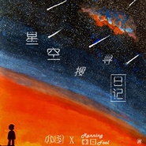

星空搜寻日记
============================

|  |  |
| :--: | :-- |
| [ 星空搜寻日记](https://emumo.xiami.com/album/2104553776) | **艺人**: [小时](../index.md) **语种**: 国语 **唱片公司**: HIFIVE **发行时间**: 2019年02月01日 **专辑类别**: EP, 单曲 **专辑风格**: 国语流行 Mandarin Pop **播放数**: 14311 **收藏数**: 1 **评论数**: 3  |

## 简介

沉默易旧  
亲吻易朽  
阿婆阿婆  
天上谁在笑哦  
  
[易朽] 指的是星光，因为我们看到的很多星光，是很久以前发出的，到达地球时，那些星星其实已经泯灭了。  
  
词作兼制作人Running Fool是以一个孩子的视角去想，“沉默易旧亲吻，沉默着用眼睛去亲吻星光。 孩子就问阿婆阿婆，天上的星星一闪一闪好像在笑呢。”  
  
星空以袖  
触摸已朽  
阿婆阿婆  
它想回家咯  
  
  
“夜空中的云就像是星空的袖子，当云飘过来遮住星光，就好像是在触摸一样。  
  
躲在云之下的星星好像想回家了。”  
  
  
  
就像儿时发生的那些事，随着我们长大，只留下碎片式的记忆，偶尔想起又被遗忘。  
  
我时常抬头仰望星空，感觉自己依旧是那个天真的孩子，渴望在这片浩瀚的星空搜寻到什么。  
  
用沉默的目光，亲吻着易朽的星光，念着“阿婆，阿婆”的咒语，想拥有故事中强大的魔法，伸手就可以触摸到星空。  
  
当那些背影慢慢走远，消失于眼眸，每个孤单的孩子，不停地搜寻着星空，写下星空搜寻日记。  
  
只希望能重新遇到你，再在这片星空下一起漫游。  
  
词/曲/编:Running Fool  
演唱：小时  
和声:Running Fool  
混音/母带:澍  
监制/统筹:卜小可  
封面：周圈圈  
 

## 曲目

## 评论

|  |  |  |
| :-- | :-- | :-- |
|  [虾米用户](https://emumo.xiami.com/u/162614058)  2019-11-03 20:33 赞(0) 踩(0) | 
单曲循环n遍，越听越好听 超喜欢
 |
|  [虾米用户](https://emumo.xiami.com/u/124009310) 微博  音悦笔记  公众... 2019-06-06 12:03 赞(0) 踩(0) | 
超级喜欢这首歌。
 |
|  [虾米用户](https://emumo.xiami.com/u/411917199) 四季很好，你尚在场 2019-02-26 19:27 赞(0) 踩(0) | 
很惊艳的一首歌
 |
