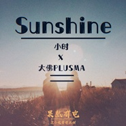

Sunshine (城市电音系列)
============================

|  |  |
| :--: | :-- |
| [ Sunshine (城市电音系列)](https://emumo.xiami.com/album/2104908563) | **艺人**: [小时](../index.md) **语种**: 国语 **唱片公司**: HIFIVE **发行时间**: 2019年05月29日 **专辑类别**: EP, 单曲 **专辑风格**:  **播放数**: 216021 **收藏数**: 4 **评论数**: 0  |

## 简介

小时工作室x果然电音社 “城市电音系列”  
  
第一期：成都。  
  
成都，一座来了就不想走的城市，休闲与活力齐行，传统与潮流并进。《Sunshine（城市电音系列）》由成都音乐人小时演唱，细腻而有穿透力的女声，双语的演绎，表达了她对成都的爱。  
  
  
 

## 曲目

## 评论

|  |  |  |  |
| :-- | :-- | :-- | :-- |
