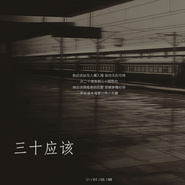

三十应该
============================

|  |  |
| :--: | :-- |
| [ 三十应该](https://emumo.xiami.com/album/2108356050) | **艺人**: [小时](../index.md) **语种**: 国语 **唱片公司**: 禾信科技 **发行时间**: 2019年11月05日 **专辑类别**: EP, 单曲 **专辑风格**: 国语流行 Mandarin Pop **播放数**: 1737 **收藏数**: 0 **评论数**: 0  |

## 简介

这首歌曲的歌名就是比较敏感的，这首歌听后也让人觉得孤单寂寥，小时姑娘用就有穿透力的嗓音娓娓道来，像是在诉说着一个女子的经历，每个女人都期望着单纯的幸福，但现实却不如人愿，生命中有一些人与我们擦肩了，却来不及遇见;遇见了，却来不及相识;相识了，却来不及熟悉;熟悉了，却还是要说再见。

## 曲目

## 评论

