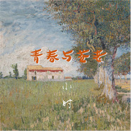

青春与苍老
============================

|  |  |
| :--: | :-- |
| [ 青春与苍老](https://emumo.xiami.com/album/5021087859) | **艺人**: [小时](../index.md) **语种**: 国语 **唱片公司**: 禾念信息 **发行时间**: 2019年06月19日 **专辑类别**: EP, 单曲 **专辑风格**: 国语流行 Mandarin Pop **播放数**: 75 **收藏数**: 0 **评论数**: 0  |

## 简介

小时带来新歌《青春与苍老》，岁月匆匆流逝，我们终将会长大，我们是否会因为生命中不得不进行的离别而落泪，是否会因为我们终将逝去的青春，终将老去的年月而落泪？

青春，在我们的世界中，或许真的遥不可及。但离我们最近的，却是我们自己的心灵。不妨在心中开拓出一片纯洁无瑕的空地，虔诚的许愿，让自己的青春的种子永远驻扎在那里。以自己的方式向世界宣布，我的青春，一直都在。

## 曲目

## 评论

|  |  |  |  |
| :-- | :-- | :-- | :-- |
