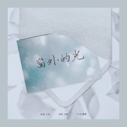

小时
============================

|  |  |
| :--: | :-- |
| [ 小时](https://i.xiami.com/weroneka) | **地区**: China 中国大陆 **风格**: 流行 Pop, 标准歌曲 Standards, 国语流行 Mandarin Pop, 欧美流行 Western Pop **播放数**: 5002917 **粉丝数**: 657 **评论数**: 32  |

## 档案

小时（原名小时姑娘） 
职业：歌手 
擅长：中国风、民谣、流行、欧美等多种风格 
代表作：《爱殇》、《望》、《入梦》等

## 专辑

| 名称 | 语种 | 唱片公司 | 发行时间 | 专辑类别 | 专辑风格 |
| :--: | :-- | :-- | :-- | :-- | :-- |
| [ 时不语](./albums/2108278933.md) | 纯音乐 | 独立发行 | 2020年04月02日 | EP, 单曲 | 流行摇滚 Pop Rock |
| [ 庸情](./albums/2108288880.md) | 国语 | 天牧瑞佳 | 2020年03月30日 | EP, 单曲 |  |
| [ 你在对岸观火](./albums/2108299058.md) | 国语 | 天牧瑞佳 | 2020年03月20日 | EP, 单曲 | 另类摇滚 Alternative Rock |
| [ 一程一程](./albums/2108300033.md) | 国语 | 独立发行 | 2020年02月17日 | EP, 单曲 | 电子乐 Electronica |
| [ 守望汉江](./albums/2108293121.md) | 国语 | 独立发行 | 2020年01月30日 | EP, 单曲 | 乡村 Country |
| [ 大湖之南](./albums/2108296062.md) | 国语 | 独立发行 | 2020年01月24日 | EP, 单曲 | 乡村 Country |
| [ 相逢不为真](./albums/2420328722.md) | 国语 | 独立发行 | 2020年01月17日 | EP, 单曲 |  |
| [ 相逢少年时](./albums/2105538768.md) | 国语 | 太声文化 | 2019年12月06日 | EP, 单曲 | 国语流行 Mandarin Pop |
| [ 三十应该](./albums/2108356050.md) | 国语 | 禾信科技 | 2019年11月05日 | EP, 单曲 | 国语流行 Mandarin Pop |
| [ 随风潜入梦](./albums/2105536225.md) | 国语 | 太声文化 | 2019年11月01日 | EP, 单曲 | 国语流行 Mandarin Pop |
| [ 窗外的光](./albums/2108239813.md) | 国语 | 禾信科技 | 2019年11月01日 | EP, 单曲 | 国语流行 Mandarin Pop |
| [ 予墨于斯](./albums/2108240196.md) | 国语 | 禾信科技 | 2019年10月30日 | EP, 单曲 | 国语流行 Mandarin Pop |
| [ 出塞](./albums/2105327341.md) | 国语 | 鲸鱼向海 | 2019年09月20日 | EP, 单曲 |  |
| [ 悬案](./albums/5020633552.md) | 国语 | 禾信科技 | 2019年08月17日 | EP, 单曲 |  |
| [ 等风与你](./albums/2105041511.md) | 国语 | 禾信科技 | 2019年07月10日 | EP, 单曲 |  |
| [ 行走在烟雨里的女子](./albums/5021103349.md) | 国语 | 禾信科技 | 2019年06月22日 | EP, 单曲 | 国语流行 Mandarin Pop |
| [ 你说你曾在西湖边做了一个梦而我今天恰好捡起](./albums/2104951809.md) | 国语 | HIFIVE | 2019年06月19日 | EP, 单曲 |  |
| [ 青春与苍老](./albums/5021087859.md) | 国语 | 禾念信息 | 2019年06月19日 | EP, 单曲 | 国语流行 Mandarin Pop |
| [ 你非顽疾](./albums/5021102534.md) | 国语 | 禾信科技 | 2019年06月05日 | EP, 单曲 | 国语流行 Mandarin Pop |
| [ Sunshine (城市电音系列)](./albums/2104908563.md) | 国语 | HIFIVE | 2019年05月29日 | EP, 单曲 |  |
| [ 长叹歌](./albums/5021146013.md) | 国语 | 禾信科技 | 2019年04月03日 | EP, 单曲 | 国语流行 Mandarin Pop |
| [ 献丑](./albums/2108317002.md) | 国语 | 禾信科技 | 2019年03月20日 | EP, 单曲 | 国语流行 Mandarin Pop |
| [ 星空搜寻日记](./albums/2104553776.md) | 国语 | HIFIVE | 2019年02月01日 | EP, 单曲 | 国语流行 Mandarin Pop |
| [ 燕青门](./albums/2103876732.md) | 国语 | StreetVoice, 木纹唱片 | 2018年08月01日 | EP, 单曲 |  |
| [ 小时中翻辑中文歌](./albums/2102698272.md) | 国语 | 独立发行 | 2017年02月23日 | 录音室专辑 | 流行 Pop |
| [ 小时英翻辑](./albums/2102698265.md) | 英语 | 独立发行 | 2017年02月23日 | 录音室专辑 |  |
| [ 爱殇](./albums/2104603448.md) | 国语 | 独立发行 | 2017年02月14日 | 原声带, 影视音乐 | 电视原声 Television Music |

## 评论

|  |  |  |
| :-- | :-- | :-- |
|  [虾米用户](https://emumo.xiami.com/u/36518599) 我还没想好要写什么... 2020-09-05 13:11 赞(0) 踩(0) | 
真的很棒啊 吐词换气拿捏的恰到好处，歌词文笔优美
 |
|  [虾米用户](https://emumo.xiami.com/u/286652270)  2020-07-11 07:37 赞(1) 踩(0) | 
总是觉得小时姑娘这名字更适合歌者:她是雨巷石阶打着油纸伞的佳人，回眸一望，眉眼之间如黛； 她是身着汉服飘逸俊美的娇俏少女，似烟火似薄雾； 也是顽皮女扮男装翩翩美少年，一枚长剑斩不断相思情愁&amp;hellip;&amp;hellip; 古风音律唱出柔情婉转似悲似愁，如萧萧风雨般苍茫，心在咫尺人在天涯的阔。
 |
|  [虾米用户](https://emumo.xiami.com/u/59156830)  2020-06-24 14:03 赞(0) 踩(0) | 
姑娘声音太美。。。
 |
|  [虾米用户](https://emumo.xiami.com/u/162614058)  2019-11-03 20:47 赞(1) 踩(0) | 
还有好多歌没放虾米上呢
 |
|  [虾米用户](https://emumo.xiami.com/u/10537792)  2019-10-15 10:22 赞(0) 踩(0) | 
✨
 |
|  [虾米用户](https://emumo.xiami.com/u/261138073) 音乐穿越了所有的空间，我... 2019-06-02 09:43 赞(1) 踩(0) | 
終於發現了妳 
 |
|  [虾米用户](https://emumo.xiami.com/u/406939748) 吾欲揽六龙 2019-05-06 18:33 赞(1) 踩(0) | 
真的唱的超级有感觉，我几乎要落下泪来，每唱一句我都会想起剧情，就是又想听又怕听
 |
|  [虾米用户](https://emumo.xiami.com/u/409784909) 初听倾尽惊流年，一见河图... 2019-05-02 18:34 赞(1) 踩(0) | 
喜欢 请容许我这个路人粉花痴一下
 |
|  [虾米用户](https://emumo.xiami.com/u/409201785)  2019-04-06 20:07 赞(2) 踩(0) | 
超级好听的爱殇
 |
|  [虾米用户](https://emumo.xiami.com/u/378957608)  2019-03-31 09:48 赞(4) 踩(0) | 
低音非常棒，像丝质一般的感觉
 |
|  [虾米用户](https://emumo.xiami.com/u/350194221)  2019-03-30 16:04 赞(1) 踩(0) | 
静慕 姑娘 已久
 |
|  [虾米用户](https://emumo.xiami.com/u/182885404)  2019-03-29 22:56 赞(1) 踩(0) | 
爱了爱了 爱殇真的完美
 |
|  [虾米用户](https://emumo.xiami.com/u/298169299) 音乐神圣，亵渎不可。 2019-03-29 21:51 赞(1) 踩(0) | 
  
 |
|  [虾米用户](https://emumo.xiami.com/u/246689266)  2019-03-20 18:16 赞(0) 踩(0) | 
;-)
 |
|  [虾米用户](https://emumo.xiami.com/u/904134) 好奇心与年龄成正比。 2019-03-15 22:39 赞(1) 踩(0) | 
才知道有个小时姑娘Hi我也是小时
 |
|  [虾米用户](https://emumo.xiami.com/u/356044507) 江河泊，东西南，闭门客，... 2019-03-09 11:46 赞(2) 踩(0) | 
天晴朗 好风光 
 |
|  [虾米用户](https://emumo.xiami.com/u/1698051) Waiting for ... 2018-12-23 13:34 赞(0) 踩(0) | 
女神！
 |
|  [虾米用户](https://emumo.xiami.com/u/84712554)  2018-04-16 01:18 赞(0) 踩(0) | 
望
 |
|  [虾米用户](https://emumo.xiami.com/u/354240320)  2018-03-13 12:32 赞(0) 踩(0) | 
奔小时！！！
 |
|  [虾米用户](https://emumo.xiami.com/u/348321495) 雨后有车驶来  驶过暮色... 2018-02-13 12:20 赞(0) 踩(0) | 
没有望这首歌
 |
|  [虾米用户](https://emumo.xiami.com/u/22895330)  2018-01-02 21:49 赞(10) 踩(0) | 
这里没有姑娘的爱殇
 |
| ⇒ |  [虾米用户](https://emumo.xiami.com/u/300381159)  2018-02-02 12:54 赞(0) 踩(0) | 
搜索&amp;ldquo;陈小幻&amp;rdquo;
 |
|  [虾米用户](https://emumo.xiami.com/u/328121109)   2017-10-03 15:31 赞(0) 踩(0) | 
女神爱你(｡･㉨･｡)ﾉ♡
 |
|  [虾米用户](https://emumo.xiami.com/u/313143160)  2017-09-09 18:49 赞(0) 踩(0) | 
唯爱小时
 |
|  [虾米用户](https://emumo.xiami.com/u/10199250)  2017-09-01 17:05 赞(0) 踩(0) | 
喜欢就是喜欢
 |
|  [虾米用户](https://emumo.xiami.com/u/6823931)   2017-06-11 12:50 赞(0) 踩(0) | 
哇女神啊 
 |
|  [虾米用户](https://emumo.xiami.com/u/191962849)  2017-04-22 09:21 赞(0) 踩(0) | 
加油
 |
|  [虾米用户](https://emumo.xiami.com/u/41144962)  2017-04-16 00:52 赞(1) 踩(0) | 
很喜欢你，从爱殇就喜欢你。相比英文歌我更喜欢你的中文歌，有一种很特殊的韵味，希望你能有更多更好的作品。
 |
|  [虾米用户](https://emumo.xiami.com/u/51983324)  2017-02-23 14:48 赞(14) 踩(0) | 
我刚入驻了虾米音乐人，欢迎大家来我的个人主页，收听我的最新音乐
 |
| ⇒ |  [虾米用户](https://emumo.xiami.com/u/91873648)   2017-03-17 12:44 赞(0) 踩(0) | 
小时姑娘又没有兴趣翻唱一下梁静茹的歌曲，感觉会很好听
 |
| ⇒ |  [虾米用户](https://emumo.xiami.com/u/229287331) 特摄导演、演员、歌手、编... 2017-03-31 16:00 赞(0) 踩(0) | 
哈喽小时，我是兔子，歌手主页的头像怎么是空的
 |
| ⇒ |  [虾米用户](https://emumo.xiami.com/u/39234174) 超以象外  得其环中 2019-10-12 13:39 赞(0) 踩(0) | 
哇  两年前就入驻了 今天才看到 两年前听爱殇知道了小时  当时就觉得是个很厉害的声音 就是曝光太少  没有被大众听到
 |
