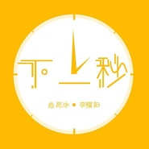

李耀阳
============================

|  |  |
| :--: | :-- |
| [ 李耀阳](https://i.xiami.com/liyaoyang) | **地区**: China 中国大陆 **风格**: 国语流行 Mandarin Pop **播放数**: 3680505 **粉丝数**: 137 **评论数**: 6  |

## 档案

李耀阳，1997年11月30日出生于广东省汕尾市，创作歌手，毕业于广州市艺术学校

## 专辑

| 名称 | 语种 | 唱片公司 | 发行时间 | 专辑类别 | 专辑风格 |
| :--: | :-- | :-- | :-- | :-- | :-- |
| [ 曾](./albums/2105444490.md) | 国语 | 泽鹏文化 | 2019年11月15日 | EP, 单曲 |  |
| [ 曾（男生版）](./albums/2108154988.md) | 国语 | 金翼龙唱片 | 2019年11月15日 | EP, 单曲 | 国语流行 Mandarin Pop |
| [ 心疼自己](./albums/2104854364.md) | 国语 | 咚吧嗒文化 | 2019年05月09日 | EP, 单曲 |  |
| [ 那个女孩](./albums/2104652185.md) | 国语 | 金翼龙唱片 | 2019年03月05日 | EP, 单曲 | 国语流行 Mandarin Pop |
| [ 下一秒](./albums/2103942574.md) | 国语 | 咚吧嗒文化 | 2018年08月23日 | EP, 单曲 | 国语流行 Mandarin Pop |
| [ 别说再约](./albums/2103517077.md) | 国语 | 金翼龙唱片 | 2018年02月06日 | EP, 单曲 |  |
| [ 毛衣](./albums/2102700294.md) | 国语 | 独立发行 | 2017年03月04日 | 录音室专辑 |  |

## 评论

|  |  |  |
| :-- | :-- | :-- |
|  [虾米用户](https://emumo.xiami.com/u/3250268) 一首好歌都比爱一个人长久... 2020-05-13 22:31 赞(0) 踩(0) | 
你怎么还没火呢 
 |
|  [虾米用户](https://emumo.xiami.com/u/408677923) 做个自律的人 2019-05-24 16:28 赞(1) 踩(0) | 
这主页介绍和照片也不是李耀阳阿
 |
|  [虾米用户](https://emumo.xiami.com/u/369222898)  2019-05-05 10:04 赞(0) 踩(0) | 
加油
 |
|  [虾米用户](https://emumo.xiami.com/u/333236387) 双胞胎 2017-11-19 11:56 赞(0) 踩(0) | 
李耀阳是整容了吗
 |
|  [虾米用户](https://emumo.xiami.com/u/190241379)  2017-05-16 13:00 赞(1) 踩(0) | 
加油
 |
|  [虾米用户](https://emumo.xiami.com/u/55454074)  2017-04-29 07:58 赞(0) 踩(0) | 
沙发
 |
