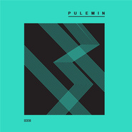

普乐民
============================

|  |  |
| :--: | :-- |
| [ 普乐民](https://i.xiami.com/pulemin) | **地区**: China 中国大陆 **风格**: 电子 Electronic, 放克电子 Electro (Electro-Funk), 电子迪斯科 Electro-Disco **播放数**: 2821276 **粉丝数**: 196 **评论数**: 5  |

## 档案

普乐民丨国内流行DJ混音制作人丨电子音乐 -3D-DJ-土嗨-雷鬼-House等丶音乐@天天为你打造最新的顶级DJ舞曲

## 专辑

| 名称 | 语种 | 唱片公司 | 发行时间 | 专辑类别 | 专辑风格 |
| :--: | :-- | :-- | :-- | :-- | :-- |
| [ Dharma](./albums/2103676724.md) | 国语 | 天悦华音 | 2018年02月24日 | EP, 单曲 |  |
| [ 3D环绕，刺激每一个听神经](./albums/2102800811.md) | 国语 | 新奥视讯 | 2017年07月20日 | 录音室专辑 |  |
| [ 嗨曲地带](./albums/2102750111.md) | 其他 | 独立发行 | 2017年05月18日 | 录音室专辑 | 流行 Pop, 电音流行 Electropop, 流行舞曲 Dance-Pop |
| [ PLM shop](./albums/2102746474.md) | 其他 | 独立发行 | 2017年05月11日 | 录音室专辑 | 电子 Electronic, 浩室舞曲 House |

## 评论

|  |  |  |
| :-- | :-- | :-- |
|  [虾米用户](https://emumo.xiami.com/u/380073729) 音声带着心情走… 2020-06-17 22:50 赞(0) 踩(0) | 
加油
 |
|  [虾米用户](https://emumo.xiami.com/u/324879742)   2019-07-08 08:17 赞(1) 踩(0) | 
.
 |
|  [虾米用户](https://emumo.xiami.com/u/379261498)  2019-06-30 09:02 赞(1) 踩(0) | 
这dj不错
 |
|  [虾米用户](https://emumo.xiami.com/u/131350078) 顺我者昌逆我者亡 2018-11-14 18:16 赞(1) 踩(0) | 
怎么没有留言？
 |
| ⇒ |  [虾米用户](https://emumo.xiami.com/u/380151227)  2019-01-25 18:43 赞(0) 踩(0) | 
还没被发现~
 |
