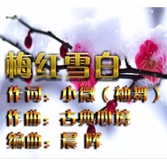

袖舞迎风
============================

|  |  |
| :--: | :-- |
| [ 袖舞迎风](https://i.xiami.com/xiuwu) | **播放数**: 3392387 **粉丝数**: 14 **评论数**: 2 **地区**: China 中国大陆 **风格**: 民谣 Folk  |

## 档案

## 专辑

| 名称 | 语种 | 唱片公司 | 发行时间 | 专辑类别 | 专辑风格 |
| :--: | :-- | :-- | :-- | :-- | :-- |
| [ 中国美如画](./albums/2103692534.md) | 国语 | 独立发行 | 2018年04月21日 | 录音室专辑 | 国语流行 Mandarin Pop |
| [ 这样一个雨天](./albums/2103692525.md) | 国语 | 独立发行 | 2018年04月21日 | 录音室专辑 | 国语流行 Mandarin Pop |
| [ 一曲琵琶歌不休](./albums/2103692520.md) | 国语 | 独立发行 | 2018年04月21日 | 录音室专辑 | 国语流行 Mandarin Pop |
| [ 笑看春风](./albums/2103692528.md) | 国语 | 独立发行 | 2018年04月21日 | 录音室专辑 | 国语流行 Mandarin Pop |
| [ 梅红雪白](./albums/2102975102.md) | 国语 | 独立发行 | 2017年12月15日 | 录音室专辑 | 流行 Pop |
| [ 梅红雪白](./albums/2102974082.md) | 国语 | 独立发行 | 2017年12月14日 | 原声带, 影视音乐 | 流行 Pop |
| [ 梦里梦外花如海](./albums/2102780163.md) | 国语 | 独立发行 | 2017年07月10日 | 录音室专辑 | 国语流行 Mandarin Pop |
| [ 小风轻拂柳](./albums/2102779784.md) | 国语 | 独立发行 | 2017年07月09日 | 录音室专辑 | 国语流行 Mandarin Pop |
| [ 成都](./albums/2102767696.md) | 国语 | 独立发行 | 2017年06月18日 | 录音室专辑 | 国语流行 Mandarin Pop |
| [ 李香君](./albums/2102761680.md) | 国语 | 独立发行 | 2017年06月08日 | 录音室专辑 | 国语流行 Mandarin Pop |
| [ 梨花情](./albums/2102758772.md) | 国语 | 独立发行 | 2017年06月03日 | 录音室专辑 | 国语流行 Mandarin Pop |
| [ 牵挂你](./albums/2102758766.md) | 国语 | 独立发行 | 2017年06月03日 | 录音室专辑 | 国语流行 Mandarin Pop |
| [ 再见花瓣雨](./albums/2102750243.md) | 国语 | 独立发行 | 2017年05月18日 | 录音室专辑 | 国语流行 Mandarin Pop |
| [ 李香君](./albums/2102747957.md) | 国语 | 独立发行 | 2017年05月14日 | 录音室专辑 | 国语流行 Mandarin Pop |
| [ 李香君](./albums/2102745852.md) | 国语 | 独立发行 | 2017年05月10日 | 录音室专辑 | 国语流行 Mandarin Pop |
| [ 梨花情](./albums/2102745836.md) | 国语 | 独立发行 | 2017年05月10日 | 录音室专辑 | 国语流行 Mandarin Pop |
| [ 半城烟雨等你来](./albums/2102740789.md) | 国语 | 独立发行 | 2017年04月30日 | 录音室专辑 | 国语流行 Mandarin Pop |
| [ 牵挂你](./albums/2102739393.md) | 国语 | 独立发行 | 2017年04月28日 | 录音室专辑 | 国语流行 Mandarin Pop |
| [ 半城烟雨等你来](./albums/2102736301.md) | 国语 | 独立发行 | 2017年04月22日 | 录音室专辑 | 国语流行 Mandarin Pop |
| [ 半城烟雨等你来](./albums/2102734937.md) | 国语 | 独立发行 | 2017年04月20日 | 录音室专辑 | 国语流行 Mandarin Pop |
| [ 昨夜桃花满帘](./albums/2102721735.md) | 国语 | 独立发行 | 2017年03月26日 | 录音室专辑 | 国语流行 Mandarin Pop |
| [ 春的遐想](./albums/2102721741.md) | 国语 | 独立发行 | 2017年03月26日 | 录音室专辑 | 国语流行 Mandarin Pop |
| [ 昨夜桃花满帘](./albums/2102710936.md) | 国语 | 独立发行 | 2017年03月13日 | 录音室专辑 |  |
| [ 昨夜桃花满帘](./albums/2102710056.md) | 国语 | 独立发行 | 2017年03月12日 | 录音室专辑 |  |
| [ 昨夜桃花满帘翁汕汕](./albums/2102705546.md) | 国语 | 独立发行 | 2017年03月07日 | 录音室专辑 |  |
| [ 迷人的月光](./albums/2102703078.md) | 国语 | 独立发行 | 2017年03月03日 | 录音室专辑 |  |
| [ 迷人的月光](./albums/2102701225.md) | 国语 | 独立发行 | 2017年02月28日 | 录音室专辑 |  |
| [ 春的遐想](./albums/2102701164.md) | 国语 | 独立发行 | 2017年02月28日 | 录音室专辑 |  |

## 评论

|  |  |  |  |
| :-- | :-- | :-- | :-- |
|  [虾米用户](https://emumo.xiami.com/u/276217593) 一梦千年 凉凉 2017-02-27 11:25 赞(0) 踩(0) | 
我刚入驻了虾米音乐人，欢迎大家来我的个人主页，收听我的最新音乐
 |
