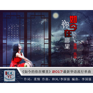

如今的你在哪里
============================

|  |  |
| :--: | :-- |
| [ 如今的你在哪里](https://emumo.xiami.com/album/2102760991) | **艺人**: [风花（付春花）](../index.md) **语种**: 国语 **唱片公司**: 独立发行 **发行时间**: 2017年06月07日 **专辑类别**: 录音室专辑 **专辑风格**: 国语流行 Mandarin Pop, 成人时代 Adult Contemporary, 独立流行 Indie Pop **播放数**: 993 **收藏数**: 0 **评论数**: 0  |

## 简介

 【如今的你在哪里】由柔情作词，和风和李国强老师作曲。

## 曲目

## 评论

|  |  |  |  |
| :-- | :-- | :-- | :-- |
