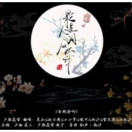

最是人间应识我
============================

|  |  |
| :--: | :-- |
| [ 最是人间应识我](https://emumo.xiami.com/album/2103900670) | **艺人**: [夕颜落雪](../index.md) **语种**: 国语 **唱片公司**: 独立发行 **发行时间**: 2018年02月15日 **专辑类别**: EP, 单曲 **专辑风格**: 古风 GuFeng Music, 中国风 China-Wave **播放数**: 236696 **收藏数**: 10 **评论数**: 2  |

## 简介

 

歌名:《最是人间应识我》
 

--赠小说《且待风尽》勒缈云
 

原曲:川田まみ《红泪》
 

## 曲目

## 评论

|  |  |  |
| :-- | :-- | :-- |
|  [虾米用户](https://emumo.xiami.com/u/426400352)  2020-02-05 15:51 赞(0) 踩(0) | 
第一个
 |
|  [虾米用户](https://emumo.xiami.com/u/266119176) 初心不负 2018-08-12 10:27 赞(0) 踩(0) | 
欢迎欢迎
 |
