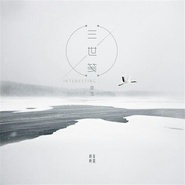

夕颜落雪
============================

|  |  |
| :--: | :-- |
| [ 夕颜落雪](https://i.xiami.com/xylx) | **地区**: China 中国大陆 **风格**: 古风 GuFeng Music, 中国风 China-Wave **播放数**: 5472283 **粉丝数**: 85 **评论数**: 9  |

## 档案

夕颜落雪，原名孙燕红，古风女词人兼歌手，美工。 
生日：1993-02-08 
国籍：中国 
民族：汉 
出生地：临沂 
代表作品：《雪落倾歌》、《青灯》、《大漠飞花》等

## 专辑

| 名称 | 语种 | 唱片公司 | 发行时间 | 专辑类别 | 专辑风格 |
| :--: | :-- | :-- | :-- | :-- | :-- |
| [ 最是人间应识我](./albums/2103900670.md) | 国语 | 独立发行 | 2018年02月15日 | EP, 单曲 | 古风 GuFeng Music, 中国风 China-Wave |
| [ 大漠飞花](./albums/2102779767.md) | 国语 | 独立发行 | 2017年07月07日 | EP, 单曲 | 古风 GuFeng Music |
| [ 染墨相思](./albums/2102975426.md) | 国语 | 独立发行 | 2017年07月02日 | EP, 单曲 | 古风 GuFeng Music, 中国风 China-Wave |
| [ 凭栏听风](./albums/2102779772.md) | 国语 | 独立发行 | 2017年05月22日 | EP, 单曲 | 古风 GuFeng Music |
| [ 醉月几酌](./albums/2102779775.md) | 国语 | 独立发行 | 2017年05月11日 | EP, 单曲 | 古风 GuFeng Music |
| [ 雪落倾歌](./albums/2102729079.md) | 国语 | 独立发行 | 2017年04月06日 | EP, 单曲 | 中国风 China-Wave, 古风 GuFeng Music |
| [ 青灯](./albums/2102708266.md) | 国语 | 独立发行 | 2017年03月07日 | EP, 单曲 | 古风 GuFeng Music |
| [ 三世笺](./albums/2102707920.md) | 国语 | 独立发行 | 2017年03月01日 | EP, 单曲 | 古风 GuFeng Music |

## 评论

|  |  |  |
| :-- | :-- | :-- |
|  [虾米用户](https://emumo.xiami.com/u/358104299) 悲观的唯心存在现实解构虚... 2020-04-22 09:04 赞(0) 踩(0) | 
17475
 |
|  [虾米用户](https://emumo.xiami.com/u/319790170)  2018-12-30 19:54 赞(0) 踩(0) | 
你是音阙诗听的，有没有纯古风的歌？
 |
|  [虾米用户](https://emumo.xiami.com/u/408797907)  2018-12-06 22:42 赞(0) 踩(0) | 
真好听
 |
|  [虾米用户](https://emumo.xiami.com/u/292980851)  2018-01-07 18:09 赞(0) 踩(0) | 
原声没去干净
 |
|  [虾米用户](https://emumo.xiami.com/u/294309587)  2017-05-20 15:39 赞(1) 踩(0) | 
棒棒
 |
|  [虾米用户](https://emumo.xiami.com/u/284864243)  2017-04-14 20:16 赞(1) 踩(0) | 
唱的挺好的，就是声音有点怪。。。。。。
 |
|  [虾米用户](https://emumo.xiami.com/u/250171808) 褪尽风华，我依然在彼岸守... 2017-03-16 08:39 赞(1) 踩(0) | 
棒棒哒
 |
|  [虾米用户](https://emumo.xiami.com/u/250171808) 褪尽风华，我依然在彼岸守... 2017-03-16 08:39 赞(2) 踩(0) | 

 |
|  [虾米用户](https://emumo.xiami.com/u/266119176) 初心不负 2017-03-10 08:59 赞(3) 踩(0) | 
我刚入驻了虾米音乐人，欢迎大家来我的个人主页，收听我的最新音乐
 |
