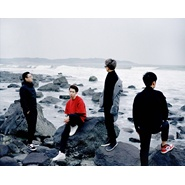
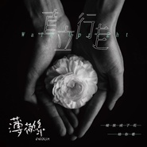

薄荷绿乐队
============================

|  |  |
| :--: | :-- |
| [ 薄荷绿乐队](https://i.xiami.com/bohelv) | **地区**: China 中国大陆 **风格**: 放克 Funk, 英伦摇滚 Britpop, 流行摇滚 Pop Rock **播放数**: 6241182 **粉丝数**: 2955 **评论数**: 97  |

## 档案

## 专辑

| 名称 | 语种 | 唱片公司 | 发行时间 | 专辑类别 | 专辑风格 |
| :--: | :-- | :-- | :-- | :-- | :-- |
| [ 逃](./albums/2103726325.md) | 国语 | 独立发行 | 2018年06月01日 | 录音室专辑 | 迷幻摇滚 Psychedelic Rock |
| [ 极夜](./albums/2103727093.md) | 国语 | 独立发行 | 2018年06月01日 | 录音室专辑 | 英伦摇滚 Britpop |
| [ 独一 (Apro Remix)](./albums/2103704245.md) | 国语 | 独立发行 | 2018年05月08日 | EP, 单曲 | 电子舞曲 EDM / Electronic Dance Music |
| [ 独一](./albums/2103698805.md) | 国语 | 独立发行 | 2018年04月29日 | EP, 单曲 | 英伦摇滚 Britpop |
| [ 直立行走](./albums/2103529838.md) | 国语 | 独立发行 | 2018年02月16日 | EP, 单曲 | 流行 Pop |
| [ 恒星](./albums/2102761698.md) | 国语 | 独立发行 | 2017年06月08日 | EP, 单曲 | 英伦摇滚 Britpop, 流行摇滚 Pop Rock |
| [ 越来越不懂](./albums/2102736395.md) | 国语 | 独立发行 | 2017年04月23日 | EP, 单曲 | 英伦摇滚 Britpop, 流行摇滚 Pop Rock |
| [ 绵羊](./albums/2102726429.md) | 国语 | 独立发行 | 2017年04月02日 | EP, 单曲 | 流行摇滚 Pop Rock |
| [ 写给二十岁的你](./albums/2102726431.md) | 国语 | 独立发行 | 2017年04月02日 | EP, 单曲 | 英伦摇滚 Britpop, 流行摇滚 Pop Rock, 放克 Funk |

## 评论

|  |  |  |
| :-- | :-- | :-- |
|  [虾米用户](https://emumo.xiami.com/u/246692829) 我还没想好要写什么... 2020-07-27 18:23 赞(1) 踩(0) | 
又是一季乐队的夏天啦  薄荷绿加油哦
 |
|  [虾米用户](https://emumo.xiami.com/u/247919469) 我还没想好要写什么... 2020-06-26 23:30 赞(1) 踩(0) | 
《恒星》里的那句  新宇宙  让我的心泛起层层涟漪  好棒 
 |
|  [虾米用户](https://emumo.xiami.com/u/292565893)  2020-06-16 15:45 赞(0) 踩(0) | 
加油!爱你们呦！❤
 |
|  [虾米用户](https://emumo.xiami.com/u/43492923) 行到水穷我才开始害怕，夕... 2020-04-11 23:31 赞(0) 踩(0) | 
。
 |
|  [虾米用户](https://emumo.xiami.com/u/115907612) 热爱 2020-02-09 22:04 赞(0) 踩(0) | 
❤请继续热爱❤
 |
|  [虾米用户](https://emumo.xiami.com/u/318627388) 是波澜或是惊涛骇浪，最终... 2019-11-10 14:58 赞(0) 踩(0) | 
现在喜欢你们会不会晚呢
 |
|  [虾米用户](https://emumo.xiami.com/u/10414650) 我还没想好要写什么... 2019-08-14 21:19 赞(1) 踩(0) | 
听到海浪声 看见云翻滚 皱着的心慢慢被熨平 想和你们一起奏起来
 |
|  [虾米用户](https://emumo.xiami.com/u/32137963)  2019-08-09 14:06 赞(2) 踩(0) | 
直立行走入坑ww
 |
|  [虾米用户](https://emumo.xiami.com/u/345229208)  2019-07-14 09:33 赞(1) 踩(0) | 
直立行走这首歌太赞了，歌词声音旋律都是 
 |
|  [虾米用户](https://emumo.xiami.com/u/5449843) 虾听听 2019-07-06 19:43 赞(1) 踩(0) | 
主唱声音很棒
 |
|  [虾米用户](https://emumo.xiami.com/u/33264684) as blank 2019-07-06 13:54 赞(3) 踩(0) | 
天呐好好听，感觉踩在云朵上要飞起来了！
 |
|  [虾米用户](https://emumo.xiami.com/u/59796618) 心动那一刻，节奏已随你…... 2019-06-14 08:43 赞(2) 踩(0) | 
没有一见钟情，却种下一颗种子，多听几遍，你会发现喜欢的种子已发芽成长 
 |
|  [虾米用户](https://emumo.xiami.com/u/12503031) hahah 2019-06-11 14:35 赞(3) 踩(0) | 
老豆，老豆，超级大老豆
 |
|  [虾米用户](https://emumo.xiami.com/u/230470007)  2019-05-24 00:23 赞(0) 踩(0) | 
开着车听着《直立独行》是最享受的事情，不好的情绪瞬间一扫而过
 |
| ⇒ |  [虾米用户](https://emumo.xiami.com/u/256710312) 览洲 2019-06-10 23:01 赞(0) 踩(0) | 
哪首？
 |
|  [虾米用户](https://emumo.xiami.com/u/131942688)   2019-04-04 08:39 赞(0) 踩(0) | 
爱你们哟
 |
|  [虾米用户](https://emumo.xiami.com/u/411058641) 取之不尽 用之不竭 2019-03-25 12:47 赞(0) 踩(0) | 

 |
|  [虾米用户](https://emumo.xiami.com/u/172921804) 断云 2019-03-20 11:15 赞(0) 踩(0) | 
很棒欧～加油↖(^ω^)↗
 |
|  [虾米用户](https://emumo.xiami.com/u/154867014)  2019-03-03 19:00 赞(0) 踩(0) | 
很喜欢，很有感染力，听完后会回想起曾经的青春时光，希望乐队越来越好
 |
|  [虾米用户](https://emumo.xiami.com/u/108525466) 多多用功 别发脾气 好好... 2019-02-20 12:48 赞(2) 踩(0) | 
抑郁症确诊，听到他们的歌，瞬间泪崩，大家都是这么温柔的人，慢慢的一定会好的。敲爱薄荷绿啊！
 |
| ⇒ |  [虾米用户](https://emumo.xiami.com/u/347885327)  2019-03-03 17:09 赞(0) 踩(0) | 
摇滚还是得听欧美的
 |
|  [虾米用户](https://emumo.xiami.com/u/407250346) 超有包容性的耳朵和一颗探... 2019-02-17 19:03 赞(0) 踩(0) | 
有没有机会来天津，女主唱嗓音真棒
 |
|  [虾米用户](https://emumo.xiami.com/u/246689266)  2019-02-05 20:54 赞(0) 踩(0) | 

 |
|  [虾米用户](https://emumo.xiami.com/u/328657369) 风格随心而变、 2019-02-02 04:58 赞(0) 踩(0) | 

 |
|  [虾米用户](https://emumo.xiami.com/u/4128556) 很可敬 很冷淡的正经女孩 2019-01-31 15:49 赞(0) 踩(0) | 
女主唱声音有点点笔笔的感觉
 |
|  [虾米用户](https://emumo.xiami.com/u/328657369) 风格随心而变、 2019-01-24 01:09 赞(0) 踩(0) | 

 |
|  [虾米用户](https://emumo.xiami.com/u/133474722)  2019-01-13 18:40 赞(0) 踩(0) | 
好听 歌词也不错
 |
|  [虾米用户](https://emumo.xiami.com/u/1024746) 灵魂不该屈服 2019-01-05 11:57 赞(0) 踩(0) | 
新专辑封面怎么少了一个人
 |
|  [虾米用户](https://emumo.xiami.com/u/121881820) 南方 2018-12-24 07:00 赞(1) 踩(0) | 
2018.12.22 摇滚音乐节 江夏站 来的刚刚好
 |
|  [虾米用户](https://emumo.xiami.com/u/348253759)  2018-12-12 18:11 赞(0) 踩(0) | 
好喜欢好有感觉 
 |
|  [虾米用户](https://emumo.xiami.com/u/299258675)  2018-11-19 15:56 赞(0) 踩(0) | 
天呐，每一首歌都很喜欢！
 |
|  [虾米用户](https://emumo.xiami.com/u/355192193)  2018-11-11 19:24 赞(1) 踩(0) | 
喜欢薄荷啊！
 |
|  [虾米用户](https://emumo.xiami.com/u/15616045) 少年回头望，笑我还不快跟... 2018-10-21 21:10 赞(1) 踩(0) | 
嘉庚的孩子来啦！
 |
|  [虾米用户](https://emumo.xiami.com/u/331212932)  2018-10-19 02:57 赞(0) 踩(0) | 
爱你哦 
 |
|  [虾米用户](https://emumo.xiami.com/u/350003253) brlu brlu. 2018-10-11 00:19 赞(3) 踩(0) | 
说，你们跟苏打绿是什么关系 
 |
| ⇒ |  [虾米用户](https://emumo.xiami.com/u/76029894) 我还没想好要写什么... 2019-03-20 16:57 赞(0) 踩(0) | 
哈哈哈
 |
|  [虾米用户](https://emumo.xiami.com/u/222280439)  2018-09-23 16:10 赞(1) 踩(0) | 
小粉丝来袭，加油！
 |
|  [虾米用户](https://emumo.xiami.com/u/38653438)   2018-09-15 10:09 赞(2) 踩(0) | 
平时听欧美和日系的比较多，中文也就是听民谣，第一次有喜欢的国内乐队 真的挖到宝了！
 |
|  [虾米用户](https://emumo.xiami.com/u/342638846) 喜欢轻松欢快的节奏 2018-09-12 08:11 赞(0) 踩(0) | 
不要放弃啊，加油
 |
|  [虾米用户](https://emumo.xiami.com/u/245113445) Out of reach... 2018-08-31 01:05 赞(2) 踩(0) | 
喜欢~❤
 |
|  [虾米用户](https://emumo.xiami.com/u/23131867)  2018-08-21 18:52 赞(22) 踩(0) | 
这个女主唱的嗓音很特别，加油，会火的！
 |
|  [虾米用户](https://emumo.xiami.com/u/366403682) 嘿 我要走了。 2018-08-01 20:31 赞(0) 踩(0) | 
加油呐
 |
|  [虾米用户](https://emumo.xiami.com/u/198778432)   2018-07-29 10:18 赞(1) 踩(0) | 
好听❤️
 |
|  [虾米用户](https://emumo.xiami.com/u/16865558) 音乐，你没戏..... 2018-06-04 05:30 赞(1) 踩(0) | 
主唱很好听 什么时候出专辑？
 |
|  [虾米用户](https://emumo.xiami.com/u/3186478) 我还没想好要写什么... 2018-05-30 02:04 赞(0) 踩(0) | 
看好你们，加油 (ง &amp;bull;̀_&amp;bull;́)ง‼
 |
|  [虾米用户](https://emumo.xiami.com/u/5520234) 淡泊宁静以致远 2018-05-13 07:10 赞(2) 踩(0) | 
这个乐队未来一定很出色
 |
|  [虾米用户](https://emumo.xiami.com/u/121864288) 想和你虚度时光 2018-04-01 10:40 赞(2) 踩(0) | 
女主唱声音好好听好苏～～
 |
|  [虾米用户](https://emumo.xiami.com/u/319601175)  2018-03-09 12:16 赞(1) 踩(0) | 
疯狂打电话，加油
 |
|  [虾米用户](https://emumo.xiami.com/u/285810952)  2018-03-09 09:30 赞(0) 踩(0) | 
加油！很喜欢你们的 
 |
|  [虾米用户](https://emumo.xiami.com/u/131587258) 五月，五月天 2018-02-24 13:16 赞(3) 踩(0) | 
清凉的感觉，期待成长！
 |
|  [虾米用户](https://emumo.xiami.com/u/53021065)   2017-12-15 16:50 赞(1) 踩(0) | 
会红的，我可以听你们的演唱会
 |
|  [虾米用户](https://emumo.xiami.com/u/53021065)   2017-12-15 16:49 赞(1) 踩(0) | 
喜欢她
 |
|  [虾米用户](https://emumo.xiami.com/u/53021065)   2017-12-15 16:49 赞(0) 踩(0) | 
我喜欢他的声音
 |
|  [虾米用户](https://emumo.xiami.com/u/245302723)  2017-12-06 23:40 赞(1) 踩(0) | 
听了绵羊 最后被老豆圈粉。 希望听到更多你们的好作品 喜欢薄荷绿[文字up] 
 |
|  [虾米用户](https://emumo.xiami.com/u/33077382) 长长来路，心生温度。 2017-12-04 11:01 赞(0) 踩(0) | 
他们是那里人求告知！
 |
| ⇒ |  [虾米用户](https://emumo.xiami.com/u/10975350) Everything i... 2018-01-22 16:06 赞(0) 踩(0) | 
厦门的好像
 |
|  [虾米用户](https://emumo.xiami.com/u/118073320) drummer  2017-11-25 11:51 赞(0) 踩(0) | 
加油哦
 |
|  [虾米用户](https://emumo.xiami.com/u/211683349) 还未如愿见过不朽 就把自... 2017-11-17 23:59 赞(1) 踩(0) | 
期待更多好作品 
 |
|  [虾米用户](https://emumo.xiami.com/u/43813348) 性感阿狗，在线听歌 2017-11-02 06:56 赞(1) 踩(0) | 
特别喜欢超级喜欢非常喜欢无敌喜欢你们 
 |
|  [虾米用户](https://emumo.xiami.com/u/274666194)  2017-10-15 19:12 赞(0) 踩(0) | 
加油。
 |
|  [虾米用户](https://emumo.xiami.com/u/1836333) 愿无岁月可回首，且以深情... 2017-10-14 21:25 赞(2) 踩(0) | 
毕竟是我大嘉庚的乐队
 |
|  [虾米用户](https://emumo.xiami.com/u/250139087)   2017-10-07 16:13 赞(0) 踩(0) | 
秒被圈粉
 |
|  [虾米用户](https://emumo.xiami.com/u/199099260)   2017-09-27 20:34 赞(0) 踩(0) | 
好听
 |
|  [虾米用户](https://emumo.xiami.com/u/268124055) ❤️ 2017-09-07 12:39 赞(0) 踩(0) | 
喜欢你们
 |
|  [虾米用户](https://emumo.xiami.com/u/269094782)  2017-08-19 14:52 赞(0) 踩(0) | 
好喜欢你们，加油，我们支持你们   
 |
|  [虾米用户](https://emumo.xiami.com/u/296138951)  2017-08-14 01:57 赞(1) 踩(0) | 
很喜欢，你们会红的。
 |
|  [虾米用户](https://emumo.xiami.com/u/313783554) 生活不止眼前的苟且，还有... 2017-08-08 10:30 赞(1) 踩(0) | 
出新歌呀，期待！ 
 |
|  [虾米用户](https://emumo.xiami.com/u/41016502)   2017-08-05 17:47 赞(1) 踩(0) | 
好听，加油
 |
|  [虾米用户](https://emumo.xiami.com/u/304460627)  2017-07-27 15:50 赞(1) 踩(0) | 
好听哇
 |
|  [虾米用户](https://emumo.xiami.com/u/248135064) 无人知 2017-07-26 18:20 赞(2) 踩(0) | 
加油，我也是听了绵羊进来的，真的不错！
 |
|  [虾米用户](https://emumo.xiami.com/u/313783554) 生活不止眼前的苟且，还有... 2017-07-26 09:33 赞(1) 踩(0) | 
看到薄荷绿这三个字就点进来听了听，恩，很好听哦
 |
|  [虾米用户](https://emumo.xiami.com/u/111537292) 我还没想好要写什么... 2017-07-25 22:22 赞(1) 踩(0) | 
加油！
 |
|  [虾米用户](https://emumo.xiami.com/u/281599594)  2017-07-25 18:35 赞(1) 踩(0) | 
加油 
 |
|  [虾米用户](https://emumo.xiami.com/u/121072092)  2017-07-25 15:04 赞(1) 踩(0) | 
无论是词还是曲，都很细致，加油 
 |
|  [虾米用户](https://emumo.xiami.com/u/1024746) 灵魂不该屈服 2017-07-19 10:58 赞(0) 踩(0) | 
虾米呀总能给我带来惊喜！让烦闷的工作多了点激情~！
 |
|  [虾米用户](https://emumo.xiami.com/u/275254261)  2017-07-17 22:57 赞(0) 踩(0) | 
加油哦！
 |
|  [虾米用户](https://emumo.xiami.com/u/2418238) weibo: @尤米口 2017-07-12 01:49 赞(0) 踩(0) | 
火钳刘明
 |
|  [虾米用户](https://emumo.xiami.com/u/246835952) 甲乙丙丁 2017-07-10 00:11 赞(0) 踩(0) | 
很抓耳的音乐
 |
|  [虾米用户](https://emumo.xiami.com/u/309909323)  2017-07-06 09:47 赞(0) 踩(0) | 
真的好听啊，绵羊真的触动内心啦，我单曲循环30+遍，加油加油   
 |
|  [虾米用户](https://emumo.xiami.com/u/256407011)  2017-07-03 11:11 赞(2) 踩(0) | 
自从听了《绵羊》就喜欢上了这个乐队，走心~希望薄荷绿乐队越来越好
 |
|  [虾米用户](https://emumo.xiami.com/u/23830733)  2017-06-30 23:24 赞(0) 踩(0) | 
会红的
 |
|  [虾米用户](https://emumo.xiami.com/u/109221156) 曼陀羅花 沿途綻放 我們... 2017-06-29 10:04 赞(0) 踩(0) | 
好聽~~ 來支持一下！
 |
|  [虾米用户](https://emumo.xiami.com/u/255740331)  2017-06-27 07:56 赞(0) 踩(0) | 
加油
 |
|  [虾米用户](https://emumo.xiami.com/u/266365217)  2017-06-22 19:55 赞(0) 踩(0) | 
节奏可以
 |
|  [虾米用户](https://emumo.xiami.com/u/304467424)  2017-06-20 20:29 赞(0) 踩(0) | 
实力派乐队     
 |
|  [虾米用户](https://emumo.xiami.com/u/305730492)   2017-06-19 10:26 赞(1) 踩(0) | 
好聽！ 支持！！！
 |
|  [虾米用户](https://emumo.xiami.com/u/304467424)  2017-06-16 01:02 赞(1) 踩(0) | 
薄荷绿乐队加油   
 |
|  [虾米用户](https://emumo.xiami.com/u/96144064)   2017-05-31 18:54 赞(0) 踩(0) | 
很赞 加油
 |
|  [虾米用户](https://emumo.xiami.com/u/6674488)  2017-05-23 02:32 赞(0) 踩(0) | 
喜欢
 |
|  [虾米用户](https://emumo.xiami.com/u/33580601) 旋轉 在 二樓拐角 2017-05-22 21:09 赞(0) 踩(0) | 
很好听！
 |
|  [虾米用户](https://emumo.xiami.com/u/54822922)   2017-05-15 03:20 赞(1) 踩(0) | 
兴隆狼群前来支持
 |
|  [虾米用户](https://emumo.xiami.com/u/266964895)  2017-05-01 23:31 赞(0) 踩(0) | 
好听，喜欢
 |
|  [虾米用户](https://emumo.xiami.com/u/22720011)  2017-04-29 19:12 赞(1) 踩(0) | 
挺棒的 希望越来越好
 |
|  [虾米用户](https://emumo.xiami.com/u/17384392) 微博：vox_tree 2017-04-29 08:52 赞(0) 踩(0) | 
挺棒的乐队❤️
 |
|  [虾米用户](https://emumo.xiami.com/u/282991205)  2017-04-26 23:05 赞(0) 踩(0) | 
一群很活泼的大哥哥姐姐
 |
|  [虾米用户](https://emumo.xiami.com/u/276085017) 昨天已灰飞烟灭，明天还在... 2017-04-20 00:25 赞(0) 踩(0) | 
支持一下
 |
|  [虾米用户](https://emumo.xiami.com/u/283536646) 我喜欢你温暖像太阳 2017-04-02 10:54 赞(80) 踩(0) | 
我刚入驻了虾米音乐人，欢迎大家来我的个人主页，收听我的最新音乐
 |
