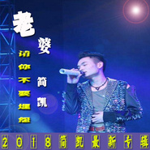

简凯
============================

|  |  |
| :--: | :-- |
| [ 简凯](https://i.xiami.com/jiankai) | **地区**: China 中国大陆 **风格**: 流行 Pop, 国语流行 Mandarin Pop, 华语唱作人 Chinese Singer-Songwriter, 当代唱作人 Contemporary Singer-Songwriter **播放数**: 1576311 **粉丝数**: 39 **评论数**: 4  |

## 档案

## 专辑

| 名称 | 语种 | 唱片公司 | 发行时间 | 专辑类别 | 专辑风格 |
| :--: | :-- | :-- | :-- | :-- | :-- |
| [ 重庆 永川故事](./albums/2105837660.md) | 国语 | 重庆音像出版社 | 2020年02月09日 | 录音室专辑 | 流行 Pop |
| [ 我以为自己可以不爱你](./albums/2105631336.md) | 国语 | 墨枫文化 | 2019年12月26日 | EP, 单曲 | 流行 Pop |
| [ 难](./albums/2104961951.md) | 国语 | 墨枫文化 | 2019年06月29日 | EP, 单曲 |  |
| [ 不放手我又怎样](./albums/2104829386.md) | 国语 |  | 2019年04月30日 | 录音室专辑 | 国语流行 Mandarin Pop |
| [ 大龄光棍](./albums/2104415444.md) | 国语 | 雨陌文化 | 2018年12月25日 | EP, 单曲 |  |
| [ 堵车歌](./albums/2104362338.md) | 国语 | 塑星文化 | 2018年12月09日 | 精选集 | 国语流行 Mandarin Pop |
| [ 老婆不要抱怨](./albums/2104055816.md) | 国语 | 独立发行 | 2018年09月27日 | EP, 单曲 | 流行舞曲 Dance-Pop |
| [ 可不可以原谅我](./albums/2103898971.md) | 国语 | 塑星文化 | 2018年08月05日 | EP, 单曲 | 当代唱作人 Contemporary Singer-Songwriter |
| [ 滴血的伤口 (DJ版)](./albums/2103699879.md) | 国语 | 魔音文化 | 2018年05月02日 | EP, 单曲 |  |
| [ 向往](./albums/2103632426.md) | 国语 | 墨枫文化 | 2018年03月22日 | EP, 单曲 |  |
| [ 男人的痛](./albums/2103560553.md) | 国语 | 墨枫文化 | 2018年02月24日 | EP, 单曲 |  |
| [ 今夜我一个人孤单（男版）毒恋](./albums/2103492888.md) | 国语 | 独立发行 | 2018年01月18日 | EP, 单曲 | 流行 Pop, 国语流行 Mandarin Pop |
| [ 远方的父亲](./albums/2102946005.md) | 国语 | 独立发行 | 2017年11月21日 | EP, 单曲 | 国语流行 Mandarin Pop |
| [ 爱你一生就是幸福 （男版）爱你一生就是幸福-简凯](./albums/2102905409.md) | 国语 | 独立发行 | 2017年11月04日 | EP, 单曲 | 国语流行 Mandarin Pop |
| [ 最美相恋-简凯最美相恋](./albums/2102880185.md) | 国语 | 独立发行 | 2017年10月25日 | EP, 单曲 | 电音流行 Electropop |
| [ 分手不再联系分手不再联系 简凯](./albums/2102860538.md) | 国语 | 独立发行 | 2017年09月20日 | EP, 单曲 | 流行摇滚 Pop Rock |
| [ 我的梦想一直在](./albums/2102758194.md) | 国语 | 独立发行 | 2017年06月02日 | EP, 单曲 | 流行 Pop |
| [ 感动2017爸爸想你啦宝贝](./albums/2102728159.md) | 国语 | 独立发行 | 2017年04月04日 | EP, 单曲 | 国语流行 Mandarin Pop |

## 评论

|  |  |  |
| :-- | :-- | :-- |
|  [虾米用户](https://emumo.xiami.com/u/199002175)  2020-03-28 06:34 赞(0) 踩(0) | 
帅
 |
|  [虾米用户](https://emumo.xiami.com/u/340340329)  2018-11-15 22:05 赞(0) 踩(0) | 

 |
|  [虾米用户](https://emumo.xiami.com/u/374774737) 我习惯了不该习惯的习惯，... 2018-06-20 07:56 赞(0) 踩(0) | 
你的歌聲真的好棒！加油
 |
|  [虾米用户](https://emumo.xiami.com/u/286490790) 我的音乐我主宰 2017-04-06 22:04 赞(1) 踩(0) | 
我刚入驻了虾米音乐人，欢迎大家来我的个人主页，收听我的最新音乐
 |
