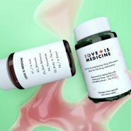

LOVE IS MEDICINE
============================

|  |  |
| :--: | :-- |
| [ LOVE IS MEDICINE](https://emumo.xiami.com/album/2104811176) | **艺人**: [Babel Records](../index.md) **语种**: 英语 **唱片公司**: Babel Records **发行时间**: 2019年05月02日 **专辑类别**: EP, 单曲 **专辑风格**: 未来流行 Futurepop, 电子 Electronic **播放数**: 18979 **收藏数**: 1699 **评论数**: 22  |

## 简介

在首张EP-LOVE IS ILLUSION发行两年后,活跃在国内电子场景最前沿的制作人JoyGinger, 发行了第二张EP- LOVE IS MEDICINE.  
  
他把不同的情绪放到不同的作品里,希望用律动治愈所有的不安与焦虑  
  
整张EP不仅与澳洲新生代女艺人PRINCI合作,更是通过大量人声旋律的采样，突破了他自有的结构,让我们看到了一个更多元更值得期待的国内音乐制作人  
  
  
  
------------------------------------  
Released by Babel Records  
  
Cover Art by Immosa  
  
Mixing by Mark Lee  
  
&nbsp;

## 曲目

## 评论

|  |  |  |  |
| :-- | :-- | :-- | :-- |
|  [虾米用户](https://emumo.xiami.com/u/1268848)  2019-07-16 21:14 赞(0) 踩(0) | 
是药三分毒
 |
|  [虾米用户](https://emumo.xiami.com/u/2418238) weibo: @尤米口 2019-05-23 10:16 赞(0) 踩(0) | 

 |
|  [虾米用户](https://emumo.xiami.com/u/18236235) 我还没想好要写什么... 2019-05-18 11:25 赞(0) 踩(0) | 
❍
 |
|  [虾米用户](https://emumo.xiami.com/u/16450428) ℑiaRiHeBieKe 2019-05-09 16:57 赞(0) 踩(0) | 

 |
|  [虾米用户](https://emumo.xiami.com/u/36422316)  2019-05-07 21:42 赞(0) 踩(0) | 
咋咋呼呼的
 |
|  [虾米用户](https://emumo.xiami.com/u/48199976)  2019-05-06 19:04 赞(1) 踩(0) | 
很好听&amp;lsquo;音乐很强；
 |
|  [虾米用户](https://emumo.xiami.com/u/48658719) 风吹散，说晚安，不再见。 2019-05-06 17:33 赞(0) 踩(0) | 
很酷啊，为什么你们打分这么低。
 |
|  [虾米用户](https://emumo.xiami.com/u/25471222) 对自由有多大的理解 就有... 2019-05-06 11:01 赞(0) 踩(0) | 
来啦！！
 |
|  [虾米用户](https://emumo.xiami.com/u/230803304) 三观正又爱国的成都宝藏男... 2019-05-05 20:25 赞(2) 踩(0) | 
支持一下
 |
|  [虾米用户](https://emumo.xiami.com/u/313826785)   2019-05-05 17:21 赞(1) 踩(0) | 
优
 |
|  [虾米用户](https://emumo.xiami.com/u/258035840) ai 2019-05-05 10:33 赞(1) 踩(0) | 
还不错
 |
|  [虾米用户](https://emumo.xiami.com/u/55094882) ｉｄ９１ｏｍｏ＞Ｉ  2019-05-03 20:30 赞(3) 踩(0) | 

 |
|  [虾米用户](https://emumo.xiami.com/u/17130245) 我还没想好要写什么... 2019-05-03 18:21 赞(3) 踩(0) | 
给你打四星
 |
|  [虾米用户](https://emumo.xiami.com/u/44019649) 这家伙很聪明 2019-05-03 14:41 赞(1) 踩(0) | 

 |
|  [虾米用户](https://emumo.xiami.com/u/45385073) 爱虾米期待再相遇为新：t... 2019-05-03 00:50 赞(1) 踩(0) | 
哇
 |
|  [虾米用户](https://emumo.xiami.com/u/31531934) 恋の道に近道はない 2019-05-03 00:30 赞(1) 踩(0) | 
#BabelRecords##每日一荐##JoyGingger#这次新专《love is medicine》,欢迎大家聆听收藏专辑,行动支持他！ ​​​Joy GingerBiography活跃在北京舞曲场景最前沿优秀DJ/制作人,Joy Ginger凭着锐利、先锋、有趣的眼光和对音乐的独特审美,一直活跃在北京舞曲场景的最前沿。喜欢在新的音乐里寻找不同的灵感,从来不会被曲风所限制的joy,都勇于将不同的音乐元素融合在一起,包括Grime,Trap,Futurebeat,Garage,Breakbeat等等
 |
|  [虾米用户](https://emumo.xiami.com/u/10170789) 路上见     网易：G... 2019-05-02 23:28 赞(3) 踩(0) | 

 |
