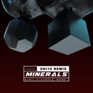
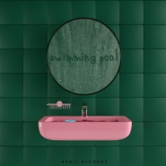
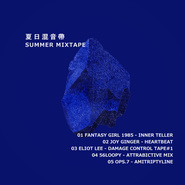
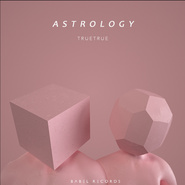

Babel Records
============================

|  |  |
| :--: | :-- |
| [ Babel Records](https://i.xiami.com/babelrecords) | **播放数**: 10361593 **粉丝数**: 3474 **评论数**: 130 **地区**: China 中国大陆 **风格**: 未来车库舞曲 Future Garage, 当代节奏布鲁斯 Contemporary R&B  |

## 档案

中 國 未 來 之 聲

## 专辑

| 名称 | 语种 | 唱片公司 | 发行时间 | 专辑类别 | 专辑风格 |
| :--: | :-- | :-- | :-- | :-- | :-- |
| [ Urban Diving](./albums/5021345176.md) | 其他 | 华宇世博 | 2020年08月19日 | 录音室专辑 | 电子乐 Electronica |
| [ Mandragora(小黑mk remix)](./albums/2420412135.md) | 国语 | Babel Records | 2020年03月06日 | EP, 单曲 | 当代节奏布鲁斯 Contemporary R&B |
| [ 鼠年·安康](./albums/2105779718.md) | 国语 | Babel Records | 2020年01月25日 | 录音室专辑 | 电子 Electronic |
| [ ZHI16 - ILLUSION](./albums/2105471237.md) | 英语 | Babel Records | 2019年11月28日 | EP, 单曲 | 电子 Electronic |
| [ 夏日宾馆VOL.2](./albums/2105156753.md) | 国语 | Babel Records | 2019年08月16日 | 录音室专辑 | 都市音乐 Urban, 电子 Electronic |
| [ PACKAGE BOX VOL.1:TOYS](./albums/2104976141.md) | 英语 | Babel Records | 2019年07月10日 | EP, 单曲 | 未来贝斯 Future Bass, 电子 Electronic, 未来浩室 Future House |
| [ ALCHEMY](./albums/2104963016.md) | 国语 | StreetVoice, Babel Records | 2019年07月02日 | 录音室专辑 |  |
| [ Minerals(CalvoMusic Club Edit)](./albums/2104853935.md) | 英语 | Babel Records | 2019年05月10日 | EP, 单曲 | 电子 Electronic |
| [ LOVE IS MEDICINE](./albums/2104811176.md) | 英语 | Babel Records | 2019年05月02日 | EP, 单曲 | 未来流行 Futurepop, 电子 Electronic |
| [ Minerals（ZHI16 Remix）](./albums/2104794779.md) | 英语 | Babel Records | 2019年04月23日 | EP, 单曲 | 电子乐 Electronica, 未来流行 Futurepop |
| [ Minerals](./albums/2104721772.md) | 国语 | StreetVoice, Babel Records | 2019年03月28日 | EP, 单曲 | 电子乐 Electronica |
| [ Night Call](./albums/2104592383.md) | 纯音乐 | Babel Records | 2019年02月14日 | EP, 单曲 | 都市流行 City Pop, 未来流行 Futurepop |
| [ Best Behavior](./albums/2104423649.md) | 英语 | StreetVoice, Babel Records | 2018年12月29日 | EP, 单曲 | 电子乐 Electronica |
| [ Fragrance Of Memory](./albums/2104194812.md) | 国语 | Babel Records | 2018年11月15日 | 录音室专辑 | 电子乐 Electronica, 弛放 Chillout |
| [ Mind Control (Remixes)](./albums/2104028315.md) | 英语 | Babel Records | 2018年09月18日 | EP, 单曲 | 电子乐 Electronica |
| [ Mind Control](./albums/2103936029.md) | 英语 | AME Entertainment, Babel Records | 2018年08月19日 | EP, 单曲 | 电子 Electronic |
| [ Bay Sea Hill](./albums/2103754247.md) | 国语 | StreetVoice, Babel Records | 2018年06月23日 | 合集, 杂锦 | 弛放 Chillout, 未来流行 Futurepop, 新灵魂乐 Neo-Soul |
| [ 回到范特西](./albums/2103537706.md) | 国语 | Babel Records | 2018年02月18日 | 合集, 杂锦 | 国语流行 Mandarin Pop |
| [ Electric Love](./albums/2103523290.md) | 国语 | Babel Records | 2018年02月12日 | EP, 单曲 | 国语流行 Mandarin Pop, 电音流行 Electropop |
| [ LOVE IS ILLUSION](./albums/2102873641.md) | 英语 | StreetVoice, Babel Records | 2017年10月18日 | EP, 单曲 | 另类节奏布鲁斯 Alternative R&B, 未来车库舞曲 Future Garage |
| [ Swimming Pool](./albums/2102849940.md) | 国语 | StreetVoice, Babel Records | 2017年09月04日 | 合集, 杂锦 | 独立电子乐 Indietronica, 另类节奏布鲁斯 Alternative R&B, 新灵魂乐 Neo-Soul |
| [ 夏日混音带](./albums/2102801378.md) | 国语 | Babel Records | 2017年07月22日 | 合集, 杂锦 | 当代节奏布鲁斯 Contemporary R&B, 新灵魂乐 Neo-Soul |
| [ ASTROLOGY](./albums/2102795907.md) | 英语 | Babel Records | 2017年07月16日 | EP, 单曲 | 艺术流行 Art Pop, 当代节奏布鲁斯 Contemporary R&B, 合成器流行 Synthpop |
| [ 人间指南](./albums/2102735956.md) | 国语 | Babel Records | 2017年04月24日 | 录音室专辑 | 新灵魂乐 Neo-Soul, 另类节奏布鲁斯 Alternative R&B, 未来车库舞曲 Future Garage |
| [ Before Midnight](./albums/2102692304.md) | 英语 | Babel Records | 2017年02月12日 | 合集, 杂锦 |  |
| [ Santa Express](./albums/2102672003.md) | 国语 | Fantasy Girl 1985, Babel Records | 2016年12月25日 | 合集, 杂锦 | 放克电子 Electro (Electro-Funk) |
| [ 夏日宾馆](./albums/2100371110.md) | 国语 | Babel Records | 2016年07月22日 | 合集, 杂锦 | 当代节奏布鲁斯 Contemporary R&B, 电子 Electronic |

## 评论

|  |  |  |  |
| :-- | :-- | :-- | :-- |
|  [虾米用户](https://emumo.xiami.com/u/335973529) 爱是永不止息。 2020-11-15 23:27 赞(0) 踩(0) | 
不错
 |
|  [虾米用户](https://emumo.xiami.com/u/9062060) 此生没拿一个亿来爱虾米是... 2020-10-09 20:57 赞(0) 踩(0) | 

 |
|  [虾米用户](https://emumo.xiami.com/u/6404176)  2020-01-05 15:33 赞(0) 踩(0) | 
留下脚印
 |
|  [虾米用户](https://emumo.xiami.com/u/42810132) Aprés l'amou... 2019-09-03 23:51 赞(0) 踩(0) | 
都是我到不了的地方（阿那亚这地名 ）
 |
|  [虾米用户](https://emumo.xiami.com/u/318096545) 我还没想好要写什么... 2019-08-16 21:45 赞(0) 踩(0) | 
欢迎欢迎好听
 |
|  [虾米用户](https://emumo.xiami.com/u/230803304) 三观正又爱国的成都宝藏男... 2019-05-05 20:25 赞(0) 踩(0) | 
支持一下少年新单曲
 |
|  [虾米用户](https://emumo.xiami.com/u/325374787)  2019-03-26 20:31 赞(1) 踩(0) | 
好玩
 |
|  [虾米用户](https://emumo.xiami.com/u/11017456) i only wanna... 2019-01-31 17:05 赞(0) 踩(0) | 
一群牛逼的人
 |
| ⇒ |  [虾米用户](https://emumo.xiami.com/u/325374787)  2019-03-26 20:32 赞(0) 踩(0) | 
你也很牛的
 |
|  [虾米用户](https://emumo.xiami.com/u/49640493) 网易云SAINTDONT... 2018-12-24 08:37 赞(1) 踩(0) | 
_
 |
| ⇒ |  [虾米用户](https://emumo.xiami.com/u/409851959)  2018-12-25 11:55 赞(0) 踩(0) | 
5
 |
|  [虾米用户](https://emumo.xiami.com/u/379005787)  2018-11-13 11:45 赞(0) 踩(0) | 
音乐制作人 编曲人 ~ 很不错
 |
|  [虾米用户](https://emumo.xiami.com/u/269536445) feel the bea... 2018-11-09 16:08 赞(1) 踩(0) | 
因为你 入了电音的坑
 |
|  [虾米用户](https://emumo.xiami.com/u/12230374) Pinkfloydzh，... 2018-10-04 16:35 赞(0) 踩(0) | 
厉害！
 |
| ⇒ |  [虾米用户](https://emumo.xiami.com/u/409851959)  2018-12-25 11:54 赞(0) 踩(0) | 
9
 |
|  [虾米用户](https://emumo.xiami.com/u/1320669) ツ 2018-09-19 21:46 赞(0) 踩(0) | 
0.0
 |
|  [虾米用户](https://emumo.xiami.com/u/2710484)  2018-09-19 19:58 赞(3) 踩(0) | 
好厉害！还以为是欧美的什么新团体~
 |
|  [虾米用户](https://emumo.xiami.com/u/120657184) 愿你不再孤单， 2018-09-19 19:15 赞(0) 踩(0) | 
酷
 |
|  [虾米用户](https://emumo.xiami.com/u/121910914) 我想好好睡个觉 2018-09-10 09:16 赞(0) 踩(0) | 
i
 |
|  [虾米用户](https://emumo.xiami.com/u/324879742)   2018-08-20 14:13 赞(0) 踩(0) | 
.
 |
|  [虾米用户](https://emumo.xiami.com/u/16337726)  2018-08-15 17:38 赞(0) 踩(0) | 
:)
 |
|  [虾米用户](https://emumo.xiami.com/u/42936819) 网易云搜索恶法lex i... 2018-06-25 13:27 赞(0) 踩(0) | 

 |
|  [虾米用户](https://emumo.xiami.com/u/314628056) 您拨打的电话已注销 2018-04-30 18:32 赞(3) 踩(0) | 
中国电音交给您了大佬也要向您退让三分
 |
|  [虾米用户](https://emumo.xiami.com/u/20177386) 感谢一切美好的遇见❤️ 2018-04-30 14:25 赞(1) 踩(0) | 

 |
|  [虾米用户](https://emumo.xiami.com/u/71178106) 塵世や 酒、風呂を抜け ... 2018-04-11 12:36 赞(1) 踩(0) | 
♡
 |
|  [虾米用户](https://emumo.xiami.com/u/39954947) 我们是保守同一个秘密的两... 2018-03-09 00:09 赞(0) 踩(0) | 
哇
 |
|  [虾米用户](https://emumo.xiami.com/u/322166210) ☕️ 2018-02-19 23:50 赞(0) 踩(0) | 
正
 |
|  [虾米用户](https://emumo.xiami.com/u/9513422) 虾米歌单迁徙到网易☁️:... 2018-02-19 02:25 赞(0) 踩(0) | 
集万千宠爱于一身
 |
|  [虾米用户](https://emumo.xiami.com/u/3570291)   2018-02-14 08:59 赞(0) 踩(0) | 
cool
 |
|  [虾米用户](https://emumo.xiami.com/u/312894132)  2018-02-13 19:17 赞(0) 踩(0) | 
期待情人节特辑 (如果有的话)
 |
|  [虾米用户](https://emumo.xiami.com/u/5493286) 。 2018-02-12 19:06 赞(0) 踩(0) | 
才发现有了主页
 |
|  [虾米用户](https://emumo.xiami.com/u/1115247) @Nebula_7293 2018-02-12 00:11 赞(0) 踩(0) | 

 |
|  [虾米用户](https://emumo.xiami.com/u/6965583) 人體穿刺師° 2018-01-12 20:24 赞(0) 踩(0) | 
可以的耶， ~
 |
|  [虾米用户](https://emumo.xiami.com/u/20147189) 嘘 2018-01-10 04:26 赞(0) 踩(0) | 
cool
 |
|  [虾米用户](https://emumo.xiami.com/u/312894132)  2017-12-25 13:35 赞(2) 踩(0) | 
今年圣诞特辑还有吗。。。
 |
| ⇒ |  [虾米用户](https://emumo.xiami.com/u/287986268) 中国未来之声 2017-12-26 12:46 赞(0) 踩(0) | 
等等情人节吧 
 |
|  [虾米用户](https://emumo.xiami.com/u/32314395) 干嘛 看什么看 2017-12-20 02:20 赞(0) 踩(0) | 
蛮可爱的
 |
|  [虾米用户](https://emumo.xiami.com/u/52323406)  2017-12-16 00:12 赞(0) 踩(0) | 
很享受
 |
|  [虾米用户](https://emumo.xiami.com/u/13825842) 頭像即本人 2017-11-13 15:08 赞(1) 踩(0) | 
酷
 |
|  [虾米用户](https://emumo.xiami.com/u/8402567) 再见 2017-10-26 23:09 赞(0) 踩(0) | 

 |
|  [虾米用户](https://emumo.xiami.com/u/2768175)  2017-10-21 10:04 赞(0) 踩(0) | 
国内强音
 |
|  [虾米用户](https://emumo.xiami.com/u/68262512) 我还没想好要写什么... 2017-10-20 21:18 赞(0) 踩(0) | 

 |
|  [虾米用户](https://emumo.xiami.com/u/103747144)  2017-10-19 18:22 赞(0) 踩(0) | 
爱爱
 |
|  [虾米用户](https://emumo.xiami.com/u/35553196) Confusion. 2017-10-18 22:23 赞(0) 踩(0) | 
如痴如醉
 |
|  [虾米用户](https://emumo.xiami.com/u/66823378)  2017-10-18 20:55 赞(0) 踩(0) | 

 |
|  [虾米用户](https://emumo.xiami.com/u/40615951)   2017-10-18 15:56 赞(1) 踩(0) | 
再来成都
 |
|  [虾米用户](https://emumo.xiami.com/u/52682108) 我还没想好要写什么... 2017-10-18 13:38 赞(0) 踩(0) | 
❤
 |
|  [虾米用户](https://emumo.xiami.com/u/285085100) ‍ 2017-10-18 12:29 赞(1) 踩(0) | 
​
 |
|  [虾米用户](https://emumo.xiami.com/u/9028760) 豆瓣见 spotify ... 2017-10-18 11:05 赞(0) 踩(0) | 
◡̈⃝♡
 |
|  [虾米用户](https://emumo.xiami.com/u/209070400) 滚 2017-10-08 19:34 赞(0) 踩(0) | 
来苏州或者上海吧！
 |
|  [虾米用户](https://emumo.xiami.com/u/22703223)  2017-09-28 06:59 赞(0) 踩(0) | 
ԅ(≖‿≖ԅ)
 |
|  [虾米用户](https://emumo.xiami.com/u/15477519) 爱  是生命的和弦，而不... 2017-09-26 10:23 赞(1) 踩(0) | 

 |
|  [虾米用户](https://emumo.xiami.com/u/318389463) 我永远忠于蓝色 2017-09-13 10:44 赞(0) 踩(0) | 
♡
 |
|  [虾米用户](https://emumo.xiami.com/u/9062060) 此生没拿一个亿来爱虾米是... 2017-09-11 21:34 赞(0) 踩(0) | 

 |
|  [虾米用户](https://emumo.xiami.com/u/11028741) 我还没想好要写什么... 2017-09-11 18:22 赞(0) 踩(0) | 

 |
|  [虾米用户](https://emumo.xiami.com/u/10215459)  2017-09-10 12:55 赞(0) 踩(0) | 
惊艳
 |
|  [虾米用户](https://emumo.xiami.com/u/31822672) 我还没想好要写什么... 2017-09-09 00:41 赞(0) 踩(0) | 
天哪 爱死了
 |
|  [虾米用户](https://emumo.xiami.com/u/515489) 我还没想好要写什么... 2017-09-05 23:30 赞(1) 踩(0) | 
一口气听了6张专辑
 |
| ⇒ |  [虾米用户](https://emumo.xiami.com/u/287986268) 中国未来之声 2017-09-06 00:32 赞(0) 踩(0) | 

 |
|  [虾米用户](https://emumo.xiami.com/u/6684451)  2017-09-05 18:44 赞(0) 踩(0) | 
好棒～加油加油
 |
|  [虾米用户](https://emumo.xiami.com/u/53712312) ⠀ 2017-09-05 00:35 赞(0) 踩(0) | 
&amp;middot;
 |
|  [虾米用户](https://emumo.xiami.com/u/209070400) 滚 2017-09-04 18:48 赞(0) 踩(0) | 
支持喔!
 |
|  [虾米用户](https://emumo.xiami.com/u/230645092) 我还没！ 2017-09-04 17:11 赞(0) 踩(0) | 
狙击⬇️!
 |
|  [虾米用户](https://emumo.xiami.com/u/22444238) 邱比官方虾米 2017-09-04 17:10 赞(4) 踩(0) | 
Get
 |
|  [虾米用户](https://emumo.xiami.com/u/11856207) 水泥中的蝴蝶之谜 2017-09-04 15:26 赞(0) 踩(0) | 
，
 |
|  [虾米用户](https://emumo.xiami.com/u/74891292)  2017-09-04 11:59 赞(0) 踩(0) | 
满满的爱和幸福
 |
|  [虾米用户](https://emumo.xiami.com/u/36232603)           冲 ... 2017-09-04 00:58 赞(0) 踩(0) | 
迷
 |
|  [虾米用户](https://emumo.xiami.com/u/13111079) 有缘再见 2017-09-04 00:15 赞(0) 踩(0) | 
(⁎⁍̴̛ᴗ⁍̴̛⁎)
 |
|  [虾米用户](https://emumo.xiami.com/u/285085100) ‍ 2017-08-11 16:34 赞(2) 踩(0) | 
&amp;zwj;
 |
|  [虾米用户](https://emumo.xiami.com/u/2418238) weibo: @尤米口 2017-08-05 00:11 赞(1) 踩(0) | 
♡⃛
 |
|  [虾米用户](https://emumo.xiami.com/u/312894132)  2017-07-26 17:40 赞(1) 踩(0) | 
什么时候再来成都啊
 |
|  [虾米用户](https://emumo.xiami.com/u/8094301) Bye bye wx n... 2017-07-24 17:19 赞(0) 踩(0) | 
嘻
 |
|  [虾米用户](https://emumo.xiami.com/u/264283064) bye  2017-07-19 15:48 赞(0) 踩(0) | 
△
 |
|  [虾米用户](https://emumo.xiami.com/u/268340271) 我还没想好要写什么... 2017-07-17 08:16 赞(0) 踩(0) | 
欣赏欣赏
 |
|  [虾米用户](https://emumo.xiami.com/u/45501065) 基围虾 2017-07-04 22:20 赞(0) 踩(0) | 
gin
 |
|  [虾米用户](https://emumo.xiami.com/u/46758368)   2017-06-11 11:53 赞(0) 踩(0) | 

 |
|  [虾米用户](https://emumo.xiami.com/u/25815015) 我还没想好要写什么... 2017-06-08 17:11 赞(0) 踩(0) | 
a
 |
|  [虾米用户](https://emumo.xiami.com/u/17146554) weibo：@L1RRO... 2017-06-02 09:40 赞(0) 踩(0) | 

 |
|  [虾米用户](https://emumo.xiami.com/u/3817709) 电视柜音乐人 2017-05-26 01:11 赞(0) 踩(0) | 
北京票哪买
 |
| ⇒ |  [虾米用户](https://emumo.xiami.com/u/287986268) 中国未来之声 2017-05-26 03:24 赞(0) 踩(0) | 
秀动
 |
| ⇒ |  [虾米用户](https://emumo.xiami.com/u/3817709) 电视柜音乐人 2017-05-27 17:01 赞(0) 踩(0) | 
<q><b>BabelRecords说：</b></q>
 |
|  [虾米用户](https://emumo.xiami.com/u/36673521) a shi sou r ... 2017-05-24 23:05 赞(3) 踩(0) | 
青岛居然取消了&amp;hellip;动车票都买好了
 |
| ⇒ |  [虾米用户](https://emumo.xiami.com/u/287986268) 中国未来之声 2017-05-25 03:06 赞(0) 踩(0) | 
其他城市免费给你留票
 |
| ⇒ |  [虾米用户](https://emumo.xiami.com/u/36673521) a shi sou r ... 2019-09-07 16:15 赞(0) 踩(0) | 
终于！！今晚见
 |
|  [虾米用户](https://emumo.xiami.com/u/5118264) Stop Talking... 2017-05-19 23:03 赞(0) 踩(0) | 
超Nice 
 |
|  [虾米用户](https://emumo.xiami.com/u/50093825) 。 2017-05-17 17:28 赞(0) 踩(0) | 
: )
 |
|  [虾米用户](https://emumo.xiami.com/u/1115247) @Nebula_7293 2017-05-17 00:43 赞(0) 踩(0) | 
为什么不来重庆
 |
| ⇒ |  [虾米用户](https://emumo.xiami.com/u/287986268) 中国未来之声 2017-05-17 00:51 赞(0) 踩(0) | 
场地满了 
 |
| ⇒ |  [虾米用户](https://emumo.xiami.com/u/1115247) @Nebula_7293 2017-05-20 17:22 赞(0) 踩(0) | 
<q><b>BabelRecords说：</b></q>
 |
|  [虾米用户](https://emumo.xiami.com/u/8424657) 海岸线 2017-05-06 22:59 赞(0) 踩(0) | 
.
 |
|  [虾米用户](https://emumo.xiami.com/u/1115247) @Nebula_7293 2017-05-01 15:13 赞(0) 踩(0) | 
&amp;radic;
 |
|  [虾米用户](https://emumo.xiami.com/u/2883292) 嘣嘣蹦。 2017-04-30 13:53 赞(0) 踩(0) | 
太酷啦！
 |
|  [虾米用户](https://emumo.xiami.com/u/45385073) 爱虾米期待再相遇为新：t... 2017-04-29 13:45 赞(0) 踩(0) | 
阿
 |
|  [虾米用户](https://emumo.xiami.com/u/45052758) 我还没想好要写什么... 2017-04-27 01:02 赞(0) 踩(0) | 
[带墨镜笑]
 |
|  [虾米用户](https://emumo.xiami.com/u/8402567) 再见 2017-04-27 00:40 赞(0) 踩(0) | 
你真的酷
 |
|  [虾米用户](https://emumo.xiami.com/u/85148548)  2017-04-26 22:12 赞(0) 踩(0) | 
❤️
 |
|  [虾米用户](https://emumo.xiami.com/u/8402567) 再见 2017-04-26 20:00 赞(0) 踩(0) | 

 |
|  [虾米用户](https://emumo.xiami.com/u/18169133) 停用个人功能.仅上传音乐... 2017-04-26 09:24 赞(0) 踩(0) | 
！
 |
|  [虾米用户](https://emumo.xiami.com/u/34442981) 夜月明· 2017-04-26 08:34 赞(0) 踩(0) | 
很好听，加油！
 |
|  [虾米用户](https://emumo.xiami.com/u/209070400) 滚 2017-04-26 07:17 赞(0) 踩(0) | 
好
 |
|  [虾米用户](https://emumo.xiami.com/u/6497319)   2017-04-25 20:21 赞(0) 踩(0) | 
音乐很棒啊！
 |
|  [虾米用户](https://emumo.xiami.com/u/156056836) 我还没想好要写什么... 2017-04-25 16:20 赞(0) 踩(0) | 
嗯
 |
|  [虾米用户](https://emumo.xiami.com/u/8402567) 再见 2017-04-25 15:50 赞(0) 踩(0) | 
好事
 |
|  [虾米用户](https://emumo.xiami.com/u/8675881) Quid pro quo... 2017-04-25 15:23 赞(0) 踩(0) | 
敲棒！5.6Loopy见！
 |
|  [虾米用户](https://emumo.xiami.com/u/18151836) 孤獨又兇 2017-04-25 03:33 赞(0) 踩(0) | 
甜甜甜
 |
|  [虾米用户](https://emumo.xiami.com/u/282570949)  2017-04-24 23:53 赞(0) 踩(0) | 
第一次听，很喜欢你的音乐，只是我觉得中国音乐人叫中国名会更牛
 |
| ⇒ |  [虾米用户](https://emumo.xiami.com/u/48373788) 模仿他人无异于自杀。 2017-04-25 14:17 赞(0) 踩(0) | 
哈哈哈哈哈哈哈哈哈哈
 |
|  [虾米用户](https://emumo.xiami.com/u/221479569) YM 2017-04-24 22:03 赞(0) 踩(0) | 
Thanks for sharing
 |
|  [虾米用户](https://emumo.xiami.com/u/48276337) 22世纪不道德 2017-04-24 19:34 赞(0) 踩(0) | 

 |
|  [虾米用户](https://emumo.xiami.com/u/11565835) 看来你品味也不怎么样 2017-04-24 19:22 赞(0) 踩(0) | 
什么陈咬金
 |
|  [虾米用户](https://emumo.xiami.com/u/1886908) 无用少年感，废物赤子心。 2017-04-24 16:57 赞(0) 踩(0) | 
好听死了！听完想去豆瓣标记发现没有，看了一下原来是今天首发&amp;hellip;&amp;hellip;
 |
|  [虾米用户](https://emumo.xiami.com/u/12818323) SO 2017-04-24 15:06 赞(0) 踩(0) | 
在国内，这么纯正的电子迪斯科，【人间指南】这张专辑算是第一张吧，我听过的，
 |
|  [虾米用户](https://emumo.xiami.com/u/704779) ( ͡° ͜ʖ ͡° ২ 2017-04-24 14:13 赞(0) 踩(0) | 
牛逼
 |
|  [虾米用户](https://emumo.xiami.com/u/3815293) baby Jesus s... 2017-04-24 12:52 赞(0) 踩(0) | 

 |
|  [虾米用户](https://emumo.xiami.com/u/9028760) 豆瓣见 spotify ... 2017-04-24 12:12 赞(0) 踩(0) | 
⚋̤̫⃝
 |
|  [虾米用户](https://emumo.xiami.com/u/5530113)   2017-04-24 12:02 赞(0) 踩(0) | 

 |
|  [虾米用户](https://emumo.xiami.com/u/36208991)   2017-04-24 00:50 赞(0) 踩(0) | 
喵
 |
|  [虾米用户](https://emumo.xiami.com/u/205282606) 渐 入 佳 境 2017-04-16 11:46 赞(0) 踩(0) | 
终于找到组织了啊～
 |
|  [虾米用户](https://emumo.xiami.com/u/10944859) ‏‏‏‏‏‏‏‏ 2017-04-15 09:29 赞(0) 踩(0) | 
泥猴
 |
|  [虾米用户](https://emumo.xiami.com/u/42725114) ThistheshitI... 2017-04-14 18:39 赞(0) 踩(0) | 

 |
|  [虾米用户](https://emumo.xiami.com/u/36673521) a shi sou r ... 2017-04-13 21:29 赞(0) 踩(0) | 
？？一天前
 |
|  [虾米用户](https://emumo.xiami.com/u/287986268) 中国未来之声 2017-04-12 16:15 赞(51) 踩(0) | 
我刚入驻了虾米音乐人，欢迎大家来我的个人主页，收听我的最新音乐
 |
| ⇒ |  [虾米用户](https://emumo.xiami.com/u/17330125) 想象音乐的另一种可能 2017-04-12 16:55 赞(0) 踩(0) | 
欢迎欢迎~
 |
| ⇒ |  [虾米用户](https://emumo.xiami.com/u/229490650) 就像他在游戏中所追求的排... 2017-05-01 19:24 赞(0) 踩(0) | 
欢迎啊，喜欢你的风格。
 |
| ⇒ |  [虾米用户](https://emumo.xiami.com/u/46329562) If a song co... 2017-05-08 09:27 赞(0) 踩(0) | 
超级心水你们
 |
| ⇒ |  [虾米用户](https://emumo.xiami.com/u/33717830) 天生神经质 & 2017-06-12 08:54 赞(0) 踩(0) | 
大哥哪里人？
 |
| ⇒ |  [虾米用户](https://emumo.xiami.com/u/287986268) 中国未来之声 2017-07-04 21:37 赞(0) 踩(0) | 
<q><b>不看红绿灯说：</b></q>
 |
| ⇒ |  [虾米用户](https://emumo.xiami.com/u/33717830) 天生神经质 & 2017-07-04 23:53 赞(0) 踩(0) | 
<q><b>BabelRecords说：</b></q>
 |
| ⇒ |  [虾米用户](https://emumo.xiami.com/u/182341948)  2017-10-20 19:02 赞(0) 踩(0) | 
真心不错
 |
| ⇒ |  [虾米用户](https://emumo.xiami.com/u/32405675) 在美丽和怪诞的边缘 2017-11-03 14:33 赞(0) 踩(0) | 
棒
 |
