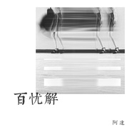
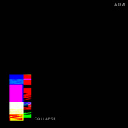

颜阿达Ada
============================

|  |  |
| :--: | :-- |
| [ 颜阿达Ada](https://i.xiami.com/ada) | **地区**: China 中国大陆 **风格**: 氛围音乐 Ambient, 自然采样 Field Recordings, 实验音乐 Experimental, 极简潮 Minimal Wave, 实验电子 Experimental Electronic **播放数**: 7549525 **粉丝数**: 441 **评论数**: 29  |

## 档案

## 专辑

| 名称 | 语种 | 唱片公司 | 发行时间 | 专辑类别 | 专辑风格 |
| :--: | :-- | :-- | :-- | :-- | :-- |
| [ Folding Shanghai](./albums/2104325027.md) | 其他 |  | 2018年12月05日 | EP, 单曲 | 氛围音乐 Ambient |
| [ 变身变变变“美图变身节”主题曲](./albums/2103795249.md) | 国语 | 独立发行 | 2018年07月11日 | EP, 单曲 | 流行 Pop |
| [ 百忧解](./albums/2103754436.md) | 国语 | 独立发行 | 2018年06月23日 | EP, 单曲 | 实验电子 Experimental Electronic, 自然采样 Field Recordings, 诵读音乐 Spoken Word |
| [ 坍塌COLLAPSE](./albums/2103754284.md) | 其他 | 独立发行 | 2018年06月22日 | EP, 单曲 | 自然采样 Field Recordings, 实验音乐 Experimental, 实验电子 Experimental Electronic |
| [ 银河漫游指南（1969-2018）](./albums/2103738671.md) | 其他 | 独立发行 | 2018年06月07日 | EP, 单曲 | 氛围音乐 Ambient |
| [ 父亲写的散文诗](./albums/2102734715.md) | 国语 | 独立发行 | 2017年04月18日 | EP, 单曲 | 国语流行 Mandarin Pop |
| [ 钟鸣万合天宜大电影《最后的我来也》片尾曲](./albums/2102734759.md) | 国语 | 独立发行 | 2017年01月02日 | EP, 单曲 | 国语流行 Mandarin Pop |
| [ 三shane街](./albums/2102734710.md) | 国语 | 独立发行 | 2015年10月03日 | 录音室专辑 | 国语流行 Mandarin Pop |
| [ 颜阿达Ada的专辑](./albums/5022637026.md) | 其他 |  | 不详 |  |  |

## 评论

|  |  |  |
| :-- | :-- | :-- |
|  [虾米用户](https://emumo.xiami.com/u/358104299) 悲观的唯心存在现实解构虚... 2020-11-21 06:21 赞(1) 踩(0) | 
42087
 |
|  [虾米用户](https://emumo.xiami.com/u/410102579)  2020-08-30 22:46 赞(0) 踩(0) | 
我的天，这是10岁孩子唱的？真是厉害啊
 |
|  [虾米用户](https://emumo.xiami.com/u/444137506)  2020-07-15 21:05 赞(0) 踩(0) | 
  
 |
|  [虾米用户](https://emumo.xiami.com/u/420552179)  2020-06-25 01:25 赞(0) 踩(0) | 
晕 我也是5月9号的
 |
|  [虾米用户](https://emumo.xiami.com/u/442593170) 算不尽芸芸众微贱命，回头... 2020-06-02 22:53 赞(0) 踩(0) | 
呀呀呀
 |
|  [虾米用户](https://emumo.xiami.com/u/25153156) 那是我们的都回去不的从前... 2020-03-04 13:04 赞(0) 踩(0) | 
听你的音乐已经三年了，继续...
 |
|  [虾米用户](https://emumo.xiami.com/u/244083199)  2020-01-04 00:21 赞(0) 踩(0) | 
虾米上最喜欢听的歌手
 |
|  [虾米用户](https://emumo.xiami.com/u/337488050) 我还没想好要写什么... 2019-08-26 10:02 赞(1) 踩(0) | 
10后不到十岁？
 |
|  [虾米用户](https://emumo.xiami.com/u/246573200) 活得像个人样 2019-06-30 06:53 赞(0) 踩(0) | 
10后的姑娘。 江山代有才人出 
 |
|  [虾米用户](https://emumo.xiami.com/u/355648744)  2019-05-12 20:25 赞(3) 踩(0) | 
宝藏女孩
 |
|  [虾米用户](https://emumo.xiami.com/u/333442934)  2019-02-04 13:14 赞(0) 踩(0) | 
很舒服
 |
|  [虾米用户](https://emumo.xiami.com/u/244083199)  2018-12-31 12:30 赞(0) 踩(0) | 
真好听，随机听到惊艳了我。
 |
|  [虾米用户](https://emumo.xiami.com/u/99168462) 再见虾米 2018-12-17 23:44 赞(0) 踩(0) | 
好听。
 |
|  [虾米用户](https://emumo.xiami.com/u/343695473) 当浮一大白 2018-10-24 13:46 赞(2) 踩(0) | 
小姐姐的安河桥超级好听
 |
|  [虾米用户](https://emumo.xiami.com/u/335953733)   2018-07-27 19:28 赞(0) 踩(0) | 
很喜欢你的声音！如果有机会来日内瓦玩记得找我，我请客 
 |
|  [虾米用户](https://emumo.xiami.com/u/42936819) 网易云搜索恶法lex i... 2018-07-15 22:14 赞(1) 踩(0) | 

 |
|  [虾米用户](https://emumo.xiami.com/u/1768818) 爱你爱我 2018-03-30 02:10 赞(0) 踩(0) | 
期待新歌
 |
|  [虾米用户](https://emumo.xiami.com/u/340725399) 给我一支兰州 2017-12-22 20:53 赞(1) 踩(0) | 
有故事的小女生！声音好听！
 |
|  [虾米用户](https://emumo.xiami.com/u/280045918)  2017-10-04 09:08 赞(3) 踩(0) | 
声音配上安和桥真的好安静
 |
|  [虾米用户](https://emumo.xiami.com/u/43992624)  2017-09-25 22:19 赞(0) 踩(0) | 
期待新的cover
 |
|  [虾米用户](https://emumo.xiami.com/u/247107147)  2017-07-05 14:02 赞(1) 踩(0) | 
不错不错
 |
|  [虾米用户](https://emumo.xiami.com/u/304533605)  2017-06-18 21:14 赞(0) 踩(0) | 
好声音
 |
|  [虾米用户](https://emumo.xiami.com/u/278397057)  2017-06-13 10:48 赞(0) 踩(0) | 
好好听，很喜欢你的声音啊 
 |
|  [虾米用户](https://emumo.xiami.com/u/282152733)   2017-05-30 11:40 赞(0) 踩(0) | 
好听
 |
|  [虾米用户](https://emumo.xiami.com/u/179576100)  2017-05-23 10:56 赞(1) 踩(0) | 
声音不错，加油
 |
|  [虾米用户](https://emumo.xiami.com/u/263615141) 春风再美也比不上你的笑 2017-05-17 08:45 赞(0) 踩(0) | 

 |
|  [虾米用户](https://emumo.xiami.com/u/275435943)  2017-04-23 09:48 赞(0) 踩(0) | 
好呀好呀
 |
|  [虾米用户](https://emumo.xiami.com/u/49423107) 普通女士。 2017-04-19 16:43 赞(20) 踩(0) | 
我刚入驻了虾米音乐人，欢迎大家来我的个人主页，收听我的最新音乐
 |
| ⇒ |  [虾米用户](https://emumo.xiami.com/u/356083514) 谁共我醉明月。 2020-03-21 14:51 赞(0) 踩(0) | 
唱的不错。
 |
