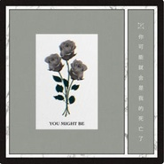

Lulu
============================

|  |  |
| :--: | :-- |
| [ Lulu](https://i.xiami.com/lulushouse) | **地区**: China 中国大陆 **风格**: 陷阱舞曲 Trap, 电子 Electronic **播放数**: 989883 **粉丝数**: 86 **评论数**: 6  |

## 档案

## 专辑

| 名称 | 语种 | 唱片公司 | 发行时间 | 专辑类别 | 专辑风格 |
| :--: | :-- | :-- | :-- | :-- | :-- |
| [ You Might Be ft.Lils (Lulu Remix)](./albums/2102861217.md) | 英语 | 独立发行 | 2017年06月25日 | EP, 单曲 | 电子 Electronic |

## 评论

|  |  |  |
| :-- | :-- | :-- |
|  [虾米用户](https://emumo.xiami.com/u/12018084)   2017-06-15 15:04 赞(0) 踩(0) | 
あ
 |
|  [虾米用户](https://emumo.xiami.com/u/62033612) 你慢慢聽，我漫漫做 2017-05-19 19:44 赞(0) 踩(0) | 
cool
 |
|  [虾米用户](https://emumo.xiami.com/u/70596582) how much i v... 2017-05-19 10:57 赞(0) 踩(0) | 
。
 |
|  [虾米用户](https://emumo.xiami.com/u/9888358)  2017-05-14 18:45 赞(0) 踩(0) | 
。
 |
|  [虾米用户](https://emumo.xiami.com/u/291758883) 我还没想好要写什么... 2017-04-28 12:16 赞(2) 踩(0) | 
我刚入驻了虾米音乐人，欢迎大家来我的个人主页，收听我的最新音乐
 |
| ⇒ |  [虾米用户](https://emumo.xiami.com/u/11223648) Enjoy music，... 2019-04-21 14:29 赞(0) 踩(0) | 
Hello
 |
