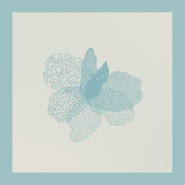

Sihan
============================

|  |  |
| :--: | :-- |
| [ Sihan](https://i.xiami.com/sihan) | **播放数**: 3241577 **粉丝数**: 1475 **评论数**: 55 **地区**: China 中国大陆 **风格**: 流行 Pop, 流行舞曲 Dance-Pop, 电子 Electronic  |

## 档案

Sihan，新生代电子音乐制作人，DJ。16岁被伯克利音乐学院破格提前录取，并于20岁完成全部学业毕业归国。 
Sihan在电子乐、流行制作、爵士作曲等领域均达到精通的水准，擅长将国际顶尖制作理念与中文词曲相结合，形成了鲜明的个人风格。2017年，Sihan以制作人身份发行的首支单曲《窒息》各平台播放量突破600万，获得国际知名唱片公司Spinnin Records、Armada Music等认可。其作品被专业乐评人誉为Billboard质量的国人单曲、华语情歌的未来方向、充满想象力的听觉盛宴。 
2018年经历了与VOGUE、ELLE、Miu Miu、Sephora等时尚品牌的合作后，Sihan在不断的艺术尝试中将其极具标志性与高级感的个人风格推向新的巅峰，希望早日带来真正具有国际影响力的作品。

## 专辑

| 名称 | 语种 | 唱片公司 | 发行时间 | 专辑类别 | 专辑风格 |
| :--: | :-- | :-- | :-- | :-- | :-- |
| [ Adore You (Endless Remix)](./albums/5022096101.md) | 英语 | EMI | 2020年12月03日 | EP, 单曲 | 流行 Pop |
| [ See You Later](./albums/2105250730.md) | 英语 | 华研国际 | 2019年09月16日 | EP, 单曲 | 流行 Pop |
| [ In My Space](./albums/2104967452.md) | 英语 |  | 2019年06月28日 | EP, 单曲 | 电子舞曲 EDM / Electronic Dance Music, 流行舞曲 Dance-Pop |
| [ 偏偏](./albums/2104950762.md) | 国语 |  | 2019年04月05日 | EP, 单曲 | 古风 GuFeng Music, 电音流行 Electropop, 中国风 China-Wave |
| [ Electricity (Sihan Remix)](./albums/2104664522.md) | 英语 |  | 2019年01月31日 | EP, 单曲 | 电子 Electronic |
| [ Just My Type](./albums/2104664501.md) | 英语 |  | 2018年12月12日 | EP, 单曲 | 流行 Pop |
| [ 世界尽头](./albums/2104664516.md) | 国语 |  | 2018年03月12日 | EP, 单曲 | 电子 Electronic |
| [ Crazy (Sihan Remix)](./albums/2102741852.md) | 英语 | 独立发行 | 2017年04月13日 | EP, 单曲 | 流行舞曲 Dance-Pop, 未来车库舞曲 Future Garage, 缓拍 Downtempo |
| [ 窒息](./albums/2102741845.md) | 国语 | 独立发行 | 2017年02月15日 | EP, 单曲 | 国语流行 Mandarin Pop, 流行舞曲 Dance-Pop, 未来贝斯 Future Bass |
| [ Work It For Me (ft. Naïka Richard)](./albums/2104664506.md) | 英语 |  | 2016年08月25日 | EP, 单曲 | 流行 Pop |

## 评论

|  |  |  |  |
| :-- | :-- | :-- | :-- |
|  [虾米用户](https://emumo.xiami.com/u/93081992) so what 2020-03-07 07:28 赞(1) 踩(0) | 
️
 |
|  [虾米用户](https://emumo.xiami.com/u/255032220) Loving and l... 2020-02-12 00:22 赞(1) 踩(0) | 
♡
 |
|  [虾米用户](https://emumo.xiami.com/u/423947424) Wnt to be ma... 2020-01-08 17:45 赞(0) 踩(0) | 
牛逼
 |
|  [虾米用户](https://emumo.xiami.com/u/248365893) 在所有人事已非的景色里，... 2019-11-27 14:28 赞(0) 踩(0) | 
加油呀！歌很好听！
 |
|  [虾米用户](https://emumo.xiami.com/u/379474851) 谢谢你那么可爱还关注着我... 2019-11-25 15:21 赞(1) 踩(0) | 
good
 |
|  [虾米用户](https://emumo.xiami.com/u/2647943) 再见了，我亲爱的虾米。 2019-08-23 22:47 赞(1) 踩(0) | 
还好还有很多人，在这个网红口水流行的年代，创作你的坚持
 |
|  [虾米用户](https://emumo.xiami.com/u/314013502)  2019-06-07 22:39 赞(1) 踩(0) | 
超级喜欢crazy，一开始还以为是哪个外国百大dj打出来的
 |
|  [虾米用户](https://emumo.xiami.com/u/11901437)   2019-05-25 12:31 赞(0) 踩(0) | 
全部喜欢 
 |
|  [虾米用户](https://emumo.xiami.com/u/47980982)  2019-05-15 14:54 赞(0) 踩(0) | 
非常棒的作品！要继续努力啊
 |
|  [虾米用户](https://emumo.xiami.com/u/316986037)  2019-03-07 12:40 赞(2) 踩(0) | 
sihan真的好帅啊
 |
|  [虾米用户](https://emumo.xiami.com/u/341184650) 长风破浪会有时，直挂云帆... 2019-03-06 16:35 赞(0) 踩(0) | 
喜欢。
 |
|  [虾米用户](https://emumo.xiami.com/u/288013826) 请大家一起养小虾米帮助听... 2019-01-01 00:24 赞(0) 踩(0) | 
）
 |
|  [虾米用户](https://emumo.xiami.com/u/339191478)   2018-11-25 16:41 赞(0) 踩(0) | 
☀
 |
|  [虾米用户](https://emumo.xiami.com/u/22444238) 邱比官方虾米 2018-11-25 14:34 赞(1) 踩(0) | 
Get
 |
|  [虾米用户](https://emumo.xiami.com/u/281475612)  2018-10-26 20:48 赞(0) 踩(0) | 
很喜欢的歌手，期待你更多的作品！
 |
|  [虾米用户](https://emumo.xiami.com/u/96928944)  2018-09-14 19:13 赞(0) 踩(0) | 
期待更好的你
 |
|  [虾米用户](https://emumo.xiami.com/u/207921220) 感谢时代，感谢音乐 2018-07-16 20:37 赞(1) 踩(0) | 
同样身为97年的人相较自己的一无是处真是差别大啊
 |
|  [虾米用户](https://emumo.xiami.com/u/38227059)   2018-05-08 20:43 赞(0) 踩(0) | 
人帅歌完美 
 |
|  [虾米用户](https://emumo.xiami.com/u/230031495) Crushed like... 2018-05-04 07:44 赞(0) 踩(0) | 
想在最难的时候有你的作品陪我度过 晚安
 |
|  [虾米用户](https://emumo.xiami.com/u/48900619) vector 2018-02-04 13:44 赞(0) 踩(0) | 
才华横溢哦
 |
|  [虾米用户](https://emumo.xiami.com/u/25972737)  2017-12-03 01:00 赞(0) 踩(0) | 
觉得不错
 |
|  [虾米用户](https://emumo.xiami.com/u/307221707)  2017-11-21 14:31 赞(0) 踩(0) | 

 |
|  [虾米用户](https://emumo.xiami.com/u/248365893) 在所有人事已非的景色里，... 2017-11-12 23:07 赞(0) 踩(0) | 
超喜欢哦，让我窒息
 |
| ⇒ |  [虾米用户](https://emumo.xiami.com/u/248365893) 在所有人事已非的景色里，... 2019-11-27 14:28 赞(0) 踩(0) | 
捕捉到两年前的自己
 |
|  [虾米用户](https://emumo.xiami.com/u/2418238) weibo: @尤米口 2017-11-07 16:15 赞(3) 踩(0) | 
♡⃛
 |
|  [虾米用户](https://emumo.xiami.com/u/1418202)  江山共老 2017-10-25 20:12 赞(0) 踩(0) | 
多些出品吧
 |
|  [虾米用户](https://emumo.xiami.com/u/325789978) 我还没想好要写什么... 2017-10-16 22:38 赞(1) 踩(0) | 
歌词写的透彻 真性情 混音效果点赞
 |
|  [虾米用户](https://emumo.xiami.com/u/299007499)  2017-08-30 15:21 赞(0) 踩(0) | 
好cool
 |
|  [虾米用户](https://emumo.xiami.com/u/247336937)  2017-08-19 05:41 赞(2) 踩(0) | 
支持 很少听到能做出纯英文曲风的
 |
|  [虾米用户](https://emumo.xiami.com/u/17146554) weibo：@L1RRO... 2017-08-14 11:21 赞(1) 踩(0) | 
Cool
 |
|  [虾米用户](https://emumo.xiami.com/u/34384394) Hello 2017-08-11 12:42 赞(0) 踩(0) | 
加油！
 |
|  [虾米用户](https://emumo.xiami.com/u/1154949) 我想在虾米找个男朋友啊 2017-08-08 16:29 赞(0) 踩(0) | 
有才
 |
|  [虾米用户](https://emumo.xiami.com/u/8402567) 再见 2017-08-05 17:49 赞(0) 踩(0) | 

 |
|  [虾米用户](https://emumo.xiami.com/u/42395575) 不睡觉是个坏习惯 2017-08-04 09:50 赞(3) 踩(0) | 
你找个这样的男朋友 我会开心的摇尾巴
 |
|  [虾米用户](https://emumo.xiami.com/u/262326500) 过往云霄，不如你回暇相濡... 2017-08-04 08:26 赞(0) 踩(0) | 
     
 |
|  [虾米用户](https://emumo.xiami.com/u/72666568)  2017-08-04 08:17 赞(1) 踩(0) | 
蛮好的
 |
|  [虾米用户](https://emumo.xiami.com/u/316107735) I was born t... 2017-08-04 01:47 赞(1) 踩(0) | 
支持了 
 |
|  [虾米用户](https://emumo.xiami.com/u/313333388) 我是一个英俊而帅气的美男... 2017-08-04 00:00 赞(1) 踩(0) | 
太好听了，太好听了，我给你打个招呼
 |
|  [虾米用户](https://emumo.xiami.com/u/13046120) 我已尽力而为，我已尽善尽... 2017-07-25 22:50 赞(1) 踩(0) | 
特别棒！
 |
|  [虾米用户](https://emumo.xiami.com/u/305276711)  2017-07-22 10:24 赞(1) 踩(0) | 
        
 |
|  [虾米用户](https://emumo.xiami.com/u/198245168) Fakeuphrosyn... 2017-07-05 22:24 赞(1) 踩(0) | 
Can&amp;#39;t take my ears off your music.  
 |
|  [虾米用户](https://emumo.xiami.com/u/3690494)   2017-06-29 21:56 赞(4) 踩(0) | 
在听虾米推荐的歌 歌声一出来 立马拿起手机来看看究竟了 感谢你做出这么棒的音乐
 |
|  [虾米用户](https://emumo.xiami.com/u/122253688) 震撼 2017-06-23 01:17 赞(0) 踩(0) | 
调的很好
 |
|  [虾米用户](https://emumo.xiami.com/u/10128210) 听歌就好 2017-06-23 00:39 赞(0) 踩(0) | 
厉害 
 |
|  [虾米用户](https://emumo.xiami.com/u/36926949) 日记 2017-05-23 01:17 赞(1) 踩(0) | 
真的是00后吗
 |
|  [虾米用户](https://emumo.xiami.com/u/275000704)  2017-05-22 21:25 赞(0) 踩(0) | 
无论曲子，歌词，还是唱功，完全让人无法自拔   
 |
|  [虾米用户](https://emumo.xiami.com/u/12730895) 不要离开！ 2017-05-20 22:02 赞(0) 踩(0) | 
get.
 |
|  [虾米用户](https://emumo.xiami.com/u/49846545) hwiii 2017-05-19 00:14 赞(0) 踩(0) | 
报告！我来了 
 |
|  [虾米用户](https://emumo.xiami.com/u/282171394) 听，见不同。 2017-05-19 00:12 赞(0) 踩(0) | 
歌词的创作源于什么
 |
|  [虾米用户](https://emumo.xiami.com/u/882750) 我也曾是彗星，曾是蝴蝶 2017-05-18 19:44 赞(0) 踩(0) | 
颜值好高
 |
|  [虾米用户](https://emumo.xiami.com/u/35467759)   2017-05-17 22:22 赞(0) 踩(0) | 
人帅声音好听   
 |
|  [虾米用户](https://emumo.xiami.com/u/222074622) 愿每个生命都承载着温暖 2017-05-16 23:50 赞(1) 踩(0) | 
迷幻感很强，空灵的鼓点，很有新颖的风格，希望能看见更多作品 
 |
|  [虾米用户](https://emumo.xiami.com/u/270407257)  2017-05-16 18:30 赞(0) 踩(0) | 
好特别的歌儿!好独特的声音!讲真，我要把所以曲单曲循环一整天!!!
 |
|  [虾米用户](https://emumo.xiami.com/u/187789681) say hi～(ღゝ◡╹... 2017-05-16 12:33 赞(0) 踩(0) | 
好棒的声音无法自拔 
 |
|  [虾米用户](https://emumo.xiami.com/u/96030106)   2017-05-16 08:33 赞(0) 踩(0) | 
特迷幻 深陷其中
 |
