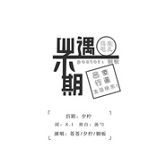
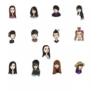

铜板板
============================

|  |  |
| :--: | :-- |
| [ 铜板板](https://i.xiami.com/tongbanban) | **播放数**: 2925535 **粉丝数**: 158 **评论数**: 16 **地区**: China 中国大陆 **风格**: 流行 Pop, 民谣 Folk  |

## 档案

## 专辑

| 名称 | 语种 | 唱片公司 | 发行时间 | 专辑类别 | 专辑风格 |
| :--: | :-- | :-- | :-- | :-- | :-- |
| [ YES OK](./albums/5020638646.md) | 国语 | 独立发行 | 2020年05月14日 | EP, 单曲 | 流行 Pop |
| [ 你的微笑](./albums/5020615138.md) | 国语 | 独立发行 | 2020年05月14日 | EP, 单曲 | 流行 Pop |
| [ 鱼仔](./albums/2105472416.md) | 国语 |  | 2019年11月21日 | 录音室专辑 | 民谣 Folk |
| [ 骄傲的猫](./albums/2104973319.md) | 国语 |  | 2019年07月05日 | EP, 单曲 | 流行 Pop |
| [ 波斯猫](./albums/2104961633.md) | 国语 |  | 2019年06月24日 | EP, 单曲 | 流行 Pop |
| [ 卡路里](./albums/2104675606.md) | 国语 |  | 2019年03月12日 | EP, 单曲 | 流行 Pop |
| [ 陪我长大 to苍苍](./albums/2104574013.md) | 国语 |  | 2019年02月04日 | EP, 单曲 | 流行 Pop |
| [ Latatalatata](./albums/2103999881.md) | 韩语 | 独立发行 | 2018年09月08日 | EP, 单曲 | 流行 Pop |
| [ Hate](./albums/2104000129.md) | 韩语 | 独立发行 | 2018年09月01日 | EP, 单曲 | 流行 Pop |
| [ J° ノーポイッ! （No Poi!）](./albums/2104000510.md) | 日语 | 独立发行 | 2018年09月01日 | 录音室专辑 | 流行 Pop |
| [ 吃鸡IOI](./albums/2103745834.md) | 国语 | 独立发行 | 2018年06月11日 | 录音室专辑 | 流行 Pop |
| [ Blue](./albums/2104000190.md) | 韩语 | 独立发行 | 2018年06月01日 | EP, 单曲 | 流行 Pop |
| [ 不期而遇](./albums/2104000317.md) | 国语 | 独立发行 | 2018年05月12日 | 录音室专辑 | 流行 Pop |
| [ 一半豆瓣酱一半豆乳盒子EiEi](./albums/2103644117.md) | 国语 | 独立发行 | 2018年03月18日 | EP, 单曲 | 流行 Pop |
| [ 独自一人的圣诞节](./albums/2104000603.md) | 韩语 | 独立发行 | 2017年12月24日 | 录音室专辑 | 流行 Pop |
| [ 小半](./albums/2102960340.md) | 国语 | 独立发行 | 2017年11月23日 | EP, 单曲 | 流行 Pop |
| [ 玲珑](./albums/2102922049.md) | 国语 | 独立发行 | 2017年11月03日 | EP, 单曲 | 流行 Pop |
| [ 庆祝](./albums/2104000433.md) | 国语 | 独立发行 | 2017年10月27日 | 录音室专辑 | 流行 Pop |
| [ 告白气球](./albums/2103745847.md) | 国语 | 独立发行 | 2017年04月10日 | 录音室专辑 | 流行 Pop |
| [ 告白气球吉他版](./albums/2102864673.md) | 国语 | 独立发行 | 2017年04月10日 | EP, 单曲 | 民谣 Folk, 轻音乐 Easy Listening |
| [ 带我飞](./albums/2103745839.md) | 国语 | 独立发行 | 2014年09月02日 | 录音室专辑 | 流行 Pop |
| [ 一爱难求](./albums/2105436164.md) | 国语 |  | 不详 | 录音室专辑 |  |
| [ 手扶拖拉机斯基](./albums/5021455813.md) | 国语 | 独立发行 | 不详 | 录音室专辑 | 流行 Pop |
| [ 你最最最重要](./albums/5021453989.md) | 国语 | 独立发行 | 不详 | 录音室专辑 | 流行 Pop |
| [ 我怎么这么好看](./albums/5021465570.md) | 国语 | 独立发行 | 不详 | 录音室专辑 | 流行 Pop |
| [ 致姗姗来迟的你](./albums/5021465572.md) | 国语 | 独立发行 | 不详 | 录音室专辑 | 流行 Pop |

## 评论

|  |  |  |  |
| :-- | :-- | :-- | :-- |
|  [虾米用户](https://emumo.xiami.com/u/356550110)  2020-03-24 12:22 赞(1) 踩(0) | 
听了玲珑，好好听！
 |
|  [虾米用户](https://emumo.xiami.com/u/349719266)  2020-02-14 22:26 赞(0) 踩(0) | 
很难忘！会一直陪伴每一天
 |
|  [虾米用户](https://emumo.xiami.com/u/357333078)  2019-07-13 08:18 赞(1) 踩(0) | 
加油！
 |
|  [虾米用户](https://emumo.xiami.com/u/325374787)  2019-07-09 14:00 赞(0) 踩(0) | 
，
 |
|  [虾米用户](https://emumo.xiami.com/u/408744760)  2019-06-03 17:47 赞(0) 踩(0) | 
能回复我吗？
 |
|  [虾米用户](https://emumo.xiami.com/u/408744760)  2019-06-02 16:28 赞(0) 踩(0) | 
我好喜欢你的声音
 |
| ⇒ |  [虾米用户](https://emumo.xiami.com/u/34667136)   2019-06-04 21:16 赞(0) 踩(0) | 
谢谢你的喜欢呀！
 |
|  [虾米用户](https://emumo.xiami.com/u/325443502) 青春无悔，为梦而狂。 2018-12-03 15:41 赞(0) 踩(0) | 
加油
 |
|  [虾米用户](https://emumo.xiami.com/u/45493733) 现居新奥尔良，交爱音乐的... 2018-11-02 14:10 赞(0) 踩(0) | 
看你每天的微博，希望出更多好听的作品
 |
|  [虾米用户](https://emumo.xiami.com/u/45493733) 现居新奥尔良，交爱音乐的... 2018-11-02 14:09 赞(0) 踩(0) | 
好喜欢你哦。加油
 |
|  [虾米用户](https://emumo.xiami.com/u/376581060)  2018-09-22 23:25 赞(1) 踩(0) | 
LATATA好好听！！！！
 |
| ⇒ |  [虾米用户](https://emumo.xiami.com/u/34667136)   2019-06-04 21:17 赞(0) 踩(0) | 
谢谢你
 |
|  [虾米用户](https://emumo.xiami.com/u/301377799)  2018-08-04 00:36 赞(1) 踩(0) | 
小半太太太太太太好听！！！！！！！！！！！！！！
 |
| ⇒ |  [虾米用户](https://emumo.xiami.com/u/34667136)   2018-09-01 14:10 赞(0) 踩(0) | 
谢谢你
 |
|  [虾米用户](https://emumo.xiami.com/u/45428482)   2018-01-19 00:39 赞(3) 踩(0) | 
加油！
 |
|  [虾米用户](https://emumo.xiami.com/u/34667136)   2017-05-23 23:16 赞(9) 踩(0) | 
我刚入驻了虾米音乐人，欢迎大家来我的个人主页，收听我的最新音乐
 |
