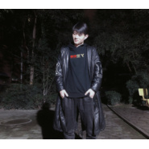

小六
============================

|  |  |
| :--: | :-- |
| [ 小六](https://i.xiami.com/lason) | **播放数**: 6206801 **粉丝数**: 219 **评论数**: 12 **地区**: China 中国大陆 **风格**: 流行 Pop, 摇滚 Rock & Roll, 民谣 Folk  |

## 档案

## 专辑

| 名称 | 语种 | 唱片公司 | 发行时间 | 专辑类别 | 专辑风格 |
| :--: | :-- | :-- | :-- | :-- | :-- |
| [ 交换余生（翻唱版）](./albums/5022174745.md) | 国语 | 独立发行 | 2020年12月12日 | EP, 单曲 | 流行 Pop |
| [ 可惜没如果](./albums/5021998651.md) | 国语 | 独立发行 | 2020年11月21日 | EP, 单曲 | 流行 Pop |
| [ 你是我的梦](./albums/5021943845.md) | 国语 | 独立发行 | 2020年11月17日 | EP, 单曲 | 流行 Pop |
| [ 一次就好](./albums/5021888725.md) | 国语 | 独立发行 | 2020年11月09日 | EP, 单曲 | 流行 Pop |
| [ 回到过去](./albums/5021291418.md) | 国语 | 独立发行 | 2020年08月16日 | EP, 单曲 | 流行 Pop |
| [ 如果你爱我](./albums/5021034342.md) | 国语 | 独立发行 | 2020年07月03日 | EP, 单曲 | 流行 Pop |
| [ 不在](./albums/5020789976.md) | 国语 | 独立发行 | 2020年06月03日 | EP, 单曲 | 流行 Pop |
| [ 你，好不好](./albums/2108271745.md) | 国语 | 独立发行 | 2020年04月01日 | 合集, 杂锦 | 流行 Pop, 国语流行 Mandarin Pop |
| [ 那个女孩](./albums/2108207796.md) | 国语 | 独立发行 | 2020年03月20日 | EP, 单曲 | 流行 Pop, 国语流行 Mandarin Pop |
| [ 我的姑娘，她在远方](./albums/2108209785.md) | 国语 | 独立发行 | 2020年03月20日 | EP, 单曲 | 流行 Pop, 国语流行 Mandarin Pop |
| [ 彩虹](./albums/2108210768.md) | 国语 | 独立发行 | 2020年03月20日 | EP, 单曲 | 流行 Pop, 国语流行 Mandarin Pop |
| [ 静悄悄](./albums/2108220985.md) | 国语 | 独立发行 | 2020年03月20日 | EP, 单曲 | 流行 Pop, 国语流行 Mandarin Pop |
| [ 遇见](./albums/2108210769.md) | 国语 | 独立发行 | 2020年03月20日 | EP, 单曲 | 流行 Pop, 国语流行 Mandarin Pop |
| [ 我要快乐](./albums/2105519065.md) | 国语 |  | 2019年11月25日 | EP, 单曲 | 流行 Pop |
| [ 这一生关于你的风景(唱吧版)](./albums/2105490719.md) | 国语 |  | 2019年11月22日 | EP, 单曲 | 流行 Pop |
| [ 愿世间美好与你与你环环相扣](./albums/2105426527.md) | 国语 |  | 2019年11月09日 | EP, 单曲 |  |
| [ 我曾](./albums/2105400408.md) | 国语 |  | 2019年11月02日 | EP, 单曲 |  |
| [ 老爸](./albums/2103885528.md) | 国语 | 独立发行 | 2018年08月01日 | EP, 单曲 | 国语流行 Mandarin Pop |
| [ 你是我心爱的姑娘](./albums/2102944192.md) | 国语 | 独立发行 | 2017年11月19日 | EP, 单曲 | 流行 Pop |
| [ 那个男人](./albums/2102863463.md) | 国语 | 独立发行 | 2017年09月25日 | EP, 单曲 | 国语流行 Mandarin Pop, 流行 Pop |
| [ 说散就散](./albums/2102774744.md) | 国语 | 独立发行 | 2017年06月30日 | EP, 单曲 | 国语流行 Mandarin Pop, 流行 Pop |
| [ 一个歌手的情书](./albums/2102774757.md) | 国语 | 独立发行 | 2017年06月30日 | EP, 单曲 | 国语流行 Mandarin Pop, 民谣 Folk |
| [ Angel](./albums/2102774739.md) | 英语 | 独立发行 | 2017年06月30日 | EP, 单曲 | 流行 Pop |
| [ 其实都没有](./albums/2102743488.md) | 国语 | 独立发行 | 2017年05月05日 | EP, 单曲 | 流行 Pop |
| [ 晚婚](./albums/2105686533.md) | 国语 | 独立发行 | 不详 | EP, 单曲 | 流行 Pop |
| [ 小六-夜曲](./albums/2104964765.md) | 国语 |  | 不详 | EP, 单曲 | 国语流行 Mandarin Pop |
| [ 海阔天空](./albums/5021001491.md) | 国语 | 独立发行 | 不详 | EP, 单曲 | 国语流行 Mandarin Pop |

## 评论

|  |  |  |  |
| :-- | :-- | :-- | :-- |
|  [虾米用户](https://emumo.xiami.com/u/2796166) 最爱莫文蔚..... 2020-04-29 01:21 赞(1) 踩(0) | 
加油~~~~
 |
|  [虾米用户](https://emumo.xiami.com/u/331610285)  2019-05-29 19:32 赞(1) 踩(0) | 
很有意境的歌
 |
|  [虾米用户](https://emumo.xiami.com/u/378093775)  2018-07-09 17:29 赞(1) 踩(0) | 
支持支持
 |
|  [虾米用户](https://emumo.xiami.com/u/308173269)  2017-11-20 17:14 赞(1) 踩(0) | 
请问那个妹子 叫啥
 |
| ⇒ |  [虾米用户](https://emumo.xiami.com/u/314078368)   2018-01-08 19:40 赞(0) 踩(0) | 
.我就是那个妹子，用我男神的号蹭人气的，所以没法单独搜 
 |
| ⇒ |  [虾米用户](https://emumo.xiami.com/u/308173269)  2018-01-13 07:00 赞(0) 踩(0) | 
<q><b>未知生物说：</b></q>
 |
| ⇒ |  [虾米用户](https://emumo.xiami.com/u/308173269)  2018-01-13 07:04 赞(0) 踩(0) | 
<q><b>未知生物说：</b></q>
 |
| ⇒ |  [虾米用户](https://emumo.xiami.com/u/314078368)   2018-01-15 16:00 赞(0) 踩(0) | 
<q><b>toocool85585说：</b></q>
 |
|  [虾米用户](https://emumo.xiami.com/u/294498170)  2017-07-19 16:23 赞(0) 踩(0) | 
男神加油      
 |
|  [虾米用户](https://emumo.xiami.com/u/293946536)  2017-05-05 06:43 赞(0) 踩(0) | 
老弟，太有范了。都为你骄傲
 |
|  [虾米用户](https://emumo.xiami.com/u/293324742) 勇敢歌唱 2017-05-04 17:00 赞(4) 踩(0) | 
我刚入驻了虾米音乐人，欢迎大家来我的个人主页，收听我的最新音乐
 |
| ⇒ |  [虾米用户](https://emumo.xiami.com/u/354088777)  2018-03-11 21:58 赞(0) 踩(0) | 
太棒了！加油加油加油
 |
