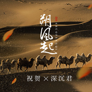
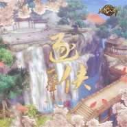

十二律音乐联盟
============================

|  |  |
| :--: | :-- |
| [ 十二律音乐联盟](https://i.xiami.com/shierlv) | **播放数**: 2075454 **粉丝数**: 497 **评论数**: 14 **地区**: China 中国大陆 **风格**: 流行 Pop, 国语流行 Mandarin Pop, 古风 GuFeng Music, 中国风 China-Wave, 同人音乐 DouJin  |

## 档案

## 专辑

| 名称 | 语种 | 唱片公司 | 发行时间 | 专辑类别 | 专辑风格 |
| :--: | :-- | :-- | :-- | :-- | :-- |
| [ 无疾而终无疾而终](./albums/2105222134.md) | 国语 |  | 2019年09月06日 | EP, 单曲 | 流行 Pop, 阳光流行 Sunshine Pop |
| [ 姻缘灯](./albums/2105171737.md) | 国语 |  | 2019年08月23日 | EP, 单曲 | 古风 GuFeng Music |
| [ 与春隔](./albums/2105007568.md) | 国语 |  | 2019年07月19日 | EP, 单曲 | 古风 GuFeng Music |
| [ 朔风起十二律弘扬民俗文化 塞北关外主题曲](./albums/2104973130.md) | 国语 |  | 2019年07月05日 | EP, 单曲 | 古风 GuFeng Music |
| [ DNF守护者主题曲 Dream 4U 国风版DNF守护者主题曲](./albums/2104185455.md) | 国语 | 独立发行 | 2018年11月07日 | EP, 单曲 | 古风 GuFeng Music, 中国风 China-Wave |
| [ 三国群英传霸王之业主题曲 《日月无声》日月无声](./albums/2104135600.md) | 国语 | 独立发行 | 2018年10月23日 | EP, 单曲 | 中国风 China-Wave |
| [ 乱世王者周年庆玩家自制主题曲](./albums/2103947013.md) | 国语 | 独立发行 | 2018年08月24日 | EP, 单曲 | 流行 Pop |
| [ 《素情》 电影《双世白蛇》主题曲电影《双世白蛇》主题曲](./albums/2103727629.md) | 国语 | 独立发行 | 2018年06月02日 | 原声带, 影视音乐 | 国语流行 Mandarin Pop |
| [ 峡谷重案组2](./albums/2103532251.md) | 国语 | 独立发行 | 2018年02月16日 | EP, 单曲 | 流行 Pop |
| [ 贺新春](./albums/2103532161.md) | 国语 | 独立发行 | 2018年02月16日 | EP, 单曲 | 流行 Pop |
| [ 燃战之灵](./albums/2103492405.md) | 国语 | 独立发行 | 2018年01月17日 | EP, 单曲 | 流行 Pop |
| [ 十二律圣诞献礼](./albums/2103458773.md) | 国语 | 独立发行 | 2017年12月25日 | 精选集 | 国语流行 Mandarin Pop |
| [ 忘忧酒馆忘忧酒馆主题曲](./albums/2102967930.md) | 国语 | 独立发行 | 2017年12月06日 | EP, 单曲 | 古风 GuFeng Music |
| [ 【十二律】火影专场](./albums/2102818967.md) | 其他 | 独立发行 | 2017年08月23日 | 精选集 | 日本流行 J-Pop, 国语流行 Mandarin Pop, 日本动漫游戏 Japanese ACG |
| [ 【十二律】火影忍者专场](./albums/2102818852.md) | 国语 | 独立发行 | 2017年08月23日 | 精选集 | 国语流行 Mandarin Pop, 日本流行 J-Pop, 日本动漫游戏 Japanese ACG |
| [ 王者音乐台王者荣耀](./albums/2102814919.md) | 国语 | 独立发行 | 2017年08月08日 | 录音室专辑 | 流行摇滚 Pop Rock, 中国风 China-Wave |
| [ 十二律成员原创音乐集](./albums/2102764328.md) | 国语 | 独立发行 | 2017年06月13日 | 录音室专辑 | 古风 GuFeng Music, 流行 Pop, 日本流行 J-Pop |
| [ 逆光小队逆光小队动画片同名专辑](./albums/2102744060.md) | 国语 | 独立发行 | 2016年12月15日 | EP, 单曲 | 日本动漫游戏 Japanese ACG, 流行 Pop |
| [ 枪灵计划枪灵计划动画片同名专辑](./albums/2102744058.md) | 国语 | 独立发行 | 2016年12月13日 | EP, 单曲 | 日本动漫游戏 Japanese ACG, 同人音乐 DouJin, 流行 Pop |
| [ 逐侠](./albums/2102744055.md) | 国语 | 独立发行 | 2016年11月09日 | EP, 单曲 | 古风 GuFeng Music, 中国风 China-Wave, 同人音乐 DouJin |
| [ 谓侠](./albums/2102744051.md) | 国语 | 独立发行 | 2016年07月28日 | 录音室专辑 | 古风 GuFeng Music, 中国风 China-Wave, 同人音乐 DouJin |
| [ 饮江湖](./albums/2102744066.md) | 国语 | 独立发行 | 2016年05月15日 | 录音室专辑 | 古风 GuFeng Music, 中国风 China-Wave, 同人音乐 DouJin |

## 评论

|  |  |  |  |
| :-- | :-- | :-- | :-- |
|  [虾米用户](https://emumo.xiami.com/u/8939466) ALL HIGH XXX... 2019-09-22 15:16 赞(1) 踩(0) | 
细腻不作的team，关注了～
 |
|  [虾米用户](https://emumo.xiami.com/u/328657369) 风格随心而变、 2019-02-14 03:50 赞(1) 踩(0) | 
评论还是这么少、
 |
|  [虾米用户](https://emumo.xiami.com/u/407783191)  2018-11-24 22:14 赞(1) 踩(0) | 
声音好酥~稀饭~❤
 |
|  [虾米用户](https://emumo.xiami.com/u/357561499)  2018-04-10 15:12 赞(3) 踩(0) | 
一点也不好听
 |
|  [虾米用户](https://emumo.xiami.com/u/321313928)  2017-11-11 09:58 赞(1) 踩(0) | 
火影翻唱真好 
 |
| ⇒ |  [虾米用户](https://emumo.xiami.com/u/368897746)  2018-10-22 21:20 赞(0) 踩(0) | 
确实你说的非常对。
 |
| ⇒ |  [虾米用户](https://emumo.xiami.com/u/368897746)  2018-10-22 21:20 赞(0) 踩(0) | 
66666
 |
|  [虾米用户](https://emumo.xiami.com/u/321313928)  2017-11-11 09:57 赞(1) 踩(0) | 
66666
 |
|  [虾米用户](https://emumo.xiami.com/u/281227935)  2017-07-21 19:08 赞(1) 踩(0) | 
好好好
 |
|  [虾米用户](https://emumo.xiami.com/u/300474379) 一念山河成，一念百草生。 2017-07-19 21:48 赞(2) 踩(0) | 
  
 |
|  [虾米用户](https://emumo.xiami.com/u/300474379) 一念山河成，一念百草生。 2017-07-19 21:48 赞(2) 踩(0) | 
  
 |
|  [虾米用户](https://emumo.xiami.com/u/300541044) 人不犯我，我不犯人，若犯... 2017-06-01 17:15 赞(2) 踩(0) | 
啥
 |
|  [虾米用户](https://emumo.xiami.com/u/299465886)  2017-05-27 07:52 赞(2) 踩(0) | 
大爱
 |
| ⇒ |  [虾米用户](https://emumo.xiami.com/u/244058837)  2018-02-10 15:53 赞(0) 踩(0) | 
。。.:.
 |
