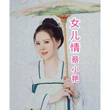

女儿情蔡小艳经典单曲集
============================

|  |  |
| :--: | :-- |
| [ 女儿情蔡小艳经典单曲集](https://emumo.xiami.com/album/2104650409) | **艺人**: [蔡小艳](../index.md) **语种**: 国语 **唱片公司**:  **发行时间**: 2019年03月04日 **专辑类别**: 录音室专辑 **专辑风格**: 国语流行 Mandarin Pop **播放数**: 34730 **收藏数**: 5 **评论数**: 0  |

## 简介

《女儿情》是一首经典歌曲，曲调婉转动听、歌词朴实简单、却又情感真挚。歌手蔡小艳悠扬而又甜美的嗓音将这首歌曲演绎得很到位，甜而不腻，情感饱满、非常耐听。

## 曲目

## 评论

|  |  |  |  |
| :-- | :-- | :-- | :-- |
