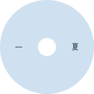
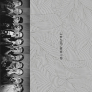

北国少年
============================

|  |  |
| :--: | :-- |
| [ 北国少年](https://i.xiami.com/bgsn) | **地区**: China 中国大陆 **风格**: 青少年流行 Teen Pop, 校园民谣 Campus Folk, 民谣流行 Folk Pop **播放数**: 5255253 **粉丝数**: 557 **评论数**: 25  |

## 档案

## 专辑

| 名称 | 语种 | 唱片公司 | 发行时间 | 专辑类别 | 专辑风格 |
| :--: | :-- | :-- | :-- | :-- | :-- |
| [ 只喜欢你一夏](./albums/2102771839.md) | 国语 | 独立发行 | 2017年06月19日 | 录音室专辑 | 流行 Pop, 校园民谣 Campus Folk |
| [ 一首起不出名字的青春](./albums/2102747931.md) | 国语 | 独立发行 | 2016年10月25日 | 录音室专辑 | 流行 Pop, 校园民谣 Campus Folk |

## 评论

|  |  |  |
| :-- | :-- | :-- |
|  [虾米用户](https://emumo.xiami.com/u/434690168)  2020-06-04 15:26 赞(0) 踩(0) | 
有微博或是抖音嘛，好想关注你
 |
|  [虾米用户](https://emumo.xiami.com/u/434690168)  2020-06-04 15:23 赞(0) 踩(0) | 
很好听，很好听
 |
|  [虾米用户](https://emumo.xiami.com/u/244083199)  2020-04-19 05:28 赞(0) 踩(0) | 
很好听
 |
|  [虾米用户](https://emumo.xiami.com/u/379822015)  2020-04-16 23:01 赞(0) 踩(0) | 
很棒
 |
|  [虾米用户](https://emumo.xiami.com/u/333864573) 喜欢很多 听歌很杂  2020-02-25 23:26 赞(1) 踩(0) | 
想要求《关键词》翻唱的歌手的其它歌曲 
 |
|  [虾米用户](https://emumo.xiami.com/u/436472337)  2020-02-07 13:14 赞(0) 踩(0) | 
真棒
 |
|  [虾米用户](https://emumo.xiami.com/u/429729534) 听好歌❤ 2019-10-12 10:11 赞(0) 踩(0) | 
好听
 |
|  [虾米用户](https://emumo.xiami.com/u/429355737) 我会记住 直到忘记为止 2019-09-02 20:22 赞(0) 踩(0) | 
谢谢你给我们带来《忽然》很温暖。
 |
|  [虾米用户](https://emumo.xiami.com/u/328657369) 风格随心而变、 2019-05-05 02:25 赞(0) 踩(0) | 

 |
|  [虾米用户](https://emumo.xiami.com/u/166685678) 朋友也挺好 2019-04-09 19:10 赞(0) 踩(0) | 
好听
 |
|  [虾米用户](https://emumo.xiami.com/u/50357169)  2019-03-11 22:33 赞(0) 踩(0) | 
不错，少年
 |
|  [虾米用户](https://emumo.xiami.com/u/164761)  2019-01-05 22:18 赞(0) 踩(0) | 
不错，加油，比抖音的强多了。
 |
|  [虾米用户](https://emumo.xiami.com/u/104395674) 我还没想好要写什么... 2018-11-13 09:12 赞(1) 踩(0) | 
照骗
 |
|  [虾米用户](https://emumo.xiami.com/u/7980403) 我还没想好要写什么... 2018-11-06 15:56 赞(0) 踩(0) | 
真的棒 继续加油
 |
|  [虾米用户](https://emumo.xiami.com/u/318695977)  2018-10-12 18:18 赞(0) 踩(0) | 
想知道伴奏在哪里下载... 下周就比赛了 ...
 |
|  [虾米用户](https://emumo.xiami.com/u/38960477)  2018-06-27 18:46 赞(0) 踩(0) | 
这首歌是呆呆akuma唱的吧  盗歌？
 |
|  [虾米用户](https://emumo.xiami.com/u/263829703)  2018-03-12 00:00 赞(0) 踩(0) | 
继续加油哦，很好听，唱到心坎去了。
 |
|  [虾米用户](https://emumo.xiami.com/u/333339240) 要努力阿！ 2017-12-03 16:00 赞(0) 踩(0) | 
good 
 |
|  [虾米用户](https://emumo.xiami.com/u/37268724) feel 2017-10-01 14:54 赞(1) 踩(0) | 
炒鸡爱里们
 |
|  [虾米用户](https://emumo.xiami.com/u/282149084) 少年回头望 笑我还不快跟... 2017-07-13 17:56 赞(0) 踩(0) | 
唱的还可以 挺棒的
 |
|  [虾米用户](https://emumo.xiami.com/u/37698608)  2017-06-04 08:15 赞(0) 踩(0) | 
想看自我介绍
 |
|  [虾米用户](https://emumo.xiami.com/u/295360148) 西北之北，少年之少年 2017-05-14 22:30 赞(3) 踩(0) | 
我刚入驻了虾米音乐人，欢迎大家来我的个人主页，收听我的最新音乐
 |
| ⇒ |  [虾米用户](https://emumo.xiami.com/u/261877060)  2018-01-06 00:03 赞(0) 踩(0) | 
你就是唱这首歌的北国少年?
 |
| ⇒ |  [虾米用户](https://emumo.xiami.com/u/295360148) 西北之北，少年之少年 2018-01-06 01:55 赞(0) 踩(0) | 
<q><b>竹林闲士说：</b></q>
 |
| ⇒ |  [虾米用户](https://emumo.xiami.com/u/261877060)  2018-01-06 09:17 赞(0) 踩(0) | 
很惊讶你的英语和音乐水平，也感慨没象霍尊那样成为一颗极其璀璨的新星。努力吧，会成功
 |
