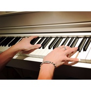

Paul Liu
============================

|  |  |
| :--: | :-- |
| [ Paul Liu](https://i.xiami.com/paul-liu) | **地区**: China 中国大陆 **风格**: 流行 Pop, 轻音乐 Easy Listening, 器乐流行 Instrumental Pop, 轻音乐流行 Light Pop, 器乐独奏 Solo Instrumental **播放数**: 14079655 **粉丝数**: 2195 **评论数**: 52  |

## 档案

## 专辑

| 名称 | 语种 | 唱片公司 | 发行时间 | 专辑类别 | 专辑风格 |
| :--: | :-- | :-- | :-- | :-- | :-- |
| [ 轻音乐流行钢琴曲](./albums/2102777976.md) | 纯音乐 | 独立发行 | 2017年07月05日 | 录音室专辑 | 轻音乐 Easy Listening, 轻音乐流行 Light Pop |
| [ 纯音乐流行歌曲钢琴版](./albums/2102749790.md) | 纯音乐 | 独立发行 | 2017年05月18日 | 录音室专辑 | 轻音乐 Easy Listening, 器乐流行 Instrumental Pop, 轻音乐流行 Light Pop |

## 评论

|  |  |  |
| :-- | :-- | :-- |
|  [虾米用户](https://emumo.xiami.com/u/3469393)  2021-01-15 21:54 赞(0) 踩(0) | 
谢谢你，虾米
 |
|  [虾米用户](https://emumo.xiami.com/u/270960895) 闭嘴 2021-01-07 18:43 赞(0) 踩(0) | 
虾米再见
 |
|  [虾米用户](https://emumo.xiami.com/u/446204814)  2020-12-12 23:32 赞(0) 踩(0) | 
喜欢《枫》和《说好的幸福呢》，前奏几个琴音一起，仿佛瞬间被恋爱的浪漫包围。
 |
|  [虾米用户](https://emumo.xiami.com/u/11446884) New York MoM... 2020-10-02 20:59 赞(0) 踩(0) | 
你改编的真棒！期待新作品！谢谢这么好听的音乐！
 |
|  [虾米用户](https://emumo.xiami.com/u/89292418)  2020-05-29 09:52 赞(0) 踩(0) | 
对比了很多站内的纯钢琴曲，你的改编轻快明亮，灵动飘逸，出多点新作品吧 
 |
|  [虾米用户](https://emumo.xiami.com/u/89292418)  2020-05-28 14:22 赞(0) 踩(0) | 
你可以多改编一些吗，你改的很精彩
 |
|  [虾米用户](https://emumo.xiami.com/u/442756037)  2020-05-05 14:10 赞(1) 踩(0) | 
你的钢琴太棒了
 |
|  [虾米用户](https://emumo.xiami.com/u/45772226) 永永远远 2020-04-08 22:32 赞(0) 踩(0) | 
能帮忙改编一首钢琴曲吗？
 |
|  [虾米用户](https://emumo.xiami.com/u/317259803)  2020-03-21 10:18 赞(1) 踩(0) | 
金融 音乐 棒
 |
|  [虾米用户](https://emumo.xiami.com/u/2749617) 我还没想好要写什么... 2020-03-09 11:11 赞(0) 踩(0) | 
不错
 |
|  [虾米用户](https://emumo.xiami.com/u/286674252)  2019-11-30 22:38 赞(1) 踩(0) | 
很好听！
 |
|  [虾米用户](https://emumo.xiami.com/u/312069451) 我还没想好要写什么... 2019-11-04 23:30 赞(1) 踩(0) | 
Thank you Paul Liu,    Sometimes, I like to listen some popular English and Chinese songs with music only.
 |
|  [虾米用户](https://emumo.xiami.com/u/292488710)   2019-10-17 15:23 赞(1) 踩(0) | 

 |
|  [虾米用户](https://emumo.xiami.com/u/342145861) 我还没想好要写什么... 2019-08-31 07:14 赞(1) 踩(0) | 
太好听啦 期待您更新
 |
|  [虾米用户](https://emumo.xiami.com/u/312663800)  2019-08-26 12:30 赞(1) 踩(0) | 
出新专辑吧
 |
|  [虾米用户](https://emumo.xiami.com/u/312663800)  2019-06-12 15:49 赞(1) 踩(0) | 
大神不出新弹奏了么。找了几家钢琴纯音乐，或许你的风格我更喜欢。 我个人喜欢悠扬，抒情，略带轻快的纯音乐。 确实很多歌曲的钢琴演奏都好好听。那么久远的轻轻的告诉你都可以演绎的这么美
 |
|  [虾米用户](https://emumo.xiami.com/u/324879742)   2019-06-06 11:39 赞(2) 踩(0) | 
.
 |
|  [虾米用户](https://emumo.xiami.com/u/33708177)   2019-05-20 21:21 赞(1) 踩(0) | 
大大弹的曲子我都很喜欢 很多杰伦的歌 啊 我爱了<a href="http://emumo.xiami.com/u/295930838" target="_blank" rel="nofollow" name_card="295930838">@Paul Liu</a>
 |
|  [虾米用户](https://emumo.xiami.com/u/37900679)  2019-05-20 19:27 赞(1) 踩(0) | 
好听 
 |
|  [虾米用户](https://emumo.xiami.com/u/23820493) 我还没想好要写什么... 2019-03-31 14:38 赞(2) 踩(0) | 
（封面）原来那双帅气的手是你的 
 |
|  [虾米用户](https://emumo.xiami.com/u/420250063)  2019-03-20 09:06 赞(1) 踩(0) | 
好听
 |
|  [虾米用户](https://emumo.xiami.com/u/74091390) 爱我所爱  无怨无悔 2019-03-10 14:47 赞(1) 踩(0) | 
难得的流行歌钢琴纯音乐  而且免费下载  好评
 |
|  [虾米用户](https://emumo.xiami.com/u/31699490)  2019-01-13 08:49 赞(1) 踩(0) | 
求弹一首柠檬树
 |
|  [虾米用户](https://emumo.xiami.com/u/332911388)  2018-12-28 17:53 赞(2) 踩(0) | 
Paul 真的懂钢琴，求微博
 |
|  [虾米用户](https://emumo.xiami.com/u/85794666)   2018-11-26 11:17 赞(2) 踩(0) | 
情感把握好到位 
 |
|  [虾米用户](https://emumo.xiami.com/u/245897481) 人生若只如初见。 2018-11-20 20:51 赞(1) 踩(0) | 
优秀，给你点赞
 |
|  [虾米用户](https://emumo.xiami.com/u/323026064)  2018-09-04 01:02 赞(0) 踩(0) | 
哪里能听告白气球，虾米音乐听不了
 |
|  [虾米用户](https://emumo.xiami.com/u/266608893)  2018-06-18 14:00 赞(1) 踩(0) | 
加油，曲子很好听
 |
|  [虾米用户](https://emumo.xiami.com/u/5952204) 新浪微博：北京音乐台 2018-06-11 11:54 赞(4) 踩(0) | 
前几天在一个书店听到连续播放流行歌曲的纯钢琴，然后就来虾米找到了这位帅哥。非常合我口味。：）
 |
|  [虾米用户](https://emumo.xiami.com/u/335243292) 心远地自偏 2018-06-06 12:54 赞(2) 踩(0) | 
人也帅曲也好听
 |
|  [虾米用户](https://emumo.xiami.com/u/274641012)  2018-05-25 23:52 赞(4) 踩(0) | 
这首钢琴曲真正弹出了女人的心声。
 |
|  [虾米用户](https://emumo.xiami.com/u/336421419) 我还没想好要写什么... 2018-04-04 05:47 赞(3) 踩(0) | 
很不错，蛮支持你的，坚持自己的音乐梦想
 |
|  [虾米用户](https://emumo.xiami.com/u/334551564)  2018-03-21 23:54 赞(2) 踩(0) | 
好听   
 |
|  [虾米用户](https://emumo.xiami.com/u/83010192) 我还没想好要写什么... 2018-03-19 19:51 赞(1) 踩(0) | 
挺好听
 |
|  [虾米用户](https://emumo.xiami.com/u/48568011)  2018-01-06 16:43 赞(0) 踩(0) | 
你是谁&amp;hellip;&amp;hellip;
 |
|  [虾米用户](https://emumo.xiami.com/u/325613193)  2017-12-30 20:53 赞(1) 踩(0) | 
666，好听
 |
|  [虾米用户](https://emumo.xiami.com/u/337402056) 真实❤ 2017-12-17 11:48 赞(0) 踩(0) | 
Y
 |
|  [虾米用户](https://emumo.xiami.com/u/74639208) Music is per... 2017-12-14 20:46 赞(1) 踩(0) | 
好听
 |
|  [虾米用户](https://emumo.xiami.com/u/40173602) 暂无签名~ 2017-11-18 16:57 赞(1) 踩(0) | 
支持
 |
|  [虾米用户](https://emumo.xiami.com/u/78330418) 鱼传尺素. 2017-09-18 00:05 赞(4) 踩(0) | 
会一直支持的，我一直很喜欢钢琴，可是没有机会去学，我是学吉他的，但弹吉他弹不出来这种感觉，我喜欢温柔的钢琴声。
 |
|  [虾米用户](https://emumo.xiami.com/u/239758480) 音乐是有魔力的。。。 2017-09-12 20:03 赞(3) 踩(0) | 
不会拔谱，求谱子
 |
|  [虾米用户](https://emumo.xiami.com/u/254844670) 飞鸽 2017-08-19 11:44 赞(1) 踩(0) | 
很棒
 |
|  [虾米用户](https://emumo.xiami.com/u/283708666)  2017-08-13 00:55 赞(1) 踩(0) | 
话说要是细节处理好点就好了 有些地方抢拍了
 |
|  [虾米用户](https://emumo.xiami.com/u/283708666)  2017-07-25 10:15 赞(2) 踩(0) | 
有谱子嘛 好听 想学
 |
|  [虾米用户](https://emumo.xiami.com/u/302436363) 这个城市很小，但没有缘分... 2017-06-15 22:52 赞(2) 踩(0) | 
非常非常非常好听。情绪都非常非常非常到位
 |
|  [虾米用户](https://emumo.xiami.com/u/126636480)  2017-06-09 10:21 赞(1) 踩(0) | 
好听极了，谢谢
 |
|  [虾米用户](https://emumo.xiami.com/u/297387631)  2017-05-19 07:12 赞(1) 踩(0) | 
 
 |
|  [虾米用户](https://emumo.xiami.com/u/295930838) 即兴流行钢琴改编 2017-05-18 02:15 赞(52) 踩(0) | 
我刚入驻了虾米音乐人，欢迎大家来我的个人主页，收听我的最新音乐
 |
| ⇒ |  [虾米用户](https://emumo.xiami.com/u/86607694) 当曾经烟消云散，再也不见... 2017-08-17 23:31 赞(0) 踩(0) | 
真好听，赞！
 |
| ⇒ |  [虾米用户](https://emumo.xiami.com/u/343449740)  2018-01-14 11:04 赞(0) 踩(0) | 
哪里可以求到你的乐谱啊啊啊啊，太喜欢了
 |
| ⇒ |  [虾米用户](https://emumo.xiami.com/u/325280969)   2018-02-20 19:53 赞(0) 踩(0) | 
這就是我的男神標準，啊～～～～，欣喜若狂中
 |
| ⇒ |  [虾米用户](https://emumo.xiami.com/u/23820493) 我还没想好要写什么... 2019-05-09 02:28 赞(0) 踩(0) | 
同问曲谱 
 |
