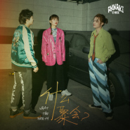

什么聚会？
============================

|  |  |
| :--: | :-- |
| [ 什么聚会？](https://emumo.xiami.com/album/5022287220) | **艺人**: [安娜其](../index.md) **语种**: 国语 **唱片公司**: Veil 帷幕工作室 **发行时间**: 2020年12月25日 **专辑类别**: EP, 单曲 **专辑风格**: 独立摇滚 Indie Rock **播放数**: 39721 **收藏数**: 5 **评论数**: 1  |

## 简介

你是否有这些症状？

社交恐惧症/僵硬的肢体表演和乏善可陈的表达/努力想靠近舞池中央

这又有什么关系呢？和安娜其一起加入这场聚会吧！

继年中发行了乐队首张同名专辑之后，安娜其于圣诞节当天推出了这首全新单曲《什么聚会？》。

当代年轻人，想出门却犯懒、出了门又社恐、面对朋友的邀约，总是在宅家撸猫还是参加聚会这两个选项里来回切换。而《什么聚会？》就像是一剂助燃剂，是安娜其希望在圣诞节送给大家一份礼物：宅家当然有一个人的快乐，但出门和朋友聚会，快乐绝对加倍！

作为独立摇滚和电子音乐结合的一次尝试，《什么聚会？》以轻松的House叠加80年代电子风格，迅速营造出自在又活跃的聚会氛围：别犹豫、也别顾虑，朋友和音乐助力消除社恐！快去聚会，收获快乐和更多情谊！

## 曲目

## 评论

|  |  |  |
| :-- | :-- | :-- |
|  [虾米用户](https://emumo.xiami.com/u/379162683) 我想要记住你们，我想要你... 2020-12-26 20:35 赞(1) 踩(0) | 

 |
