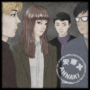

安娜其
============================

|  |  |
| :--: | :-- |
| [ 安娜其](https://i.xiami.com/annaki) | **播放数**: 178663 **粉丝数**: 396 **评论数**: 14 **地区**: China 中国大陆 **风格**: 独立摇滚 Indie Rock, 新浪潮 New Wave  |

## 档案

成立于2016年 独立摇滚乐队 ，成员都毕业于四川音乐学院流行器乐系  音乐风格：Indie Rock    安娜其乐队成员：  荔枝（vocal keyboard）  芒果（guitar）  张冉（drum program）  张向（bass）      经纪公司：Veil帷幕工作室

## 专辑

| 名称 | 语种 | 唱片公司 | 发行时间 | 专辑类别 | 专辑风格 |
| :--: | :-- | :-- | :-- | :-- | :-- |
| [ 什么聚会？](./albums/5022287220.md) | 国语 | Veil 帷幕工作室 | 2020年12月25日 | EP, 单曲 | 独立摇滚 Indie Rock |
| [ 安娜其](./albums/5020912829.md) | 国语 | Veil 帷幕工作室 | 2020年06月24日 | 录音室专辑 | 独立摇滚 Indie Rock |
| [ 难过的事总是发生在夏天](./albums/5020868035.md) | 国语 | Veil 帷幕工作室 | 2020年06月17日 | EP, 单曲 | 独立摇滚 Indie Rock |
| [ Annaki Ⅲ](./albums/2103703906.md) | 英语 | 独立发行 | 2018年05月07日 | EP, 单曲 | 独立摇滚 Indie Rock, 新浪潮 New Wave, 噪音摇滚 Noise Rock |
| [ AnnakiⅡ](./albums/2103502834.md) | 国语 | 独立发行 | 2018年01月07日 | EP, 单曲 | 新浪潮 New Wave, 噪音摇滚 Noise Rock |
| [ Annaki](./albums/2103562433.md) | 国语 | 独立发行 | 2017年08月24日 | EP, 单曲 | 新浪潮 New Wave, 朋克 Punk Rock |

## 评论

|  |  |  |  |
| :-- | :-- | :-- | :-- |
|  [虾米用户](https://emumo.xiami.com/u/379162683) 我想要记住你们，我想要你... 2020-12-26 20:35 赞(0) 踩(0) | 

 |
|  [虾米用户](https://emumo.xiami.com/u/445409723)  2020-11-16 15:06 赞(2) 踩(0) | 
神仙乐队✨✨✨
 |
|  [虾米用户](https://emumo.xiami.com/u/14152141)  2020-07-01 16:26 赞(0) 踩(0) | 
(ง &amp;bull;_&amp;bull;)ง
 |
|  [虾米用户](https://emumo.xiami.com/u/344018512) 我还没想好要写什么... 2020-06-29 00:24 赞(0) 踩(0) | 
D
 |
|  [虾米用户](https://emumo.xiami.com/u/266461620) 这家伙很懒，什么都没有留... 2020-06-27 06:06 赞(0) 踩(0) | 

 |
|  [虾米用户](https://emumo.xiami.com/u/2796166) 最爱莫文蔚..... 2020-06-20 01:00 赞(1) 踩(0) | 
加油~~~~~~
 |
|  [虾米用户](https://emumo.xiami.com/u/295601728)   /给我们一点时间  ... 2019-05-13 21:22 赞(4) 踩(0) | 
嘿，我们是安娜其的故事，乐队正在秀动众筹预售我们的第一张全长专辑，希望大家可以支持我们，另外我们准备了小礼物，大家可以关注我们微博转发互动抽奖哦
 |
|  [虾米用户](https://emumo.xiami.com/u/404345216) 我还没想好要写什么... 2018-12-03 19:59 赞(1) 踩(0) | 
喜欢
 |
|  [虾米用户](https://emumo.xiami.com/u/9064094) 我还没想好要写什么... 2018-05-06 15:24 赞(4) 踩(0) | 
天呐，你居然是安娜其的主唱妹子！ 
 |
|  [虾米用户](https://emumo.xiami.com/u/30212822)  2018-05-06 10:03 赞(3) 踩(0) | 
昨晚超棒！
 |
|  [虾米用户](https://emumo.xiami.com/u/43100103)  2017-10-19 09:29 赞(1) 踩(0) | 

 |
|  [虾米用户](https://emumo.xiami.com/u/61831122) Hello,world 2017-06-28 17:54 赞(2) 踩(0) | 
小姐姐加油哟 
 |
|  [虾米用户](https://emumo.xiami.com/u/18695816) 坐听雨，卧入梦 2017-06-27 12:51 赞(1) 踩(0) | 
伴奏声音略高于人声，
 |
|  [虾米用户](https://emumo.xiami.com/u/295601728)   /给我们一点时间  ... 2017-05-16 15:14 赞(3) 踩(0) | 
我刚入驻了虾米音乐人，欢迎大家来我的个人主页，收听我的最新音乐
 |
