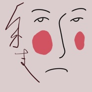
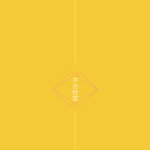
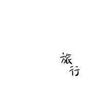
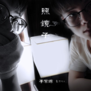
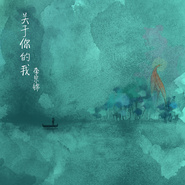
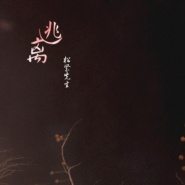

松紧先生
============================

|  |  |
| :--: | :-- |
| [ 松紧先生](https://i.xiami.com/isonig) | **播放数**: 1504756 **粉丝数**: 498 **评论数**: 12 **地区**: China 中国大陆 **风格**: 国语流行 Mandarin Pop, 迷幻流行 Psychedelic Pop  |

## 档案

## 专辑

| 名称 | 语种 | 唱片公司 | 发行时间 | 专辑类别 | 专辑风格 |
| :--: | :-- | :-- | :-- | :-- | :-- |
| [ 余生](./albums/2104974878.md) | 国语 |  | 2019年07月01日 | EP, 单曲 | 迷幻流行 Psychedelic Pop |
| [ 不合时宜](./albums/2104940414.md) | 国语 |  | 2019年05月20日 | EP, 单曲 | 民谣流行 Folk Pop |
| [ 有可能的夜](./albums/2104721872.md) | 国语 |  | 2019年03月27日 | EP, 单曲 | 艺术流行 Art Pop, 迷幻流行 Psychedelic Pop |
| [ 旅行](./albums/2104605514.md) | 国语 | 独立发行 | 2019年02月20日 | EP, 单曲 | 流行 Pop, 国语流行 Mandarin Pop, 节奏布鲁斯 R&B |
| [ 说爱我](./albums/2104131791.md) | 国语 | 独立发行 | 2018年10月22日 | 录音室专辑 | 流行 Pop, 国语流行 Mandarin Pop, 独立流行 Indie Pop |
| [ 照镜子](./albums/2104035863.md) | 国语 | 独立发行 | 2018年09月18日 | 录音室专辑 | 华语唱作人 Chinese Singer-Songwriter, 流行 Pop, 另类唱作人 Alternative Singer-Songwriter |
| [ 脸脸有今日 崔崔有今朝](./albums/2104018486.md) | 国语 | 独立发行 | 2018年09月12日 | 录音室专辑 | 国语流行 Mandarin Pop, 世界音乐 World Music |
| [ 关于你的我](./albums/2103976480.md) | 国语 | 独立发行 | 2018年09月04日 | 录音室专辑 | 流行 Pop, 华语唱作人 Chinese Singer-Songwriter, 中国风 China-Wave |
| [ 迷宫人生](./albums/2103972928.md) | 国语 | 独立发行 | 2018年09月03日 | EP, 单曲 | 电子 Electronic, 另类唱作人 Alternative Singer-Songwriter |
| [ 你走](./albums/2103702870.md) | 国语 | 独立发行 | 2018年05月06日 | EP, 单曲 | 国语流行 Mandarin Pop |
| [ 松紧的翻](./albums/2103489211.md) | 国语 | 独立发行 | 2018年01月12日 | 录音室专辑 | 流行 Pop, 国语流行 Mandarin Pop |
| [ 儿童节](./albums/2103472095.md) | 国语 | 独立发行 | 2018年01月07日 | EP, 单曲 | 独立流行 Indie Pop, 迷幻流行 Psychedelic Pop |
| [ 等待天明（《寻找独角兽》创投电视真人秀主题曲）](./albums/2102973796.md) | 国语 | 独立发行 | 2017年12月12日 | 录音室专辑 | 流行 Pop, 国语流行 Mandarin Pop |
| [ 逃离](./albums/2102754311.md) | 国语 | 独立发行 | 2016年06月26日 | EP, 单曲 | 迷幻流行 Psychedelic Pop, 独立流行 Indie Pop, 流行 Pop |

## 评论

|  |  |  |  |
| :-- | :-- | :-- | :-- |
|  [虾米用户](https://emumo.xiami.com/u/441654725) ʙʟᴀᴄᴋᴘɪɴᴋ Ji... 2020-11-11 20:04 赞(0) 踩(0) | 
抓到一个宝藏小哥哥～揪(^-^)
 |
|  [虾米用户](https://emumo.xiami.com/u/427495716)  2020-10-13 17:16 赞(0) 踩(0) | 

 |
|  [虾米用户](https://emumo.xiami.com/u/427956490) 人生的路很短，一定要珍惜... 2020-10-08 18:19 赞(0) 踩(0) | 
好好听 
 |
|  [虾米用户](https://emumo.xiami.com/u/39385224) 好想跟衣服在洗衣机里滚 2020-09-06 00:39 赞(0) 踩(0) | 
  关注关注，好听！
 |
|  [虾米用户](https://emumo.xiami.com/u/442915786) 蹭能量都蹭不到了好累累卑... 2020-06-22 00:43 赞(0) 踩(0) | 
希望你能再接再厉 创作出更多的 比这一首令我觉得在我后面两三个礼拜重播的这样的 新作加油期待你后面的佳作
 |
|  [虾米用户](https://emumo.xiami.com/u/293352355) 我爱的样子你都有  你的... 2019-08-08 18:23 赞(2) 踩(0) | 
小哥哥我做梦多想回你
 |
| ⇒ |  [虾米用户](https://emumo.xiami.com/u/293352355) 我爱的样子你都有  你的... 2019-08-09 17:21 赞(0) 踩(0) | 
帅气 
 |
|  [虾米用户](https://emumo.xiami.com/u/53707842)  2019-05-31 19:53 赞(1) 踩(0) | 
逃离真的好听
 |
|  [虾米用户](https://emumo.xiami.com/u/335861655) 我还没想好要写什么... 2019-05-08 00:20 赞(2) 踩(0) | 
在国外听你的歌很治愈。半夜听你的声音很舒服
 |
|  [虾米用户](https://emumo.xiami.com/u/115963216) 鼻青脸肿的哭过  若无其... 2018-01-03 20:35 赞(1) 踩(0) | 
你和你的DUO加油喽 
 |
|  [虾米用户](https://emumo.xiami.com/u/281131530)  2017-06-21 08:40 赞(3) 踩(0) | 
小哥哥加油
 |
|  [虾米用户](https://emumo.xiami.com/u/46806226) 欢迎关注微博@松紧先生 2017-05-26 11:50 赞(3) 踩(0) | 
我刚入驻了虾米音乐人，欢迎大家来我的个人主页，收听我的最新音乐
 |
