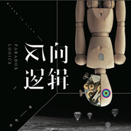

反向逻辑
============================

|  |  |
| :--: | :-- |
| [ 反向逻辑](https://emumo.xiami.com/album/2102748649) | **艺人**: [GloomyAngel 陈怡男](../index.md) **语种**: 国语 **唱片公司**: 独立发行 **发行时间**: 2017年04月06日 **专辑类别**: 录音室专辑 **专辑风格**: 独立摇滚 Indie Rock, 流行摇滚 Pop Rock **播放数**: 4967984 **收藏数**: 422 **评论数**: 42  |

## 简介

疯帽子乐队《反向逻辑》

## 曲目

## 评论

|  |  |  |
| :-- | :-- | :-- |
|  [虾米用户](https://emumo.xiami.com/u/334711726)  2020-12-22 16:02 赞(0) 踩(0) | 
有实体专辑吗
 |
|  [虾米用户](https://emumo.xiami.com/u/43913576) 后来 2020-10-04 17:53 赞(0) 踩(0) | 
好歌！
 |
|  [虾米用户](https://emumo.xiami.com/u/3913983) 随心之所欲 2020-03-10 21:22 赞(0) 踩(0) | 
见证未来华语乐坛巨星的升起
 |
|  [虾米用户](https://emumo.xiami.com/u/281652061)  2020-02-28 23:53 赞(0) 踩(0) | 
好听！自私的我不想分享给别人 
 |
|  [虾米用户](https://emumo.xiami.com/u/431603475)  2019-11-21 22:21 赞(0) 踩(0) | 
听过时光就来了
 |
|  [虾米用户](https://emumo.xiami.com/u/153354814)  2019-10-03 19:59 赞(0) 踩(0) | 
好
 |
|  [虾米用户](https://emumo.xiami.com/u/378139986) 一切好的音乐都是为了拨动... 2019-09-14 08:05 赞(0) 踩(0) | 
‍♂️‍♀️
 |
|  [虾米用户](https://emumo.xiami.com/u/44487914)  2019-08-18 23:53 赞(0) 踩(0) | 
时光非常不错 
 |
|  [虾米用户](https://emumo.xiami.com/u/5796865)  2019-08-07 16:36 赞(0) 踩(0) | 
从听了时光过来的....很惊喜...
 |
|  [虾米用户](https://emumo.xiami.com/u/376869175) 南国生红豆，春来发几枝。... 2019-05-06 11:48 赞(0) 踩(0) | 
耳目一新
 |
|  [虾米用户](https://emumo.xiami.com/u/356258267) BE OK. 2019-04-27 06:48 赞(0) 踩(0) | 
真的好惊艳 
 |
|  [虾米用户](https://emumo.xiami.com/u/327952880) Waldeinsamke... 2019-04-15 18:30 赞(1) 踩(0) | 
不错
 |
|  [虾米用户](https://emumo.xiami.com/u/407250346) 超有包容性的耳朵和一颗探... 2019-02-17 19:11 赞(1) 踩(0) | 
哪里可以买到你们的实体唱片？
 |
|  [虾米用户](https://emumo.xiami.com/u/367025219) my法克幽 2019-01-02 22:52 赞(0) 踩(0) | 
期待你们更多的作品
 |
|  [虾米用户](https://emumo.xiami.com/u/251036091) 五月天的超狂热粉丝 2018-05-20 12:38 赞(3) 踩(0) | 
可以说这是我今年乃至这十年来听过最棒的一张专辑，大爱疯帽子乐队
 |
|  [虾米用户](https://emumo.xiami.com/u/323240490)  2017-12-12 00:15 赞(3) 踩(0) | 
比那些商业歌曲好多了
 |
|  [虾米用户](https://emumo.xiami.com/u/327534125) 伱夢中熟睡的時候 有人為... 2017-10-05 11:00 赞(0) 踩(0) | 
很棒
 |
|  [虾米用户](https://emumo.xiami.com/u/285031008)  2017-10-01 02:04 赞(12) 踩(0) | 
看到的一句话：一首好歌在没有红的时候被我遇到是一种幸运！
 |
|  [虾米用户](https://emumo.xiami.com/u/326326042)  2017-10-01 01:45 赞(0) 踩(0) | 
占座
 |
|  [虾米用户](https://emumo.xiami.com/u/94294232) no rock no b... 2017-09-13 23:23 赞(1) 踩(0) | 
意外的发现，不错
 |
|  [虾米用户](https://emumo.xiami.com/u/241242679) 音乐给了我力量，给了我活... 2017-08-26 14:24 赞(0) 踩(0) | 
很好听
 |
|  [虾米用户](https://emumo.xiami.com/u/244906531)   2017-08-23 00:29 赞(0) 踩(0) | 
不错不错
 |
|  [虾米用户](https://emumo.xiami.com/u/2022341) 懶似精靈。。。。 2017-08-08 22:49 赞(0) 踩(0) | 
主唱不错呀
 |
|  [虾米用户](https://emumo.xiami.com/u/30880669) 爱 2017-08-08 21:58 赞(0) 踩(0) | 
二维码在哪
 |
| ⇒ |  [虾米用户](https://emumo.xiami.com/u/296592784) 我还没想好要写什么... 2017-08-08 22:11 赞(0) 踩(0) | 
你好 二维码在乐队微博，可以登录新浪微博搜索乐队名字就可以了
 |
| ⇒ |  [虾米用户](https://emumo.xiami.com/u/30880669) 爱 2017-08-08 22:15 赞(0) 踩(0) | 
<q><b>GloomyAngel 陈怡男说：</b></q>
 |
|  [虾米用户](https://emumo.xiami.com/u/30880669) 爱 2017-07-31 16:01 赞(0) 踩(0) | 
好喜欢
 |
|  [虾米用户](https://emumo.xiami.com/u/30880669) 爱 2017-07-31 15:54 赞(0) 踩(0) | 
喜欢 棒 超喜欢
 |
|  [虾米用户](https://emumo.xiami.com/u/3245069) 创作吗？！ 2017-07-30 15:28 赞(1) 踩(0) | 
整张专辑都不错啊～～
 |
|  [虾米用户](https://emumo.xiami.com/u/298957056)   2017-07-25 20:20 赞(0) 踩(0) | 
加油！！！
 |
|  [虾米用户](https://emumo.xiami.com/u/246504915) VIP到期时，当立业成家... 2017-07-23 15:55 赞(0) 踩(0) | 
喜欢疯帽子呀！有机会要听live!
 |
|  [虾米用户](https://emumo.xiami.com/u/52763491) 眼熟我，惊喜我，意外我. 2017-07-09 11:28 赞(1) 踩(0) | 
注册使用虾米半年以来，收藏的第一张专辑《反向逻辑》超级喜欢。
 |
|  [虾米用户](https://emumo.xiami.com/u/7831392) 吃得苦中苦，方为人上人 2017-07-09 11:21 赞(1) 踩(0) | 
占个位置带袋瓜子
 |
|  [虾米用户](https://emumo.xiami.com/u/8697455) 相信就能看见 2017-07-08 17:01 赞(0) 踩(0) | 
好听
 |
|  [虾米用户](https://emumo.xiami.com/u/12832061) 行善沒有條件 2017-07-08 16:14 赞(1) 踩(0) | 
好棒
 |
|  [虾米用户](https://emumo.xiami.com/u/91988198)  2017-07-07 23:44 赞(2) 踩(0) | 
这个乐队一定会成功的！
 |
|  [虾米用户](https://emumo.xiami.com/u/203286290)  2017-06-29 12:52 赞(0) 踩(0) | 
旧时光 旧时光 音色很特别
 |
|  [虾米用户](https://emumo.xiami.com/u/1343193) 我还没想好要写什么... 2017-06-27 22:06 赞(0) 踩(0) | 
可以可以,没犹豫偷了你们一票
 |
|  [虾米用户](https://emumo.xiami.com/u/128670306) 开心之路与你同行 2017-06-26 19:56 赞(2) 踩(0) | 
整个专辑是不多见的精品，作曲很棒，陪词有才，内涵有深度
 |
|  [虾米用户](https://emumo.xiami.com/u/49356081) 有缘再相逢 wyy：食冰... 2017-06-26 14:09 赞(0) 踩(0) | 
趁人不多，先占座_(:3」&amp;ang;)_
 |
|  [虾米用户](https://emumo.xiami.com/u/109019164) 徒然求索，不如思止。 2017-06-20 21:06 赞(2) 踩(0) | 
制作人挺厉害
 |
|  [虾米用户](https://emumo.xiami.com/u/73884732) 疯帽子乐队吉他手 玛尔斯... 2017-06-14 21:51 赞(0) 踩(0) | 
必须牛掰
 |
