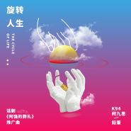
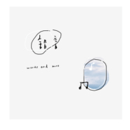
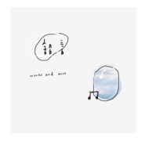
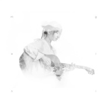

鉛筆
============================

|  |  |
| :--: | :-- |
| [ 鉛筆](https://i.xiami.com/cher) | **地区**: China 中国大陆 **风格**: 流行 Pop, 民谣 Folk, 独立民谣 Indie Folk, 民谣流行 Folk Pop **播放数**: 2242105 **粉丝数**: 365 **评论数**: 28  |

## 档案

## 专辑

| 名称 | 语种 | 唱片公司 | 发行时间 | 专辑类别 | 专辑风格 |
| :--: | :-- | :-- | :-- | :-- | :-- |
| [ 旋转人生 (话剧《阿强的葬礼》推广曲)](./albums/2104664493.md) | 国语 | StreetVoice | 2019年03月10日 | EP, 单曲 | 嘻哈 Hip-Hop |
| [ 千寻](./albums/2103515073.md) | 国语 | 独立发行 | 2018年02月04日 | EP, 单曲 |  |
| [ 铅言](./albums/2103466388.md) | 国语 |  | 2017年12月31日 | EP, 单曲 |  |
| [ 二三事](./albums/2102953577.md) | 国语 | 独立发行 | 2017年11月17日 | 录音室专辑 | 民谣 Folk, 民谣流行 Folk Pop, 校园民谣 Campus Folk |
| [ 梦黎](./albums/2102870222.md) | 国语 | 独立发行 | 2017年09月28日 | EP, 单曲 | 民谣 Folk, 民谣流行 Folk Pop, 校园民谣 Campus Folk |
| [ 鉛筆未收录歌曲](./albums/2102819446.md) | 国语 | 独立发行 | 2017年08月24日 | EP, 单曲 | 民谣 Folk, 独立民谣 Indie Folk, 民谣流行 Folk Pop |

## 评论

|  |  |  |
| :-- | :-- | :-- |
|  [虾米用户](https://emumo.xiami.com/u/13927906) 路漫漫其修远吾将上下而其... 2020-09-02 17:00 赞(0) 踩(0) | 
大家好，我带着没有版权的歌入驻了虾米，
 |
|  [虾米用户](https://emumo.xiami.com/u/230391102) 万般皆是命 2020-02-29 23:34 赞(0) 踩(0) | 

 |
|  [虾米用户](https://emumo.xiami.com/u/71099836) 我来不及认真的年轻，待明... 2019-06-06 22:39 赞(0) 踩(0) | 
很好听，加油
 |
|  [虾米用户](https://emumo.xiami.com/u/245305879) 即使有一天我要远走他乡，... 2019-05-30 17:37 赞(0) 踩(0) | 
很好的女歌手，加油！
 |
|  [虾米用户](https://emumo.xiami.com/u/328657369) 风格随心而变、 2019-05-20 13:17 赞(0) 踩(0) | 

 |
|  [虾米用户](https://emumo.xiami.com/u/311555298)  2019-03-29 09:55 赞(0) 踩(0) | 
加油！安徽小姐姐！！
 |
|  [虾米用户](https://emumo.xiami.com/u/285344829) 「耶穌愛您」 2019-03-12 15:35 赞(0) 踩(0) | 
加油 
 |
|  [虾米用户](https://emumo.xiami.com/u/15440308) 隐藏的小虾米 2019-02-02 01:00 赞(1) 踩(0) | 
声音如蜂鸟般动听～ 谢谢夜晚的陪伴
 |
| ⇒ |  [虾米用户](https://emumo.xiami.com/u/345690462)  2019-07-01 01:26 赞(0) 踩(0) | 
蜂鸟～呵呵
 |
|  [虾米用户](https://emumo.xiami.com/u/340877676)  2018-10-14 20:34 赞(1) 踩(0) | 
我在听她的Live，好听的声音
 |
|  [虾米用户](https://emumo.xiami.com/u/43499257) 所有的酒，都不如你。 2018-08-03 09:19 赞(0) 踩(0) | 
又发现一把好声音，小姐姐加油＾０＾~
 |
|  [虾米用户](https://emumo.xiami.com/u/319865036)  2018-06-15 07:54 赞(0) 踩(0) | 
发现一个歌超棒的小姐姐 喜欢你的这种感觉 
 |
|  [虾米用户](https://emumo.xiami.com/u/125156460) 梦想是做个女侠 2018-01-04 01:02 赞(1) 踩(0) | 
歌都超舒服。
 |
|  [虾米用户](https://emumo.xiami.com/u/72816066) “吞噬者：喂我黑暗的莓果... 2017-12-17 11:34 赞(2) 踩(0) | 
因一段不知来源的短视频，找了你大半年...
 |
|  [虾米用户](https://emumo.xiami.com/u/256537083)   2017-11-25 23:28 赞(0) 踩(0) | 
很好听，看好铅笔噢~
 |
|  [虾米用户](https://emumo.xiami.com/u/185527337)  2017-11-05 08:57 赞(1) 踩(0) | 
再回如期怎么没了？ 
 |
|  [虾米用户](https://emumo.xiami.com/u/45941802) 干就完了，不矫情 2017-11-02 09:23 赞(1) 踩(0) | 
电台听歌识曲过来……温暖的声音
 |
|  [虾米用户](https://emumo.xiami.com/u/323552148) 开心点朋友们，人间不值得... 2017-10-28 10:40 赞(1) 踩(0) | 
今天晚上就要去看你了咯。
 |
|  [虾米用户](https://emumo.xiami.com/u/237426162) 因为五月天 我想要成为更... 2017-10-22 21:46 赞(1) 踩(0) | 
铅笔欧尼 加油：）
 |
|  [虾米用户](https://emumo.xiami.com/u/330193818)  2017-10-14 23:14 赞(1) 踩(0) | 
好好听
 |
|  [虾米用户](https://emumo.xiami.com/u/245414427)  2017-09-16 21:42 赞(1) 踩(0) | 
喜欢你的声音
 |
|  [虾米用户](https://emumo.xiami.com/u/10419853) 暂无签名~ 2017-09-05 20:22 赞(1) 踩(0) | 
有气质的好声音，一定会红的。
 |
|  [虾米用户](https://emumo.xiami.com/u/322150758)  2017-08-28 23:12 赞(1) 踩(0) | 
你当时好像嗓子不舒服 
 |
|  [虾米用户](https://emumo.xiami.com/u/322150758)  2017-08-28 23:11 赞(1) 踩(0) | 
我是在王家坝音乐节知道你的 
 |
|  [虾米用户](https://emumo.xiami.com/u/40945932) 微博@Cher鉛筆 2017-08-24 17:15 赞(14) 踩(0) | 
我刚入驻了虾米音乐人，欢迎大家来我的个人主页，收听我的最新音乐
 |
| ⇒ |  [虾米用户](https://emumo.xiami.com/u/122239766)  2017-12-10 14:37 赞(0) 踩(0) | 
小妹妹，加油！
 |
| ⇒ |  [虾米用户](https://emumo.xiami.com/u/48942352) 品一杯香茗翻起一本书，面... 2017-12-17 10:12 赞(0) 踩(0) | 
铅笔小姐姐加油^&amp;omega;^很温暖的声音，适合在阳光下听听～
 |
| ⇒ |  [虾米用户](https://emumo.xiami.com/u/426773107) 生命中的過客 2019-07-02 14:08 赞(0) 踩(0) | 
很棒的歌聲，捨不得離開
 |
