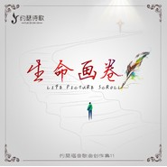

生命画卷
============================

|  |  |
| :--: | :-- |
| [ 生命画卷](https://emumo.xiami.com/album/5021979521) | **艺人**: [约瑟诗歌](../index.md) **语种**: 国语 **唱片公司**: 推星传媒 **发行时间**: 2020年11月19日 **专辑类别**: 录音室专辑 **专辑风格**: 福音 Gospel **播放数**: 5378 **收藏数**: 15 **评论数**: 3  |

## 简介

 无论世界如何风云变幻，

世事如何险阻艰难，

《约瑟诗歌》

第十一张专辑《生命画卷》，

在十一月怀感恩的喜乐之情，

携赞美的馨香之气按时奉上！

## 曲目

## 评论

|  |  |  |
| :-- | :-- | :-- |
|  [虾米用户](https://emumo.xiami.com/u/306219812)  2020-12-16 09:27 赞(0) 踩(0) | 
好听，
 |
|  [虾米用户](https://emumo.xiami.com/u/252587614)  2020-11-20 09:55 赞(0) 踩(0) | 

 |
|  [虾米用户](https://emumo.xiami.com/u/418415362) 心中旋律，如诗岁月 2020-11-19 22:04 赞(0) 踩(0) | 
感动灵魂的心曲永远是最美的，辛苦了！！！
 |
