Massica
============================

|  |  |
| :--: | :-- |
| [ Massica](https://i.xiami.com/massica) | **播放数**: 681285 **粉丝数**: 204 **评论数**: 5 **地区**: China 中国大陆 **风格**: 弛放 Chillout, 未来贝斯 Future Bass, 合成器流行 Synthpop, 华语唱作人 Chinese Singer-Songwriter, 独立流行 Indie Pop  |

## 档案

## 专辑

| 名称 | 语种 | 唱片公司 | 发行时间 | 专辑类别 | 专辑风格 |
| :--: | :-- | :-- | :-- | :-- | :-- |
| [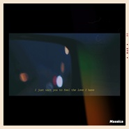 Airplane Over My Head](./albums/2108209552.md) | 英语 | 独立发行 | 2020年03月20日 | EP, 单曲 | 合成器流行 Synthpop, 另类唱作人 Alternative Singer-Songwriter, 电音流行 Electropop |
| [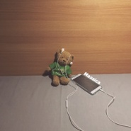 a message](./albums/2105034489.md) | 其他 |  | 2019年07月27日 | EP, 单曲 | 另类唱作人 Alternative Singer-Songwriter, 轻音乐 Easy Listening |
| [ 瘾](./albums/2104886994.md) | 国语 |  | 2019年05月22日 | EP, 单曲 | 电音流行 Electropop, 华语唱作人 Chinese Singer-Songwriter |
| [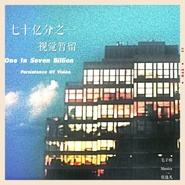 七十亿分之一 / 视觉暂留](./albums/2104683077.md) | 国语 |  | 2019年03月20日 | EP, 单曲 | 华语唱作人 Chinese Singer-Songwriter, 梦幻流行 Dream Pop |
| [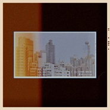 I'll Come Back](./albums/2104603700.md) | 英语 | 独立发行 | 2019年02月18日 | EP, 单曲 | 电音流行 Electropop, 梦幻流行 Dream Pop |
| [ 7PM;in my room](./albums/2104036078.md) | 其他 | 独立发行 | 2018年09月18日 | EP, 单曲 | 沙发音乐 Lounge, 微声 Microsound, 另类唱作人 Alternative Singer-Songwriter |
| [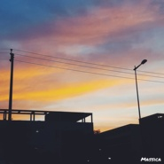 U don't know...](./albums/2103943943.md) | 英语 | 独立发行 | 2018年08月24日 | EP, 单曲 | 另类唱作人 Alternative Singer-Songwriter, 轻音乐流行 Light Pop |
| [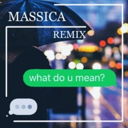 What Do You Mean(Massica Remix)](./albums/2103752443.md) | 英语 | 独立发行 | 2018年06月19日 | EP, 单曲 | 欧美流行 Western Pop, 未来贝斯 Future Bass |
| [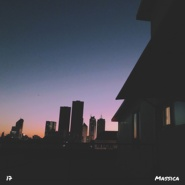 17](./albums/2103689458.md) | 英语 | 独立发行 | 2018年04月19日 | EP, 单曲 | 合成器流行 Synthpop |
| [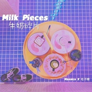 牛奶碎片Milk Pieces](./albums/2103619960.md) | 国语 | 独立发行 | 2018年03月20日 | EP, 单曲 | 华语唱作人 Chinese Singer-Songwriter, 未来车库舞曲 Future Garage, 独立流行 Indie Pop |
| [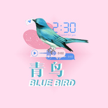 青鸟(Bluebird)Bluebird](./albums/2102974974.md) | 国语 | 独立发行 | 2017年12月14日 | EP, 单曲 | 电音流行 Electropop, 华语唱作人 Chinese Singer-Songwriter |
| [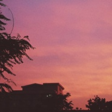 Seems far away,that's the past](./albums/2102922308.md) | 英语 | 独立发行 | 2017年11月11日 | EP, 单曲 | 寒潮 Chillwave |
| [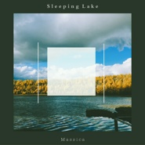 Sleeping Lake](./albums/2102799438.md) | 国语 | 独立发行 | 2017年07月14日 | EP, 单曲 | 回响贝斯 Dubstep |
| [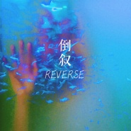 倒叙（Reverse）](./albums/2102751514.md) | 国语 | 独立发行 | 2017年05月08日 | EP, 单曲 | 浩室舞曲 House |
| [ Through The Clouds（云端）](./albums/2102799439.md) | 国语 | 独立发行 | 2017年05月01日 | EP, 单曲 | 弛放 Chillout, 鼓打贝斯 Drum & Bass |
| [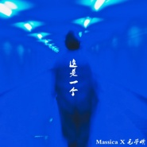 这是一个](./albums/2102751200.md) | 国语 | 独立发行 | 2017年03月20日 | EP, 单曲 | 未来贝斯 Future Bass |
| [ Time To Go（启程）](./albums/2102751195.md) | 其他 | 独立发行 | 2016年12月04日 | EP, 单曲 | 弛放 Chillout |
| [ Call Me Maybe(Massica Remix)](./albums/2102751513.md) | 英语 | 独立发行 | 2016年09月28日 | EP, 单曲 | 浩室舞曲 House |
| [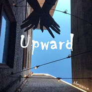 Upward](./albums/2102751191.md) | 其他 | 独立发行 | 2016年08月09日 | EP, 单曲 | 浩室舞曲 House |

## 评论

|  |  |  |  |
| :-- | :-- | :-- | :-- |
|  [虾米用户](https://emumo.xiami.com/u/50302951) 未来的憧憬 2019-09-01 19:09 赞(1) 踩(0) | 
不说多的，首首旋律都很喜欢
 |
|  [虾米用户](https://emumo.xiami.com/u/340110502)  2017-12-15 23:36 赞(0) 踩(0) | 
发现了gay季老师
 |
|  [虾米用户](https://emumo.xiami.com/u/49265597) 我还没想好要写什么... 2017-07-28 19:00 赞(0) 踩(0) | 
加油
 |
|  [虾米用户](https://emumo.xiami.com/u/297145756)  2017-06-15 13:05 赞(4) 踩(0) | 
如果可以倒叙，我希望是这样&amp;mdash;&amp;mdash;我们摆脱倦怠变得疯狂，再慢慢地心照不宣，最后只留下人群中的惊艳一眼。
 |
|  [虾米用户](https://emumo.xiami.com/u/297145756)  2017-05-20 11:51 赞(3) 踩(0) | 
我刚入驻了虾米音乐人，欢迎大家来我的个人主页，收听我的最新音乐
 |
