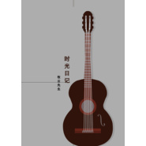

时光日记
============================

|  |  |
| :--: | :-- |
| [ 时光日记](https://emumo.xiami.com/album/2102900518) | **艺人**: [吴桐](../index.md) **语种**: 国语 **唱片公司**: 独立发行 **发行时间**: 2017年11月01日 **专辑类别**: 录音室专辑 **专辑风格**: 流行 Pop, 国语流行 Mandarin Pop **播放数**: 1758 **收藏数**: 0 **评论数**: 0  |

## 简介

 以梦为马，不负大好时光。
 

心有远方，随处是远方。

## 曲目

## 评论

|  |  |  |  |
| :-- | :-- | :-- | :-- |
