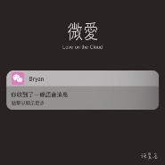

微爱 (Love on the Cloud)
============================

|  |  |
| :--: | :-- |
| [ 微爱 (Love on the Cloud)](https://emumo.xiami.com/album/2102886324) | **艺人**: [汪昱名](../index.md) **语种**: 国语 **唱片公司**: 独立发行 **发行时间**: 2017年09月09日 **专辑类别**: EP, 单曲 **专辑风格**:  **播放数**: 2721291 **收藏数**: 14 **评论数**: 1  |

## 简介

說了這個週末按時發歌 雖然昨天工作了一整天 但每次到發歌的時候還是那麼激動 在這個快節奏的社會 簡單 純粹 灑脫 的 愛 會給你帶來不一樣的感覺 希望你們喜歡 感謝 賀老師(Yili) 的封面 當然還有一如既往的作詞人 拾柒問

## 曲目

## 评论

|  |  |  |  |
| :-- | :-- | :-- | :-- |
|  [虾米用户](https://emumo.xiami.com/u/2960029) 如果世界太危险 只有音乐... 2017-10-31 21:56 赞(1) 踩(0) | 
好听 
 |
