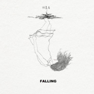

Falling
============================

|  |  |
| :--: | :-- |
| [ Falling](https://emumo.xiami.com/album/2102923971) | **艺人**: [汪昱名](../index.md) **语种**: 国语 **唱片公司**: 独立发行 **发行时间**: 2017年11月11日 **专辑类别**: EP, 单曲 **专辑风格**: 节奏布鲁斯 R&B, 灵魂乐 Soul, 未来贝斯 Future Bass **播放数**: 25331 **收藏数**: 4 **评论数**: 1  |

## 简介

可能之前的歌都太溫柔了  
所以這次融入了FutureBass  
這是首可以讓小夥伴們High起來的歌  
希望大家喜歡  
這次我也參與了作詞  
但還是要一如既往的感謝 我的作詞人：拾柒問  
還有非常感謝 賀老師(Yili) 的封面EP
 

 
 

 

## 曲目

## 评论

|  |  |  |  |
| :-- | :-- | :-- | :-- |
|  [虾米用户](https://emumo.xiami.com/u/11883095) 慢慢等 2017-11-13 08:41 赞(2) 踩(0) | 
沙发 
 |
