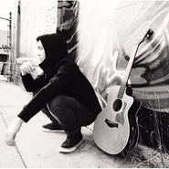
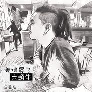
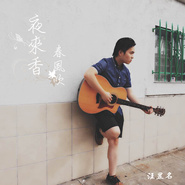
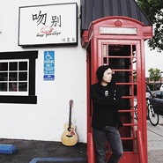

汪昱名
============================

|  |  |
| :--: | :-- |
| [ 汪昱名](https://i.xiami.com/yumingwang) | **播放数**: 7333567 **粉丝数**: 1024 **评论数**: 21 **地区**: United States of America 美国 **风格**: 节奏布鲁斯 R&B, 新灵魂乐 Neo-Soul, 另类节奏布鲁斯 Alternative R&B  |

## 档案

浙江湖州人，现定居美国洛杉矶，15岁开始自学吉他，18岁自学钢琴。2014年毕业于Musicians Institute（美国洛杉矶音乐学院）现在是一名音乐制作人／唱作人，擅长写歌，编曲，音乐制作。最擅长的曲风是Pop,R&B/Soul,Neo-Soul。

## 专辑

| 名称 | 语种 | 唱片公司 | 发行时间 | 专辑类别 | 专辑风格 |
| :--: | :-- | :-- | :-- | :-- | :-- |
| [ Beautiful](./albums/5020606344.md) | 国语 | 独立发行 | 2020年04月22日 | 录音室专辑 | 流行 Pop |
| [ Falling](./albums/2102923971.md) | 国语 | 独立发行 | 2017年11月11日 | EP, 单曲 | 节奏布鲁斯 R&B, 灵魂乐 Soul, 未来贝斯 Future Bass |
| [ 微爱 (Love on the Cloud)](./albums/2102886324.md) | 国语 | 独立发行 | 2017年09月09日 | EP, 单曲 |  |
| [ 爱不够(Lack of Love)](./albums/2102852600.md) | 国语 | 独立发行 | 2017年07月21日 | EP, 单曲 | 流行 Pop, 节奏布鲁斯 R&B, 灵魂乐 Soul |
| [ 回力车(Pullback Cars)](./albums/2102753602.md) | 国语 | 独立发行 | 2017年04月29日 | EP, 单曲 | 节奏布鲁斯 R&B, 灵魂乐 Soul |
| [ 透支(Exhaustion)](./albums/2102754137.md) | 国语 | 独立发行 | 2017年03月20日 | EP, 单曲 | 节奏布鲁斯 R&B |
| [ 姜伟买了六头牛](./albums/2102754132.md) | 国语 | 独立发行 | 2017年02月08日 | EP, 单曲 | 节奏布鲁斯 R&B, 灵魂乐 Soul |
| [ 爱你](./albums/2102754126.md) | 国语 | 独立发行 | 2016年11月18日 | EP, 单曲 | 节奏布鲁斯 R&B, 灵魂乐 Soul |
| [ 演员](./albums/2102754133.md) | 国语 | 独立发行 | 2016年08月03日 | EP, 单曲 | 节奏布鲁斯 R&B |
| [ 夜来香＋春风吹](./albums/2102754135.md) | 国语 | 独立发行 | 2016年05月28日 | EP, 单曲 | 节奏布鲁斯 R&B |
| [ 吻别](./albums/2102754134.md) | 国语 | 独立发行 | 2016年05月18日 | EP, 单曲 | 节奏布鲁斯 R&B |
| [ 普通朋友](./albums/2102754121.md) | 国语 | 独立发行 | 2016年04月10日 | EP, 单曲 | 节奏布鲁斯 R&B |

## 评论

|  |  |  |  |
| :-- | :-- | :-- | :-- |
|  [虾米用户](https://emumo.xiami.com/u/139771592) 我还没想好要写什么... 2020-02-20 17:57 赞(0) 踩(0) | 
 
 |
|  [虾米用户](https://emumo.xiami.com/u/93681236)  2019-01-14 15:30 赞(0) 踩(0) | 
四中的学长好
 |
|  [虾米用户](https://emumo.xiami.com/u/293692544) 你敢给我说话吗？我咬你 2018-12-06 17:01 赞(1) 踩(0) | 
好听
 |
|  [虾米用户](https://emumo.xiami.com/u/374765499)  2018-09-24 00:15 赞(1) 踩(0) | 
好好听
 |
|  [虾米用户](https://emumo.xiami.com/u/46033863) 布衣芒履  任春与秋 2018-07-28 23:14 赞(3) 踩(0) | 
这么好听有才，原来老乡
 |
|  [虾米用户](https://emumo.xiami.com/u/337583648) 这世界没满足过你，是吗 2018-07-02 20:06 赞(3) 踩(0) | 
好喜欢你的歌
 |
|  [虾米用户](https://emumo.xiami.com/u/313262985) 奠定基石，展望未来。 2018-06-08 03:50 赞(2) 踩(0) | 
好听 
 |
|  [虾米用户](https://emumo.xiami.com/u/130878584)  2018-03-28 15:14 赞(1) 踩(0) | 
快点上传情人街啊
 |
|  [虾米用户](https://emumo.xiami.com/u/344592672)  2018-01-13 18:11 赞(4) 踩(0) | 
超喜欢――爱你就这样静静的牵着你的手走过红地毯一阵风静静的吹过你的脸笑得多么甜满是回忆的画面在眼前多么的幸福
 |
|  [虾米用户](https://emumo.xiami.com/u/248296902)  2017-12-13 05:13 赞(7) 踩(0) | 
曲风帅，我爱这种曲风
 |
|  [虾米用户](https://emumo.xiami.com/u/299995802) お願いします 2017-12-01 11:46 赞(2) 踩(0) | 
感觉很不错的一个歌手，很喜欢他的曲风
 |
|  [虾米用户](https://emumo.xiami.com/u/290051352)  2017-11-02 20:51 赞(2) 踩(0) | 
好好好好喜欢
 |
|  [虾米用户](https://emumo.xiami.com/u/120564136) 我还没想好要写什么... 2017-10-02 05:58 赞(0) 踩(0) | 
牛皮
 |
|  [虾米用户](https://emumo.xiami.com/u/88144500) 喜欢听歌 2017-08-23 00:26 赞(0) 踩(0) | 

 |
|  [虾米用户](https://emumo.xiami.com/u/2418238) weibo: @尤米口 2017-07-11 23:28 赞(0) 踩(0) | 
ღ
 |
|  [虾米用户](https://emumo.xiami.com/u/36625121)  2017-07-09 13:38 赞(0) 踩(0) | 
透支是谁唱的呢？
 |
|  [虾米用户](https://emumo.xiami.com/u/117969234) 我还没想好要写什么... 2017-06-19 06:27 赞(2) 踩(0) | 
期待新歌
 |
|  [虾米用户](https://emumo.xiami.com/u/36536228) 舒服的音乐会伤心 2017-06-14 22:33 赞(1) 踩(0) | 
呦呦呦蓝调
 |
|  [虾米用户](https://emumo.xiami.com/u/303060359)  2017-06-14 20:58 赞(0) 踩(0) | 
[文字cool]
 |
|  [虾米用户](https://emumo.xiami.com/u/298543876)  2017-05-26 10:48 赞(0) 踩(0) | 

 |
