DrEuphoria
============================

|  |  |
| :--: | :-- |
| [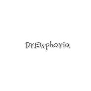 DrEuphoria](https://i.xiami.com/dreuphoria) | **播放数**: 3953735 **粉丝数**: 554 **评论数**: 37 **地区**: French Guiana 法属圭亚那 **风格**: 电子 Electronic  |

## 档案

## 专辑

| 名称 | 语种 | 唱片公司 | 发行时间 | 专辑类别 | 专辑风格 |
| :--: | :-- | :-- | :-- | :-- | :-- |
| [ Justin Bieber-Holy(remix)Justin Bieber](./albums/5021669874.md) | 英语 | 独立发行 | 2020年10月15日 | 合集, 杂锦 | 出神舞曲 Trance, 缓拍 Downtempo, 脉冲流行 Glitch Hop |
| [ All Falls Down (DrEuphoria Remix)](./albums/5021673252.md) | 纯音乐 | 独立发行 | 2020年10月14日 | EP, 单曲 | 电子舞曲 EDM / Electronic Dance Music |
| [ Alan Walker-End of Time(REMIX)](./albums/5021301991.md) | 纯音乐 | 独立发行 | 2020年08月18日 | EP, 单曲 | 未来贝斯 Future Bass, 鼓打贝斯 Drum & Bass, 恍惚嘻哈舞曲 Wonky |
| [ Alan Walker - Darkside(DrEuphoria Remix)](./albums/5021111922.md) | 英语 | 独立发行 | 2020年07月18日 | EP, 单曲 | 独立电子乐 Indietronica, 泡泡糖贝斯 Bubblegum Bass, 神游舞曲 Trip Hop |
| [ Heading Home(Remix)](./albums/5020710004.md) | 纯音乐 | 独立发行 | 2020年05月24日 | EP, 单曲 | 电子舞曲 EDM / Electronic Dance Music |
| [ All Falls Down](./albums/2108395028.md) | 纯音乐 | 独立发行 | 2020年05月03日 | EP, 单曲 | 电子 Electronic, 陷阱舞曲 Trap, 未来车库舞曲 Future Garage |
| [ Sad Sometimes](./albums/2108419034.md) | 纯音乐 | 独立发行 | 2020年05月03日 | EP, 单曲 | 电子 Electronic |
| [ Bad Guy](./albums/2108400032.md) | 英语 | 独立发行 | 2020年05月03日 | EP, 单曲 | 电子舞曲 EDM / Electronic Dance Music |
| [ The Spectre(DrEuphoria Remix)](./albums/2108400015.md) | 英语 | 独立发行 | 2020年05月01日 | EP, 单曲 | 电子 Electronic |
| [ Astronomia](./albums/2108399016.md) | 纯音乐 | 独立发行 | 2020年04月30日 | EP, 单曲 | 电子 Electronic, 电子舞曲 EDM / Electronic Dance Music, 陷阱说唱 Trap Rap |
| [ 徐梦圆 China-Rain（remix）](./albums/2420349392.md) | 纯音乐 | 独立发行 | 2020年03月03日 | EP, 单曲 | 电子 Electronic |
| [ 中国风电音Sayonara](./albums/2420365054.md) | 纯音乐 | 独立发行 | 2020年03月03日 | EP, 单曲 | 电子舞曲 EDM / Electronic Dance Music |
| [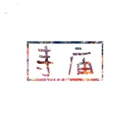 寺庙](./albums/2420367036.md) | 纯音乐 | 独立发行 | 2020年03月03日 | EP, 单曲 | 电子舞曲 EDM / Electronic Dance Music |
| [ Play(DrEuphoria Remix)](./albums/2106065109.md) | 英语 | 独立发行 | 2020年02月18日 | EP, 单曲 | 未来贝斯 Future Bass, 陷阱舞曲 Trap, 鼓打贝斯 Drum & Bass |
| [ Are You Lonely(Remix)](./albums/2106065107.md) | 国语 | 独立发行 | 2020年02月18日 | EP, 单曲 | 浩室舞曲 House |
| [ Are You Lonely](./albums/2106065094.md) | 国语 | 独立发行 | 2020年02月18日 | EP, 单曲 | 浩室舞曲 House |
| [ Play](./albums/2105283093.md) | 英语 |  | 2019年09月26日 | EP, 单曲 | 浩室舞曲 House, 英国车库舞曲 UK Garage, 蒙巴顿舞曲 Moombahton |
| [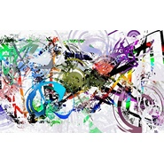 HIGER](./albums/2105179941.md) | 国语 |  | 2019年08月25日 | EP, 单曲 | 浩室舞曲 House |
| [ Faded](./albums/2105151341.md) | 英语 |  | 2019年08月12日 | EP, 单曲 | 独立电子乐 Indietronica |
| [ On My Way(DrEuphoria Remix)](./albums/2105000329.md) | 英语 |  | 2019年07月17日 | EP, 单曲 | 独立电子乐 Indietronica, 电子舞曲 EDM / Electronic Dance Music, 氛围音乐 Ambient |
| [ We Dont Talk Anymor(DrEuphoria Mix)](./albums/2104999331.md) | 英语 |  | 2019年07月16日 | EP, 单曲 | 浩室舞曲 House, 未来贝斯 Future Bass, 复合电气 Complextro |
| [ The Spectre](./albums/2104946992.md) | 英语 |  | 2019年06月16日 | EP, 单曲 | 合成器流行 Synthpop, 缓拍 Downtempo, 寒潮 Chillwave |
| [ Sing Me to Sleep](./albums/2104946994.md) | 英语 |  | 2019年06月16日 | EP, 单曲 | 浩室舞曲 House, 科技舞曲 Techno, 前卫浩室 Progressive House |
| [ Something Just Like This](./albums/2104946996.md) | 英语 |  | 2019年06月16日 | EP, 单曲 | 未来贝斯 Future Bass, 回响贝斯 Dubstep, 复合电气 Complextro |
| [ Alan Walker - Darkside(DrEuphoria Remix)](./albums/2104811759.md) | 纯音乐 |  | 2019年04月26日 | EP, 单曲 | 浩室舞曲 House, 泡泡糖贝斯 Bubblegum Bass, 恍惚嘻哈舞曲 Wonky |
| [ DJ Snake - Made in China (DrEuphoria Remix)](./albums/2104691882.md) | 国语 |  | 2019年03月21日 | 精选集 | 陷阱说唱 Trap Rap |
| [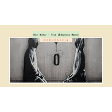 Alan Walker - Tired (DrEuphoria Remix)](./albums/2104669891.md) | 国语 |  | 2019年03月14日 | EP, 单曲 | 独立电子乐 Indietronica, 弛放 Chillout, 后回响重拍 Brostep |
| [ LilPump](./albums/2104585818.md) | 英语 |  | 2019年02月09日 | EP, 单曲 | 陷阱舞曲 Trap, 电子舞曲 EDM / Electronic Dance Music, 回响贝斯 Dubstep |
| [ Darkside](./albums/2104427755.md) | 英语 |  | 2018年12月29日 | EP, 单曲 | 后回响贝斯 Post-Dubstep, 微浩室舞曲 Microhouse, 迷幻科技舞曲 Acid Techno |
| [ Different World](./albums/2104427757.md) | 英语 |  | 2018年12月29日 | EP, 单曲 | 浩室舞曲 House, 缓拍 Downtempo, 电子舞曲 EDM / Electronic Dance Music |
| [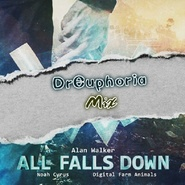 All Falls Down (DrEuphoria Remix)](./albums/2104362320.md) | 英语 |  | 2018年12月09日 | EP, 单曲 | 电子舞曲 EDM / Electronic Dance Music, 电子 Electronic |
| [ All Falls Down (Instrumental DrEuphoria Remix)](./albums/2103946505.md) | 纯音乐 | 独立发行 | 2018年08月24日 | EP, 单曲 | 未来贝斯 Future Bass, 电子舞曲 EDM / Electronic Dance Music, 电子 Electronic |
| [ 南山忆](./albums/2103757983.md) | 纯音乐 | 独立发行 | 2018年06月26日 | EP, 单曲 | 电子舞曲 EDM / Electronic Dance Music, 中国风 China-Wave |
| [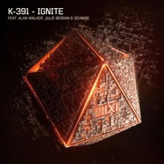 Ignite (DrEuphoria Remix)](./albums/2103751404.md) | 英语 | 独立发行 | 2018年06月16日 | 录音室专辑 | 电子 Electronic, 电子舞曲 EDM / Electronic Dance Music |
| [ Something Just Like This[DrEuphoria Remix]](./albums/2103727575.md) | 英语 | 独立发行 | 2018年06月02日 | EP, 单曲 | 电子舞曲 EDM / Electronic Dance Music, 前卫浩室 Progressive House, 电子 Electronic |
| [ Alan Walker](./albums/2103716926.md) | 纯音乐 | 独立发行 | 2018年05月23日 | EP, 单曲 | 电子 Electronic, 电子舞曲 EDM / Electronic Dance Music |
| [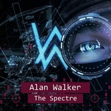 Alan Walker - The Spectre (DrEuphoria Remix)](./albums/2103689249.md) | 纯音乐 | 独立发行 | 2018年04月18日 | EP, 单曲 | 电子 Electronic, 电子舞曲 EDM / Electronic Dance Music, 酸性浩室舞曲 Acid House |
| [ The Spectre](./albums/2103618133.md) | 英语 | 独立发行 | 2018年03月19日 | EP, 单曲 | 轻音乐 Easy Listening, 电子 Electronic, 电子舞曲 EDM / Electronic Dance Music |
| [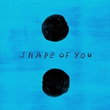 Shape of you (DrEuphoria Remix)](./albums/2103524524.md) | 英语 | 独立发行 | 2018年02月10日 | EP, 单曲 | 电子 Electronic, 电子舞曲 EDM / Electronic Dance Music |
| [ Alan Walker](./albums/2103498995.md) | 纯音乐 | 独立发行 | 2018年01月23日 | EP, 单曲 | 电子 Electronic, 浩室舞曲 House, 大节拍 Big Beat |
| [ All Falls Down](./albums/2103465611.md) | 英语 | 独立发行 | 2017年12月31日 | EP, 单曲 | 电子 Electronic, 电子民谣 Folktronica, 二步舞曲 2-Step |
| [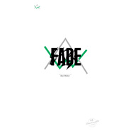 Alan Walker](./albums/2102944283.md) | 纯音乐 | 独立发行 | 2017年11月19日 | EP, 单曲 | 电子 Electronic, 酸性浩室舞曲 Acid House, 二步舞曲 2-Step |
| [ Alan Walker](./albums/2102863488.md) | 英语 | 独立发行 | 2017年09月25日 | EP, 单曲 | 电子 Electronic, 黑暗氛围 Dark Ambient, 酸性浩室舞曲 Acid House |
| [ 路远](./albums/2102818330.md) | 其他 | 独立发行 | 2017年08月23日 | EP, 单曲 | 微浩室舞曲 Microhouse, 浩室舞曲 House, 出神舞曲 Trance |
| [ Lone Wakler](./albums/2102810388.md) | 其他 | 独立发行 | 2017年08月08日 | EP, 单曲 | 电子 Electronic, 回响贝斯 Dubstep, 合成器流行 Synthpop |
| [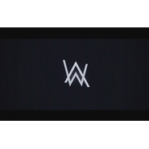 中国人的Faded](./albums/2102755669.md) | 英语 | 独立发行 | 2017年05月28日 | 录音室专辑 | 电子 Electronic, 电子民谣 Folktronica, 出神舞曲 Trance |
| [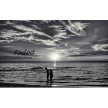 Faded AginaFaded Agina](./albums/2102753342.md) | 英语 | 独立发行 | 2017年05月24日 | 录音室专辑 | 电子 Electronic |
| [ Faded【无女声版】](./albums/2102752757.md) | 其他 | 独立发行 | 2017年05月23日 | EP, 单曲 | 电子 Electronic |

## 评论

|  |  |  |  |
| :-- | :-- | :-- | :-- |
|  [虾米用户](https://emumo.xiami.com/u/431925728) 再见了各位，希望在虾米下... 2020-06-19 23:39 赞(4) 踩(0) | 
可以尝试去做做自己的电音，老是搬教主的歌不是很好
 |
| ⇒ |  [虾米用户](https://emumo.xiami.com/u/429732797) *面对懒惰的你充满了决心 2020-07-20 00:43 赞(0) 踩(0) | 
ta现在都没有自己原创的歌曲，还说支持国人电音&amp;hellip;
 |
| ⇒ |  [虾米用户](https://emumo.xiami.com/u/431925728) 再见了各位，希望在虾米下... 2020-07-25 21:55 赞(0) 踩(0) | 
<q><b>カイシン.百里说：</b></q>
 |
|  [虾米用户](https://emumo.xiami.com/u/353116797) put you hand... 2020-06-13 21:46 赞(0) 踩(0) | 
为什么要钱呢
 |
|  [虾米用户](https://emumo.xiami.com/u/409298409) C4D渲染师 bigro... 2020-05-16 07:53 赞(1) 踩(0) | 
牛逼  
 |
|  [虾米用户](https://emumo.xiami.com/u/403469495) 生命在于韵动～～ 2019-10-28 21:05 赞(2) 踩(0) | 
有改变
 |
|  [虾米用户](https://emumo.xiami.com/u/263200489) 生活多无趣，唯有音乐入我... 2019-09-06 01:10 赞(2) 踩(0) | 
本来就是别人的歌还有脸说购买？
 |
|  [虾米用户](https://emumo.xiami.com/u/325205625)  2019-08-20 13:21 赞(0) 踩(0) | 
好
 |
|  [虾米用户](https://emumo.xiami.com/u/342380756) 如果爱有颜色 那一定是蓝... 2019-07-26 13:47 赞(1) 踩(0) | 
歌很好听啊 为啥要骂Ta
 |
| ⇒ |  [虾米用户](https://emumo.xiami.com/u/431925728) 再见了各位，希望在虾米下... 2020-07-25 21:56 赞(0) 踩(0) | 
都是改编的，没有原创啊 
 |
|  [虾米用户](https://emumo.xiami.com/u/310754428) wa da xi… 2019-07-23 20:17 赞(1) 踩(0) | 
我怎么感觉这作者侵权了
 |
|  [虾米用户](https://emumo.xiami.com/u/420831355) 音乐制作人，DJ，努力中 2019-07-19 11:55 赞(2) 踩(0) | 
你的歌也不属于原创啊
 |
|  [虾米用户](https://emumo.xiami.com/u/233494352) put your han... 2019-07-18 14:14 赞(4) 踩(0) | 
油管搬运工？？？
 |
|  [虾米用户](https://emumo.xiami.com/u/324879742)   2019-07-17 17:41 赞(1) 踩(0) | 
.
 |
|  [虾米用户](https://emumo.xiami.com/u/137746974)   2019-07-15 11:15 赞(0) 踩(0) | 
有时间做个ON MY WAY好不？
 |
| ⇒ |  [虾米用户](https://emumo.xiami.com/u/12358240) Edinorog  2020-04-13 08:46 赞(0) 踩(0) | 
早有了，要收费的
 |
|  [虾米用户](https://emumo.xiami.com/u/356148960) 天下没有不散的筵席 2019-07-11 19:20 赞(1) 踩(0) | 
做成这样牛啊
 |
|  [虾米用户](https://emumo.xiami.com/u/198199945) 我还没想好要写什么... 2019-05-25 14:57 赞(2) 踩(0) | 
原创呢
 |
|  [虾米用户](https://emumo.xiami.com/u/325374787)  2019-04-25 10:52 赞(0) 踩(0) | 
666666666666666666666666666666
 |
|  [虾米用户](https://emumo.xiami.com/u/358104299) 悲观的唯心存在现实解构虚... 2019-03-12 20:18 赞(2) 踩(0) | 
10245
 |
|  [虾米用户](https://emumo.xiami.com/u/4487129)  2019-03-08 11:06 赞(2) 踩(0) | 
！！！
 |
|  [虾米用户](https://emumo.xiami.com/u/338222040)  2019-03-05 22:59 赞(13) 踩(0) | 
明明是教主的，你弄个还要收费！
 |
|  [虾米用户](https://emumo.xiami.com/u/298585331) 我还没想好要写什么... 2019-02-09 12:33 赞(4) 踩(0) | 
请大家支持购买我的国人DrEuphoria原创电音，支持国人电音，做更棒的作品
 |
| ⇒ |  [虾米用户](https://emumo.xiami.com/u/345302609) 抹茶拿铁贼好喝 2019-03-26 18:43 赞(0) 踩(0) | 
有改的电音就要避讳原创这个词啦~支持！好听哦 
 |
|  [虾米用户](https://emumo.xiami.com/u/418460693)  2019-02-06 17:32 赞(1) 踩(0) | 
好听但要付费A
 |
|  [虾米用户](https://emumo.xiami.com/u/375985565)  2019-02-02 17:13 赞(0) 踩(0) | 
超好听
 |
|  [虾米用户](https://emumo.xiami.com/u/320956595)  2018-12-25 17:06 赞(0) 踩(0) | 
请问Alan Walker 的ignite 怎么找不到呢？
 |
|  [虾米用户](https://emumo.xiami.com/u/345709759)  2018-07-13 21:50 赞(1) 踩(0) | 
电音做的好棒，相信你会有自己的一片天地
 |
|  [虾米用户](https://emumo.xiami.com/u/333660322) 我还没想好要写什么... 2018-06-06 17:56 赞(3) 踩(0) | 
好听呢，神韵有了[带墨镜笑]
 |
|  [虾米用户](https://emumo.xiami.com/u/327635122)  2018-01-05 13:38 赞(6) 踩(0) | 
我还把你的歌收藏起来！！！诶！ 有一些非物质东西是不能用金钱去购买或衡量的！
 |
|  [虾米用户](https://emumo.xiami.com/u/327635122)  2018-01-05 13:34 赞(7) 踩(0) | 
为毛删我QQ号？是不是我说&amp;ldquo;我什么都没有！我没有经费！我没有设备！我没有技术！&amp;rdquo;才删 我的？啊！？你啊！就是为了钱那！！~
 |
| ⇒ |  [虾米用户](https://emumo.xiami.com/u/431925728) 再见了各位，希望在虾米下... 2020-07-30 23:00 赞(0) 踩(0) | 
哈，现在咋样
 |
|  [虾米用户](https://emumo.xiami.com/u/327635122)  2018-01-02 16:00 赞(1) 踩(0) | 
可以收我为徒吗？！说真的！！！我现在温州！！！
 |
|  [虾米用户](https://emumo.xiami.com/u/309119368)   2017-11-02 07:39 赞(0) 踩(0) | 
支持作者
 |
|  [虾米用户](https://emumo.xiami.com/u/298585331) 我还没想好要写什么... 2017-10-22 16:18 赞(4) 踩(0) | 
啊啊啊。新歌已经没人听了啊
 |
|  [虾米用户](https://emumo.xiami.com/u/247606764) 这家伙很逗比什么也没留下... 2017-06-12 00:29 赞(2) 踩(0) | 
顶顶 
 |
|  [虾米用户](https://emumo.xiami.com/u/298585331) 我还没想好要写什么... 2017-05-23 17:06 赞(0) 踩(0) | 
我刚入驻了虾米音乐人，欢迎大家来我的个人主页，收听我的最新音乐
 |
