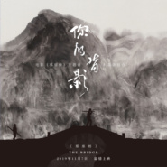
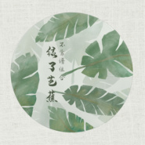
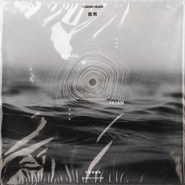
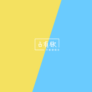
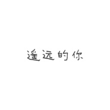
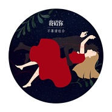

不靠谱组合
============================

|  |  |
| :--: | :-- |
| [ 不靠谱组合](https://i.xiami.com/bkp) | **播放数**: 18940771 **粉丝数**: 6139 **评论数**: 139 **地区**: China 中国大陆 **风格**: 流行 Pop, 人声合唱团 Vocal Group, 独立流行 Indie Pop  |

## 档案

## 专辑

| 名称 | 语种 | 唱片公司 | 发行时间 | 专辑类别 | 专辑风格 |
| :--: | :-- | :-- | :-- | :-- | :-- |
| [ 广寒谣](./albums/2106072862.md) | 国语 |  | 2019年12月12日 |  |  |
| [ 我们都没错](./albums/2105450091.md) | 国语 | 嗨库文化 | 2019年11月11日 | EP, 单曲 |  |
| [ 你的背影](./albums/2105442663.md) | 国语 | 鲸鱼向海 | 2019年11月01日 | EP, 单曲 |  |
| [ 绿了芭蕉](./albums/2105327367.md) | 国语 | 嗨库文化 | 2019年10月10日 | EP, 单曲 |  |
| [ 狂欢](./albums/2105250820.md) | 国语 | 鲸鱼向海 | 2019年09月09日 | EP, 单曲 |  |
| [ 占有欲](./albums/2105155496.md) | 国语 | 咚吧嗒文化 | 2019年08月08日 | EP, 单曲 |  |
| [ 关于本人生活状态的报告](./albums/2104989270.md) | 国语 | 咚吧嗒文化 | 2019年07月11日 | EP, 单曲 |  |
| [ 恒星](./albums/2104969569.md) | 国语 | 咚吧嗒文化 | 2019年07月01日 | EP, 单曲 |  |
| [ 梦](./albums/2104950371.md) | 国语 | 咚吧嗒文化 | 2019年06月18日 | EP, 单曲 |  |
| [ 偏偏](./albums/2104881229.md) | 国语 | 咚吧嗒文化 | 2019年05月09日 | EP, 单曲 | 国语流行 Mandarin Pop |
| [ 遥远的你](./albums/2104603528.md) | 国语 | 鲸鱼向海 | 2018年12月14日 | EP, 单曲 | 国语流行 Mandarin Pop |
| [ Don't U Never](./albums/2103950288.md) | 国语 | 鲸鱼向海 | 2018年09月01日 | EP, 单曲 | 流行 Pop |
| [ 请吃饭的关系](./albums/2103906937.md) | 国语 | 鲸鱼向海 | 2018年08月13日 | EP, 单曲 |  |
| [ 我碍你](./albums/2104195645.md) | 国语 | 等待音乐 | 2018年04月23日 | EP, 单曲 | 国语流行 Mandarin Pop |
| [ 传情达意小夜曲](./albums/2103460188.md) | 国语 | 腾研国际 | 2017年12月26日 | EP, 单曲 |  |
| [ 怎么不可以](./albums/2102787899.md) | 国语 | 独立发行 | 2017年07月13日 | EP, 单曲 |  |
| [ 我不喜欢](./albums/2102768423.md) | 国语 | 独立发行 | 2017年06月20日 | EP, 单曲 | 流行 Pop |
| [ 凭什么说](./albums/2102755011.md) | 国语 | 独立发行 | 2017年05月27日 | EP, 单曲 | 电子 Electronic, 独立流行 Indie Pop |

## 评论

|  |  |  |  |
| :-- | :-- | :-- | :-- |
|  [虾米用户](https://emumo.xiami.com/u/446321946)  2021-01-07 05:46 赞(0) 踩(0) | 
好听好听
 |
|  [虾米用户](https://emumo.xiami.com/u/445832136)  2020-12-24 01:52 赞(0) 踩(0) | 
喜欢广寒谣！希望能早日听到
 |
|  [虾米用户](https://emumo.xiami.com/u/18634393)   2020-10-27 12:48 赞(0) 踩(0) | 
加油！好听的组合！ 
 |
|  [虾米用户](https://emumo.xiami.com/u/444549169) 跟我走吧，天亮就出发！⭐... 2020-08-14 02:28 赞(1) 踩(0) | 
☺️
 |
|  [虾米用户](https://emumo.xiami.com/u/246252528) 我还没想好要写什么... 2020-08-11 18:32 赞(0) 踩(0) | 
气质如光而不耀
 |
|  [虾米用户](https://emumo.xiami.com/u/44191794) 听风，听雨，等光，等爱。 2020-08-01 15:07 赞(1) 踩(0) | 
希望能听到你们更多的音乐，加油，不靠谱组合很靠谱 
 |
|  [虾米用户](https://emumo.xiami.com/u/350689350)  2020-06-16 18:29 赞(0) 踩(0) | 
加油哦
 |
|  [虾米用户](https://emumo.xiami.com/u/282690540) 化作一棵树 2020-05-22 21:06 赞(0) 踩(0) | 
喜欢
 |
|  [虾米用户](https://emumo.xiami.com/u/328657369) 风格随心而变、 2020-02-20 18:27 赞(0) 踩(0) | 
真希望你们的歌越来越多，大火
 |
|  [虾米用户](https://emumo.xiami.com/u/192335227)  2020-01-16 08:12 赞(0) 踩(0) | 
给你们点赞
 |
|  [虾米用户](https://emumo.xiami.com/u/29334503) 我还没想好要写什么... 2020-01-06 09:45 赞(0) 踩(0) | 
好听！
 |
|  [虾米用户](https://emumo.xiami.com/u/283040611) 不忘初心，方得始终。 2019-12-22 13:36 赞(1) 踩(0) | 
你们无比优秀，并且赋有灵气，希望可以坚持下去，给我们带来更多优秀的作品。   
 |
|  [虾米用户](https://emumo.xiami.com/u/271174674)  2019-11-21 11:58 赞(0) 踩(0) | 
好听 加油(ง •̀_•́)ง
 |
|  [虾米用户](https://emumo.xiami.com/u/97190394)  2019-09-18 11:50 赞(0) 踩(0) | 
超级好听！有点酷哈
 |
|  [虾米用户](https://emumo.xiami.com/u/5011964)  2019-09-17 15:52 赞(1) 踩(0) | 
居然这么低调哎，那些榜单什么鬼的不靠谱
 |
|  [虾米用户](https://emumo.xiami.com/u/26732195) 小确幸(ง •̀_•́)... 2019-09-15 14:20 赞(0) 踩(0) | 
偷偷藏起来。 
 |
|  [虾米用户](https://emumo.xiami.com/u/188902054) born in 2002 2019-08-20 22:02 赞(4) 踩(0) | 
划重点，哪个大学的，清华的！考得上吗？考不上。唱歌有人家好听吗？没有。有人家有才华吗？没有。那还有脸搁这吹着空调吃西瓜玩手机！！
 |
|  [虾米用户](https://emumo.xiami.com/u/408899086)  2019-08-03 11:48 赞(0) 踩(0) | 
好听到不像话
 |
|  [虾米用户](https://emumo.xiami.com/u/14513413) 这家伙很聪明什么也没留下... 2019-07-21 01:33 赞(0) 踩(0) | 
好好听啊！从我碍你开始 中毒啦！沉迷歌声！
 |
|  [虾米用户](https://emumo.xiami.com/u/148999706)  2019-07-13 11:02 赞(0) 踩(0) | 
加油
 |
|  [虾米用户](https://emumo.xiami.com/u/319928818) 等银河灌溉阡陌 2019-07-09 00:13 赞(1) 踩(0) | 
喜欢
 |
|  [虾米用户](https://emumo.xiami.com/u/247863887)  2019-06-22 08:35 赞(0) 踩(0) | 
好听，声音特棒~
 |
|  [虾米用户](https://emumo.xiami.com/u/408354453)  2019-05-30 14:11 赞(0) 踩(0) | 
❤❤❤
 |
|  [虾米用户](https://emumo.xiami.com/u/293692544) 你敢给我说话吗？我咬你 2019-05-20 06:39 赞(1) 踩(0) | 
好听
 |
|  [虾米用户](https://emumo.xiami.com/u/328657369) 风格随心而变、 2019-04-23 01:50 赞(1) 踩(0) | 

 |
|  [虾米用户](https://emumo.xiami.com/u/346165752)  2019-04-18 09:09 赞(1) 踩(0) | 

 |
|  [虾米用户](https://emumo.xiami.com/u/229134595)  2019-04-17 12:33 赞(1) 踩(0) | 
为什么没有《画》
 |
|  [虾米用户](https://emumo.xiami.com/u/415545478)  2019-03-29 19:06 赞(1) 踩(0) | 
喜欢我不喜欢。
 |
|  [虾米用户](https://emumo.xiami.com/u/411270919)  2019-03-24 23:46 赞(2) 踩(0) | 

 |
|  [虾米用户](https://emumo.xiami.com/u/344233467) 很高兴认识你 2019-03-14 18:36 赞(1) 踩(0) | 
什么时候有今天雷雨北风4-5级
 |
|  [虾米用户](https://emumo.xiami.com/u/101636444) ❤️一只喜欢闵玧其的疯姑... 2019-03-12 23:45 赞(3) 踩(0) | 
我猜 要出新专辑啦
 |
|  [虾米用户](https://emumo.xiami.com/u/175336840) 他是世界上所有声音和情绪... 2019-03-06 20:47 赞(1) 踩(0) | 
真的超级喜欢!  爆炸好听 !
 |
|  [虾米用户](https://emumo.xiami.com/u/95656280) 山海 2019-02-04 17:34 赞(2) 踩(0) | 
柒月的風，捌月的雨。卑微我喜歡遥远的你们！
 |
|  [虾米用户](https://emumo.xiami.com/u/122640458)  2019-02-03 23:11 赞(3) 踩(0) | 
好听呐(づ ●─● )づ为你加油！！！！！！☆  *　.  　☆. ∧＿∧　∩　* ☆*  ☆ ( ・∀・)/ ..  ⊂　　 ノ* ☆☆ * (つ ノ  .☆(ノ♪ 加油加油! ♪ミ ゛ミ ∧＿∧ ミ゛ミミ ミ ( ・∀・ )ミ゛ミ゛゛ ＼　　　／゛゛i⌒ヽ ｜(＿) ノ∪
 |
|  [虾米用户](https://emumo.xiami.com/u/245304503) 希望今天的你比昨天快乐. 2019-01-26 16:19 赞(1) 踩(0) | 
太有实力了！！爆炸喜欢啊！！！找到一个宝藏组合 
 |
|  [虾米用户](https://emumo.xiami.com/u/95736814) 大笑！哈哈哈！❤ 2019-01-11 22:02 赞(1) 踩(0) | 
好棒！加油！
 |
|  [虾米用户](https://emumo.xiami.com/u/127464024) Get avec le ... 2019-01-07 21:55 赞(2) 踩(0) | 
我独自分享给身边的人都挺喜欢这个组合的歌曲的哈。也许不被大众发现，但我也挺欢喜，美好的歌声属于我自己的。虽然他们唱歌，也没有想过太多人知道，唱自己的歌就好了。真好。
 |
|  [虾米用户](https://emumo.xiami.com/u/229548739) 再见了 2019-01-02 23:08 赞(1) 踩(0) | 
很喜欢
 |
|  [虾米用户](https://emumo.xiami.com/u/51857582) 晚来天欲雪 能饮一杯无 2018-11-29 23:06 赞(2) 踩(0) | 
两次都听到你们的歌，好喜欢！事不过三，先收藏了
 |
|  [虾米用户](https://emumo.xiami.com/u/195925764)  2018-11-21 21:03 赞(2) 踩(0) | 
真的很喜欢  就是没有运营和宣传 没人知道
 |
|  [虾米用户](https://emumo.xiami.com/u/188902054) born in 2002 2018-11-19 11:43 赞(2) 踩(0) | 
自己偷偷的宝藏。
 |
|  [虾米用户](https://emumo.xiami.com/u/378285405)  2018-10-10 19:37 赞(1) 踩(0) | 
跪求发新歌！！
 |
|  [虾米用户](https://emumo.xiami.com/u/12719802) lame 2018-10-04 16:47 赞(1) 踩(0) | 
☻
 |
|  [虾米用户](https://emumo.xiami.com/u/38259862) 别啊 2018-09-28 12:34 赞(1) 踩(0) | 
有丶像Oh wonder
 |
|  [虾米用户](https://emumo.xiami.com/u/401389970) 我还没想好要写什么... 2018-09-20 22:43 赞(2) 踩(0) | 
加油 一直支持你们
 |
|  [虾米用户](https://emumo.xiami.com/u/43016551)  2018-08-23 00:28 赞(2) 踩(0) | 
声音太好听，风格很个性
 |
|  [虾米用户](https://emumo.xiami.com/u/10970030) 今天也是很好的一天 2018-08-10 12:24 赞(1) 踩(0) | 
魔鬼嗓音
 |
|  [虾米用户](https://emumo.xiami.com/u/187386388) 愿你被世界温柔相待。 2018-08-07 11:37 赞(1) 踩(0) | 
发现宝藏了！两个人的声音都好赞而且组合起来刚好合适歌都很好听！！
 |
|  [虾米用户](https://emumo.xiami.com/u/38936964) 一直是我心里的光 2018-08-02 12:02 赞(0) 踩(0) | 
86
 |
|  [虾米用户](https://emumo.xiami.com/u/34303764)  2018-07-28 18:05 赞(0) 踩(0) | 
八十五
 |
|  [虾米用户](https://emumo.xiami.com/u/298328298) (￣(●●)￣) 2018-07-12 22:10 赞(0) 踩(0) | 
你们还会出新歌吗？好期待&amp;hellip;&amp;hellip;
 |
|  [虾米用户](https://emumo.xiami.com/u/117966578) 山茶的红色归根结底只是海... 2018-07-08 21:16 赞(0) 踩(0) | 
很喜欢的组合诶 男女声都很有特色 ( ͡&amp;deg; ͜ʖ ͡&amp;deg;)✧
 |
|  [虾米用户](https://emumo.xiami.com/u/339762388)  2018-06-16 13:08 赞(0) 踩(0) | 
期待你们更多作品
 |
|  [虾米用户](https://emumo.xiami.com/u/374416885)  2018-06-02 15:40 赞(0) 踩(0) | 
好喜欢你们这个组合
 |
|  [虾米用户](https://emumo.xiami.com/u/358028245)  2018-05-19 16:52 赞(2) 踩(0) | 
考虑出道吗（｡&amp;ograve; &amp;forall; &amp;oacute;｡）
 |
|  [虾米用户](https://emumo.xiami.com/u/2193835) 马老湿 2018-05-13 11:06 赞(0) 踩(0) | 
纸短情长呢
 |
|  [虾米用户](https://emumo.xiami.com/u/250990)   2018-05-10 18:05 赞(1) 踩(0) | 
居然一点资料都没有。。。。。。。。。。
 |
|  [虾米用户](https://emumo.xiami.com/u/52606913)   2018-04-27 00:22 赞(0) 踩(0) | 
每首都好喜欢啊！棒棒
 |
|  [虾米用户](https://emumo.xiami.com/u/33553262) 我还没想好要写什么... 2018-04-12 20:07 赞(2) 踩(0) | 
女声主唱 微博 丁芙妮
 |
| ⇒ |  [虾米用户](https://emumo.xiami.com/u/184290548) 80的大叔 2018-06-01 01:18 赞(0) 踩(0) | 
丁芙妮
 |
|  [虾米用户](https://emumo.xiami.com/u/33553262) 我还没想好要写什么... 2018-04-12 20:05 赞(1) 踩(0) | 
丁芙妮 老子要喜欢你一辈子
 |
| ⇒ |  [虾米用户](https://emumo.xiami.com/u/52606913)   2018-04-27 00:24 赞(0) 踩(0) | 
我才知道她是丁芙妮，发现收藏里已经有她的单曲
 |
|  [虾米用户](https://emumo.xiami.com/u/235352992)  2018-04-04 20:23 赞(0) 踩(0) | 
新歌主要发在什么地方
 |
|  [虾米用户](https://emumo.xiami.com/u/295196164) 这一生这一次为自己抬起头... 2018-03-29 12:51 赞(0) 踩(0) | 
好听
 |
|  [虾米用户](https://emumo.xiami.com/u/343743647)  2018-03-26 23:34 赞(0) 踩(0) | 
抖音过来的喔
 |
|  [虾米用户](https://emumo.xiami.com/u/247133278)   2018-03-17 11:33 赞(0) 踩(0) | 
好听
 |
|  [虾米用户](https://emumo.xiami.com/u/337318573)   2018-03-05 23:33 赞(0) 踩(0) | 
&amp;hellip;好喜欢女生
 |
|  [虾米用户](https://emumo.xiami.com/u/337318573)   2018-03-05 23:32 赞(0) 踩(0) | 
好听！！炒鸡期待新歌啊啊啊啊 而且看到我粒的走马哈哈哈哈哈
 |
|  [虾米用户](https://emumo.xiami.com/u/117966578) 山茶的红色归根结底只是海... 2018-03-03 22:47 赞(0) 踩(0) | 

 |
|  [虾米用户](https://emumo.xiami.com/u/43813348) 性感阿狗，在线听歌 2018-02-28 22:13 赞(38) 踩(0) | 
这个组合有点酷诶，男声清澈干净似女声，女声又酷酷的拽拽的似男声
 |
| ⇒ |  [虾米用户](https://emumo.xiami.com/u/412518839)  2019-08-07 22:19 赞(0) 踩(0) | 
男声有点娘，女声有点狂，有趣的组合（知音 ）
 |
| ⇒ |  [虾米用户](https://emumo.xiami.com/u/43813348) 性感阿狗，在线听歌 2019-09-18 12:43 赞(0) 踩(0) | 
<q><b>温柔的汉堡说：</b></q>
 |
|  [虾米用户](https://emumo.xiami.com/u/267733377)   2018-02-25 23:04 赞(0) 踩(0) | 
我不喜欢这个专辑是6.20发行的，跟我生日一天，超级无敌更喜欢了！
 |
|  [虾米用户](https://emumo.xiami.com/u/277644785) 我还在原地，你飞向天际. 2018-02-19 07:11 赞(0) 踩(0) | 

 |
|  [虾米用户](https://emumo.xiami.com/u/51850646) 我好帅 2018-01-12 15:31 赞(0) 踩(0) | 
吸吸
 |
|  [虾米用户](https://emumo.xiami.com/u/89160444) (๑•̀ㅂ•́)و✧. 2018-01-02 15:50 赞(0) 踩(0) | 
支持！
 |
|  [虾米用户](https://emumo.xiami.com/u/6705873) 吐翔而亡 =皿 = 2017-12-21 00:01 赞(0) 踩(0) | 
我从唱吧滾過來關注了 
 |
|  [虾米用户](https://emumo.xiami.com/u/34830052) 我还没想好要写什么... 2017-12-13 16:23 赞(2) 踩(0) | 
组合男生是廖国钺？
 |
|  [虾米用户](https://emumo.xiami.com/u/100285330)  2017-12-05 13:49 赞(0) 踩(0) | 
好听
 |
|  [虾米用户](https://emumo.xiami.com/u/281275467)  2017-11-15 20:50 赞(0) 踩(0) | 
我大哥
 |
|  [虾米用户](https://emumo.xiami.com/u/2547186) 国内迷幻乐井喷发展 这么... 2017-11-07 05:35 赞(0) 踩(0) | 
女生比较靓
 |
|  [虾米用户](https://emumo.xiami.com/u/306742111)  2017-10-30 19:16 赞(0) 踩(0) | 
加油
 |
|  [虾米用户](https://emumo.xiami.com/u/306397541) 我不配得到自由 2017-10-14 15:27 赞(0) 踩(0) | 
2470
 |
|  [虾米用户](https://emumo.xiami.com/u/322230836)  2017-10-02 17:32 赞(0) 踩(0) | 
2440打卡
 |
|  [虾米用户](https://emumo.xiami.com/u/231324627) 耶耶耶 2017-09-25 20:57 赞(1) 踩(0) | 
2420打卡嘻嘻
 |
|  [虾米用户](https://emumo.xiami.com/u/279191749)  2017-09-21 23:04 赞(1) 踩(0) | 
2400名，哈哈哈 
 |
|  [虾米用户](https://emumo.xiami.com/u/291704680)  2017-09-17 23:33 赞(0) 踩(0) | 
期待更多单曲！
 |
|  [虾米用户](https://emumo.xiami.com/u/289526926)  2017-09-11 22:45 赞(0) 踩(0) | 
继续加油哦，你们的歌很棒 
 |
|  [虾米用户](https://emumo.xiami.com/u/323455287)  2017-09-07 10:20 赞(0) 踩(0) | 
超爱丁芙妮
 |
|  [虾米用户](https://emumo.xiami.com/u/822491)   2017-09-05 00:01 赞(4) 踩(0) | 
不靠谱组合偏偏忒靠谱 
 |
|  [虾米用户](https://emumo.xiami.com/u/43838497) 陈奕迅神经研究所 2017-09-03 19:03 赞(0) 踩(0) | 
刷屏刷死有一天 
 |
|  [虾米用户](https://emumo.xiami.com/u/194290668)  2017-09-02 23:33 赞(0) 踩(0) | 
2344
 |
|  [虾米用户](https://emumo.xiami.com/u/38799510) QQ音乐 ID 雪千寻，... 2017-08-31 17:20 赞(0) 踩(0) | 
新歌可以发布歌词么&amp;hellip;&amp;hellip;
 |
|  [虾米用户](https://emumo.xiami.com/u/258486687)  2017-08-15 00:55 赞(0) 踩(0) | 
好听，加油
 |
|  [虾米用户](https://emumo.xiami.com/u/3947543) love life ba... 2017-08-04 23:15 赞(2) 踩(0) | 
清华真是个神奇的地方 没陪伴过的人不会明了
 |
|  [虾米用户](https://emumo.xiami.com/u/200322508) 因为生来当机器人，竟然感... 2017-07-26 10:32 赞(73) 踩(0) | 
我知道他们为什么叫不靠谱组合了，唱歌这么好听颜值高还都是清华毕业却不火，这太不靠谱了 
 |
| ⇒ |  [虾米用户](https://emumo.xiami.com/u/338439305)  2020-10-06 14:19 赞(0) 踩(0) | 
没事，不用着急，一切都要慢慢来，坚持走下去吧，相信他们终将修成正果！
 |
|  [虾米用户](https://emumo.xiami.com/u/279843745)  2017-07-25 11:04 赞(0) 踩(0) | 
打卡
 |
|  [虾米用户](https://emumo.xiami.com/u/184449300) 风雨如晦，鸡鸣不已 2017-07-23 11:50 赞(0) 踩(0) | 
歌词很好
 |
|  [虾米用户](https://emumo.xiami.com/u/200322508) 因为生来当机器人，竟然感... 2017-07-22 00:04 赞(3) 踩(0) | 
这么好听的声音，耳朵都要怀孕
 |
|  [虾米用户](https://emumo.xiami.com/u/260478831)  2017-07-18 19:41 赞(2) 踩(0) | 
喜欢你们，加油。
 |
|  [虾米用户](https://emumo.xiami.com/u/122597192) 洒脱点 2017-07-17 22:47 赞(0) 踩(0) | 
哦好好好好好听啊！
 |
|  [虾米用户](https://emumo.xiami.com/u/312367583) 音樂真是最好的藥 2017-07-15 17:38 赞(0) 踩(0) | 
有多少是水军 
 |
|  [虾米用户](https://emumo.xiami.com/u/225373317)  2017-07-08 10:13 赞(0) 踩(0) | 
哇 太喜欢了!!!!!!
 |
|  [虾米用户](https://emumo.xiami.com/u/320387) 赐我爱上你的力量 2017-07-08 02:21 赞(0) 踩(0) | 
可以的，好听
 |
|  [虾米用户](https://emumo.xiami.com/u/8819461) 对于没有办法放弃的事情 ... 2017-07-08 01:25 赞(0) 踩(0) | 
太好听了！会有一天红的
 |
|  [虾米用户](https://emumo.xiami.com/u/38799510) QQ音乐 ID 雪千寻，... 2017-07-07 15:02 赞(1) 踩(0) | 
为什么只有两首歌，希望发到网易的歌也可以在虾米发行，不想下那多播放器
 |
|  [虾米用户](https://emumo.xiami.com/u/293717955)  虾米为我打开了新的音乐... 2017-07-07 10:23 赞(0) 踩(0) | 
打卡
 |
|  [虾米用户](https://emumo.xiami.com/u/39530099) 而我们应该长大 2017-07-05 23:52 赞(1) 踩(0) | 
声音听起来好舒服啊。趁人少，先打卡。
 |
|  [虾米用户](https://emumo.xiami.com/u/42799966) 两棵朝圣的树。 2017-07-05 15:45 赞(1) 踩(0) | 
要浮出水面了
 |
|  [虾米用户](https://emumo.xiami.com/u/279984324) 星が落ちそうな夜だから　 2017-07-03 23:52 赞(0) 踩(0) | 
加油呀
 |
|  [虾米用户](https://emumo.xiami.com/u/298047417)  2017-07-02 13:32 赞(0) 踩(0) | 
good  
 |
|  [虾米用户](https://emumo.xiami.com/u/281507146)  2017-07-01 10:31 赞(0) 踩(0) | 
土地公的桥梁
 |
|  [虾米用户](https://emumo.xiami.com/u/61831122) Hello,world 2017-06-30 16:52 赞(0) 踩(0) | 
好棒呀 
 |
|  [虾米用户](https://emumo.xiami.com/u/255374051) 总是狗屎运！ 2017-06-29 11:09 赞(0) 踩(0) | 
这个男声很好
 |
|  [虾米用户](https://emumo.xiami.com/u/301330136) 我还没想好要写什么... 2017-06-26 22:43 赞(1) 踩(0) | 
之前虾米关注   今天在B站又看到了   加油！
 |
|  [虾米用户](https://emumo.xiami.com/u/186860332) 风再冷也不想逃，花再美也... 2017-06-26 22:02 赞(0) 踩(0) | 
清华学子加油↖(^&amp;omega;^)↗
 |
|  [虾米用户](https://emumo.xiami.com/u/270141084) 我终将落俗但浪漫不死 2017-06-26 19:25 赞(0) 踩(0) | 
b站过来的
 |
|  [虾米用户](https://emumo.xiami.com/u/305327292)  2017-06-23 13:31 赞(0) 踩(0) | 
好好听 
 |
|  [虾米用户](https://emumo.xiami.com/u/233775122)  2017-06-20 08:01 赞(1) 踩(0) | 
好听好听好听好听 
 |
|  [虾米用户](https://emumo.xiami.com/u/304519745)  2017-06-19 23:56 赞(1) 踩(0) | 
期待
 |
|  [虾米用户](https://emumo.xiami.com/u/305023775)  2017-06-17 08:34 赞(1) 踩(0) | 
好棒，加油 
 |
|  [虾米用户](https://emumo.xiami.com/u/304634516)  2017-06-16 22:23 赞(2) 踩(0) | 
表白丁芙妮
 |
|  [虾米用户](https://emumo.xiami.com/u/27531907) 小峰峰 2017-06-16 17:22 赞(1) 踩(0) | 
好好听好好听好好听
 |
|  [虾米用户](https://emumo.xiami.com/u/304818239)   2017-06-15 23:29 赞(1) 踩(0) | 

 |
|  [虾米用户](https://emumo.xiami.com/u/230542648)  2017-06-14 21:02 赞(1) 踩(0) | 
很喜欢呢
 |
|  [虾米用户](https://emumo.xiami.com/u/50348836) 孤舟蓑笠翁，独钓寒江雪 2017-06-03 14:52 赞(2) 踩(0) | 
太好听了！
 |
|  [虾米用户](https://emumo.xiami.com/u/283105350)  2017-05-26 23:17 赞(3) 踩(0) | 
加油 唱吧很关注你们的歌
 |
|  [虾米用户](https://emumo.xiami.com/u/24447507)   2017-05-24 16:44 赞(117) 踩(0) | 
我刚入驻了虾米音乐人，欢迎大家来我的个人主页，收听我的最新音乐
 |
| ⇒ |  [虾米用户](https://emumo.xiami.com/u/43470776)  2017-07-27 19:12 赞(0) 踩(0) | 
你们好棒，发布的歌都收藏了，很喜欢这风格。希望能继续听到你们的新歌。
 |
| ⇒ |  [虾米用户](https://emumo.xiami.com/u/315942450)  2017-07-31 23:37 赞(0) 踩(0) | 
音乐超棒，继续做下去啊
 |
| ⇒ |  [虾米用户](https://emumo.xiami.com/u/199447965)  2017-09-23 01:12 赞(0) 踩(0) | 
加油！
 |
| ⇒ |  [虾米用户](https://emumo.xiami.com/u/318749869) 时间太短了 2017-10-09 20:17 赞(0) 踩(0) | 
加油
 |
| ⇒ |  [虾米用户](https://emumo.xiami.com/u/257439787)  2017-10-16 12:21 赞(0) 踩(0) | 
加油
 |
| ⇒ |  [虾米用户](https://emumo.xiami.com/u/103032348) 萌少女 2017-10-29 10:57 赞(0) 踩(0) | 
很喜欢你们的歌，加油哦
 |
| ⇒ |  [虾米用户](https://emumo.xiami.com/u/125198482)  2018-03-21 11:10 赞(0) 踩(0) | 
喜欢你们，加油
 |
| ⇒ |  [虾米用户](https://emumo.xiami.com/u/378214448)  2018-08-30 22:20 赞(0) 踩(0) | 
加油！
 |
| ⇒ |  [虾米用户](https://emumo.xiami.com/u/95736814) 大笑！哈哈哈！❤ 2019-01-11 22:01 赞(0) 踩(0) | 
加油加油
 |
| ⇒ |  [虾米用户](https://emumo.xiami.com/u/253581783)  2019-01-19 23:15 赞(0) 踩(0) | 
加油鸭
 |
