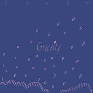

Gravity
============================

|  |  |
| :--: | :-- |
| [ Gravity](https://emumo.xiami.com/album/2102856322) | **艺人**: [SARRA](../index.md) **语种**: 国语 **唱片公司**: 独立发行 **发行时间**: 2017年09月13日 **专辑类别**: EP, 单曲 **专辑风格**: 独立流行 Indie Pop **播放数**: 879089 **收藏数**: 126 **评论数**: 9  |

## 简介

## 曲目

## 评论

|  |  |  |
| :-- | :-- | :-- |
|  [虾米用户](https://emumo.xiami.com/u/426852495)  2020-04-03 17:58 赞(0) 踩(0) | 
⊙▽⊙
 |
|  [虾米用户](https://emumo.xiami.com/u/344018512) 我还没想好要写什么... 2019-07-02 20:37 赞(0) 踩(0) | 
D
 |
|  [虾米用户](https://emumo.xiami.com/u/372358968) 人要是能活在歌里就好了。 2019-03-07 06:24 赞(0) 踩(0) | 
超喜欢
 |
|  [虾米用户](https://emumo.xiami.com/u/239593427)  2018-09-22 00:28 赞(0) 踩(0) | 
pick 
 |
|  [虾米用户](https://emumo.xiami.com/u/82399758) May Day ～ 2018-03-12 06:04 赞(1) 踩(0) | 
喜欢这个调调
 |
|  [虾米用户](https://emumo.xiami.com/u/2961074) 听两首歌 2017-09-22 14:01 赞(1) 踩(0) | 
好有味道！！！！
 |
|  [虾米用户](https://emumo.xiami.com/u/150644716) 我和我的赘肉，一刻也不能... 2017-09-13 22:59 赞(1) 踩(0) | 
封面一看就是文科生
 |
|  [虾米用户](https://emumo.xiami.com/u/13111079) 有缘再见 2017-09-13 18:23 赞(0) 踩(0) | 
nice
 |
