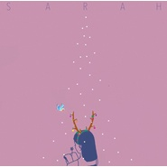

It's just Christmas Day
============================

|  |  |
| :--: | :-- |
| [ It's just Christmas Day](https://emumo.xiami.com/album/2103316306) | **艺人**: [SARRA](../index.md) **语种**: 英语 **唱片公司**: 虾米音乐人 **发行时间**: 2017年12月25日 **专辑类别**: EP, 单曲 **专辑风格**: 独立流行 Indie Pop **播放数**: 845534 **收藏数**: 305 **评论数**: 41  |

## 简介

寻光计划II 未曝光少年  
全新音乐作品，  
首次正式发声  
圣诞特别篇  
  
It's just Christmas Day  
“落单的圣诞节，想表达的是，12.25对我来说和其余364天没什么区别 。因为我每天都很想你，今天也不例外。” 

## 曲目

## 评论

|  |  |  |  |
| :-- | :-- | :-- | :-- |
|  [虾米用户](https://emumo.xiami.com/u/10170789) 最後一天 网易：Gimm... 2018-08-23 03:42 赞(0) 踩(0) | 
聖誕節會在哪呢
 |
|  [虾米用户](https://emumo.xiami.com/u/205096317) 小王子与玫瑰 2018-04-19 20:58 赞(0) 踩(0) | 
太美了
 |
|  [虾米用户](https://emumo.xiami.com/u/171155968) 我还没想好要写什么... 2018-03-17 09:26 赞(0) 踩(0) | 
发现新大陆
 |
|  [虾米用户](https://emumo.xiami.com/u/38129793) 这个家伙很拽什么都不留下... 2017-12-27 04:19 赞(1) 踩(0) | 
这世上只有一个节日&amp;mdash;&amp;mdash;情侣的节日
 |
|  [虾米用户](https://emumo.xiami.com/u/271713357)  2017-12-26 18:38 赞(0) 踩(0) | 
好喜欢封面❤️❤️❤️️
 |
|  [虾米用户](https://emumo.xiami.com/u/35097799)  2017-12-26 18:10 赞(0) 踩(0) | 
(⁎⁍̴̛ᴗ⁍̴̛⁎)
 |
|  [虾米用户](https://emumo.xiami.com/u/334646032)   2017-12-26 10:24 赞(1) 踩(0) | 
我只能说所有女生收的到礼物的节日都能火，女人推动经济啊
 |
|  [虾米用户](https://emumo.xiami.com/u/222663551)   2017-12-25 23:24 赞(1) 踩(0) | 
封面我收下了
 |
|  [虾米用户](https://emumo.xiami.com/u/298548930)   2017-12-25 21:05 赞(4) 踩(0) | 
每个圣诞节都是孤孤单单的一人过，不想出去 怎么感觉自己变成了孤独患者了呢
 |
|  [虾米用户](https://emumo.xiami.com/u/4207623)  2017-12-25 20:52 赞(3) 踩(0) | 
才知道 原来自己还是会怕一个人孤单单的  好不容易习惯的独居生活 被打破之后  又要回去原点好不容易熟悉的人 一个个离开有点难过呢 这一刻
 |
|  [虾米用户](https://emumo.xiami.com/u/334716619)  2017-12-25 20:25 赞(1) 踩(0) | 
圣诞快乐！虾米
 |
|  [虾米用户](https://emumo.xiami.com/u/181297456)   2017-12-25 19:45 赞(0) 踩(0) | 
棒
 |
|  [虾米用户](https://emumo.xiami.com/u/311479018)   2017-12-25 18:11 赞(0) 踩(0) | 
666
 |
|  [虾米用户](https://emumo.xiami.com/u/468203) 我还没想好要写什么... 2017-12-25 16:29 赞(2) 踩(0) | 
圣诞快乐！尊重历史才是真正的爱国！
 |
|  [虾米用户](https://emumo.xiami.com/u/41284147) 我就是你要找的贱人 2017-12-25 16:16 赞(0) 踩(0) | 
merry Christmas～
 |
|  [虾米用户](https://emumo.xiami.com/u/235914785) 一切美好发生 2017-12-25 13:54 赞(2) 踩(0) | 
温暖了我这颗千疮百孔的心
 |
|  [虾米用户](https://emumo.xiami.com/u/296903052) 我还没想好要写什么... 2017-12-25 13:37 赞(0) 踩(0) | 
圣诞快乐1
 |
|  [虾米用户](https://emumo.xiami.com/u/15247105)   2017-12-25 12:36 赞(1) 踩(0) | 
带着绸缎光泽的声音
 |
|  [虾米用户](https://emumo.xiami.com/u/20177656)  2017-12-25 11:43 赞(6) 踩(0) | 
只有清明节是属于我的
 |
| ⇒ |  [虾米用户](https://emumo.xiami.com/u/1836333) 愿无岁月可回首，且以深情... 2017-12-25 17:57 赞(0) 踩(0) | 
小可怜
 |
|  [虾米用户](https://emumo.xiami.com/u/8850174) 我还没想好要写什么... 2017-12-25 11:32 赞(11) 踩(0) | 
对于中国人，如果不信基督，圣诞节大张旗鼓的确实有点过分了，宗教节日被过成了大中型的，更希望春节时候大家也能这么用心，就不会有人说年味淡了
 |
| ⇒ |  [虾米用户](https://emumo.xiami.com/u/311295058)  2017-12-25 23:02 赞(0) 踩(0) | 
非常认可
 |
| ⇒ |  [虾米用户](https://emumo.xiami.com/u/5782884) hi there :) 2018-03-17 22:28 赞(0) 踩(0) | 
哎哎 我努力努力写首春节的歌啊
 |
| ⇒ |  [虾米用户](https://emumo.xiami.com/u/8850174) 我还没想好要写什么... 2018-03-17 22:28 赞(0) 踩(0) | 
<q><b>SARRA说：</b></q>
 |
| ⇒ |  [虾米用户](https://emumo.xiami.com/u/309511031)  2018-04-10 21:03 赞(0) 踩(0) | 
<q><b>SARRA说：</b></q>
 |
| ⇒ |  [虾米用户](https://emumo.xiami.com/u/309511031)  2018-04-10 21:04 赞(0) 踩(0) | 
不是年味变了，心变了而已。真的觉得你蛮有意思的，说这些话。
 |
| ⇒ |  [虾米用户](https://emumo.xiami.com/u/8850174) 我还没想好要写什么... 2018-04-10 21:08 赞(0) 踩(0) | 
<q><b>文说：</b></q>
 |
| ⇒ |  [虾米用户](https://emumo.xiami.com/u/309511031)  2018-04-10 21:09 赞(0) 踩(0) | 
<q><b>Logan说：</b></q>
 |
| ⇒ |  [虾米用户](https://emumo.xiami.com/u/361839699) 淋漓尽致见怪不怪美不胜收... 2018-07-18 08:32 赞(0) 踩(0) | 
原话我头圆叶子说我洒脱
 |
| ⇒ |  [虾米用户](https://emumo.xiami.com/u/361839699) 淋漓尽致见怪不怪美不胜收... 2018-07-18 08:36 赞(0) 踩(0) | 
<q><b>淋雨煮菜说：</b></q>
 |
| ⇒ |  [虾米用户](https://emumo.xiami.com/u/361839699) 淋漓尽致见怪不怪美不胜收... 2018-07-18 08:40 赞(0) 踩(0) | 
<q><b>淋雨煮菜说：</b></q>
 |
|  [虾米用户](https://emumo.xiami.com/u/1453136) hi, there 2017-12-25 11:29 赞(0) 踩(0) | 
这也歌单，只有一首歌！
 |
|  [虾米用户](https://emumo.xiami.com/u/331513052) 处对象吗，分手割腕的那种 2017-12-25 10:39 赞(0) 踩(0) | 
只有虾米的陪伴
 |
|  [虾米用户](https://emumo.xiami.com/u/340151286)  2017-12-25 10:21 赞(1) 踩(0) | 
lonely Christmas
 |
|  [虾米用户](https://emumo.xiami.com/u/13518748)  2017-12-25 09:48 赞(1) 踩(0) | 
好奇心使我点进来，被惊艳的感觉使我留下评论呀~才气满满+1！
 |
|  [虾米用户](https://emumo.xiami.com/u/18622046) 初识变化 2017-12-25 03:08 赞(0) 踩(0) | 
才气满满！期末肯定顺利的哈哈 
 |
|  [虾米用户](https://emumo.xiami.com/u/5691521) 孤独是最大的敌人 2017-12-25 02:44 赞(1) 踩(0) | 
只有虾米还爱我
 |
|  [虾米用户](https://emumo.xiami.com/u/38918617) 你相信我，我相信你 2017-12-25 00:21 赞(0) 踩(0) | 
圣诞快乐 merry xmas
 |
|  [虾米用户](https://emumo.xiami.com/u/23744327)   2017-12-25 00:05 赞(0) 踩(0) | 
哪儿呢
 |
|  [虾米用户](https://emumo.xiami.com/u/288051792) 我拿着旧钥匙，敲着厚厚的... 2017-12-25 00:01 赞(0) 踩(0) | 
好听！
 |
|  [虾米用户](https://emumo.xiami.com/u/13117289)  2017-12-24 21:57 赞(0) 踩(0) | 
等待中！
 |
