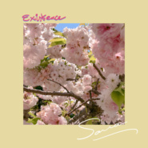

你存在我每个清晨
============================

|  |  |
| :--: | :-- |
| [ 你存在我每个清晨](https://emumo.xiami.com/album/2105904565) | **艺人**: [SARRA](../index.md) **语种**: 国语 **唱片公司**: 独立发行 **发行时间**: 2020年02月13日 **专辑类别**: EP, 单曲 **专辑风格**: 国语流行 Mandarin Pop **播放数**: 734474 **收藏数**: 35 **评论数**: 16  |

## 简介

天才唱作少女SARRA更名后第一首全新中文单曲，一人操刀词曲编唱混以及母带工程。以全新的尝试，去呈现全新的自己，希望带给听众一个富有层次感、独立而浪漫的听感。歌词一看是在诉说对每日醒来枕边人的爱意，二看是在探讨：独立存在于这个世界上的你我他，在相遇之后，我们的关系如何生长。  
“我在每一个春日的清晨，睁眼的瞬间游荡在五彩斑斓的鸟鱼间，拍黑白照片。闭眼的刹那坠进切切细语的花海，指缝攥漫湿厚的泥。后来你来了，照片即刻洋洋盈耳，手中捧满欲说无言。”  
这是一首关于春天的歌，关于你存在我的每个清晨。 

## 曲目

## 评论

|  |  |  |  |
| :-- | :-- | :-- | :-- |
|  [虾米用户](https://emumo.xiami.com/u/1904691)  2020-10-11 13:12 赞(0) 踩(0) | 
好喜欢这首歌，每次听都能强烈感受到自己的存在，姑娘真棒
 |
|  [虾米用户](https://emumo.xiami.com/u/50201833) 我还没想好要写什么灬 2020-05-24 10:49 赞(0) 踩(0) | 
这编曲，湿了
 |
|  [虾米用户](https://emumo.xiami.com/u/439939375)  2020-02-13 21:18 赞(0) 踩(0) | 
好！！！
 |
|  [虾米用户](https://emumo.xiami.com/u/313961702)  2020-02-13 20:57 赞(0) 踩(0) | 
  
 |
|  [虾米用户](https://emumo.xiami.com/u/313961441)  2020-02-13 20:52 赞(1) 踩(0) | 
十年老粉为你点赞
 |
|  [虾米用户](https://emumo.xiami.com/u/357515639)  2020-02-13 20:41 赞(1) 踩(0) | 
 
 |
|  [虾米用户](https://emumo.xiami.com/u/305933665)  2020-02-13 09:34 赞(0) 踩(0) | 
✨
 |
|  [虾米用户](https://emumo.xiami.com/u/305932447)  2020-02-13 09:06 赞(0) 踩(0) | 
终于等到你的新歌
 |
|  [虾米用户](https://emumo.xiami.com/u/24674997)  2020-02-13 09:04 赞(0) 踩(0) | 

 |
|  [虾米用户](https://emumo.xiami.com/u/378817288) 一遇钟情生，从此铭身骨。 2020-02-13 01:17 赞(0) 踩(0) | 

 |
|  [虾米用户](https://emumo.xiami.com/u/185678833)  2020-02-13 00:22 赞(2) 踩(0) | 
我眼中的春天：“光线，梦境，好天气，鸟鸣，耳边音乐和视线范围内的你”
 |
|  [虾米用户](https://emumo.xiami.com/u/31531934) 恋の道に近道はない 2020-02-13 00:13 赞(0) 踩(0) | 

 |
|  [虾米用户](https://emumo.xiami.com/u/322523580) 夜空 总有更大密度的蓝色 2020-02-13 00:01 赞(0) 踩(0) | 
。
 |
|  [虾米用户](https://emumo.xiami.com/u/3553665) wyy: LESLIE-... 2020-02-13 00:00 赞(0) 踩(0) | 
❤️
 |
|  [虾米用户](https://emumo.xiami.com/u/32441343) itsallaboutj... 2020-02-11 22:26 赞(1) 踩(0) | 
第一
 |
