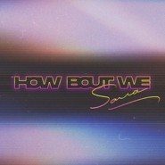

How Bout We
============================

|  |  |
| :--: | :-- |
| [ How Bout We](https://emumo.xiami.com/album/5021044938) | **艺人**: [SARRA](../index.md) **语种**: 国语 **唱片公司**: 唯帆音悦 **发行时间**: 2020年07月10日 **专辑类别**: EP, 单曲 **专辑风格**: 独立流行 Indie Pop, 合成器流行 Synthpop, 当代唱作人 Contemporary Singer-Songwriter **播放数**: 864751 **收藏数**: 34 **评论数**: 24  |

## 简介

How Bout We（不如我们）

 

听说有这样一个地方

在那里，我们可以逃避所有是非，卸下所有重量

在那里，两个灵魂可以无限交融，无限调配新的颜色

在那里，所有的爱与美好，皆存在即合理

听说有这样一个空间

在那里，即便我们是完全不同的个体，也可以一起舞动

在那里，所有预设都将失效，所有限制都将打开

在那里，一切由我们重新定义

 

而你我，离极乐之地只差一个真挚的触碰。

 

竖琴与定音鼓，拉开新世界的幔帐；底鼓与Bass的齐奏，是心跳的共振；模仿弦乐组下行滑奏的合成器，是灵魂正疾速坠入浪漫。在这首歌里，SARRA邀请你一起，跳脱一切局限，踏出一切自我预设，真诚而赤裸地相对，一同定义全新的世界。

 

## 曲目

## 评论

|  |  |  |  |
| :-- | :-- | :-- | :-- |
|  [虾米用户](https://emumo.xiami.com/u/263625478)  2020-10-05 22:11 赞(2) 踩(0) | 
我觉得其实相比于电音流行。。。爵士流行更能展现出sarrh独特的魅力
 |
|  [虾米用户](https://emumo.xiami.com/u/128936020)  2020-08-05 09:29 赞(0) 踩(0) | 
开头的顺滑 让人惊艳
 |
|  [虾米用户](https://emumo.xiami.com/u/418924373) 我还没想好要写什么... 2020-07-14 18:36 赞(0) 踩(0) | 
不知你在唱什么 但我就是喜欢听你声音
 |
|  [虾米用户](https://emumo.xiami.com/u/345223252) 我还没想好要写什么... 2020-07-14 00:11 赞(0) 踩(0) | 
love it
 |
|  [虾米用户](https://emumo.xiami.com/u/6728242)  2020-07-11 17:20 赞(0) 踩(0) | 
沙发有吗？？
 |
|  [虾米用户](https://emumo.xiami.com/u/38802367)   2020-07-11 16:28 赞(1) 踩(0) | 
爱您的第三年！等我考完研就去听你现场！
 |
|  [虾米用户](https://emumo.xiami.com/u/20731688)  2020-07-11 13:32 赞(0) 踩(0) | 
是喜欢的感觉，似曾相识一般。总体情绪上有点平，抑扬起伏明显一点可能会更好
 |
|  [虾米用户](https://emumo.xiami.com/u/428031593) 【十灰】春对夏，喜对√哀... 2020-07-11 13:32 赞(0) 踩(0) | 
【十蒸】76蘋对√蓼，芡对√菱，雁弋对√鱼鱼罾。齐纨对√鲁缟，蜀锦对√吴绫。星渐没，日初升，九聘对√三征。萧何曾作吏，贾岛昔为僧。贤人视履循规矩，大匠挥斤按准绳。野渡春风，人喜乘潮移酒舫；江天暮雨☔️☔️☔️☔️☔️☔️☔️☔️☔️☔️☔️☔️，客愁隔岸对√渔灯。谈对√吐，谓对√称，冉闵对√颜曾。侯嬴对√伯嚭，祖逖对√孙登。抛白纻，宴红绫，胜友对√良朋。争名如逐鹿，谋利似趋蝇。仁杰姨惭周不仕，王陵母识汉方兴。句写穷愁，浣花寄迹传工部；诗吟变乱，凝碧伤心π_π叹右丞。
 |
|  [虾米用户](https://emumo.xiami.com/u/340276798) 世事无绝对，唯有真情趣，... 2020-07-11 12:54 赞(0) 踩(0) | 
天籁之音。吐字清晰，曲调美好，富于感情。
 |
|  [虾米用户](https://emumo.xiami.com/u/247629557)  2020-07-11 00:23 赞(0) 踩(0) | 
该女生的曲风、韵律及创意演绎，给我带来视听享受，谢谢！
 |
|  [虾米用户](https://emumo.xiami.com/u/50694176) ……………… 2020-07-10 18:47 赞(0) 踩(0) | 
SARRA新曲支持，已经循环了多遍，好听
 |
|  [虾米用户](https://emumo.xiami.com/u/23744327)   2020-07-10 16:52 赞(0) 踩(0) | 
真的很棒！这一年的进步明显
 |
|  [虾米用户](https://emumo.xiami.com/u/199014212) 说的对 2020-07-10 16:05 赞(0) 踩(0) | 
很好听啊，支持！
 |
|  [虾米用户](https://emumo.xiami.com/u/50094982) 孤寂的灵魂在漫漫长夜突如... 2020-07-10 15:59 赞(0) 踩(0) | 
值得珍藏
 |
|  [虾米用户](https://emumo.xiami.com/u/2266563) 「让我为你逝去的生命颂唱... 2020-07-10 12:41 赞(1) 踩(0) | 
SARRA是近几年最喜欢的大陆歌手，没有之一。虽然有点无脑喜欢，但是真的很好听啊啊啊啊
 |
| ⇒ |  [虾米用户](https://emumo.xiami.com/u/25274644)  2020-07-25 00:53 赞(0) 踩(0) | 
无脑加我一个
 |
|  [虾米用户](https://emumo.xiami.com/u/322523580) 夜空 总有更大密度的蓝色 2020-07-10 11:47 赞(0) 踩(0) | 

 |
|  [虾米用户](https://emumo.xiami.com/u/1450620) 我是玛丽杨 2020-07-10 11:32 赞(0) 踩(0) | 
妹妹出新单曲了！！！曲子一如既往很赞！
 |
|  [虾米用户](https://emumo.xiami.com/u/46031009)  2020-07-10 11:26 赞(0) 踩(0) | 

 |
|  [虾米用户](https://emumo.xiami.com/u/3817709) 电视柜音乐人 2020-07-10 00:58 赞(0) 踩(0) | 
好听死了!
 |
|  [虾米用户](https://emumo.xiami.com/u/2502751) 各人有各人的修行 2020-07-10 00:22 赞(0) 踩(0) | 
How Bout Me
 |
|  [虾米用户](https://emumo.xiami.com/u/322523580) 夜空 总有更大密度的蓝色 2020-07-10 00:02 赞(0) 踩(0) | 
。
 |
|  [虾米用户](https://emumo.xiami.com/u/3553665) wyy: LESLIE-... 2020-07-10 00:01 赞(0) 踩(0) | 
¹
 |
|  [虾米用户](https://emumo.xiami.com/u/1418202)  江山共老 2020-07-10 00:00 赞(0) 踩(0) | 
1
 |
