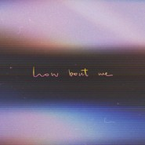

How Bout We (acoustic)
============================

|  |  |
| :--: | :-- |
| [ How Bout We (acoustic)](https://emumo.xiami.com/album/5021157850) | **艺人**: [SARRA](../index.md) **语种**: 国语 **唱片公司**: 唯帆音悦 **发行时间**: 2020年07月25日 **专辑类别**: EP, 单曲 **专辑风格**: 独立流行 Indie Pop **播放数**: 483287 **收藏数**: 13 **评论数**: 14  |

## 简介

## 曲目

## 评论

|  |  |  |  |
| :-- | :-- | :-- | :-- |
|  [虾米用户](https://emumo.xiami.com/u/71989728) 再见啦 2020-12-31 19:18 赞(0) 踩(0) | 
！
 |
|  [虾米用户](https://emumo.xiami.com/u/2024517) 潮流易逝，风格永存。 2020-09-04 20:16 赞(0) 踩(0) | 

 |
|  [虾米用户](https://emumo.xiami.com/u/23744327)   2020-07-29 19:32 赞(0) 踩(0) | 
喜欢那一丝空灵飘逸的感觉
 |
|  [虾米用户](https://emumo.xiami.com/u/247629557)  2020-07-26 00:10 赞(0) 踩(0) | 
你的作品:不是在炫技，而是胜于一般歌手唱功之拿捏，欣赏你！
 |
|  [虾米用户](https://emumo.xiami.com/u/9694577) 大桥好规是我男神。 2020-07-25 22:28 赞(0) 踩(0) | 
这版不插电的比原版强多了，原版真的平庸
 |
|  [虾米用户](https://emumo.xiami.com/u/62792788) 还在路上~~ 2020-07-25 17:52 赞(0) 踩(0) | 
听过阿
 |
|  [虾米用户](https://emumo.xiami.com/u/160463994)  2020-07-25 17:01 赞(0) 踩(0) | 
sarra找到路子了。喜歡這一版的夏夜甜蜜感
 |
|  [虾米用户](https://emumo.xiami.com/u/346579742) 我是小明呀！ 2020-07-25 11:02 赞(0) 踩(0) | 
来了来了
 |
|  [虾米用户](https://emumo.xiami.com/u/266302534) 没有魅力 就使暴力 2020-07-25 08:43 赞(0) 踩(0) | 
一路牛逼带闪电
 |
|  [虾米用户](https://emumo.xiami.com/u/25274644)  2020-07-25 00:51 赞(0) 踩(0) | 
好温柔   
 |
|  [虾米用户](https://emumo.xiami.com/u/31531934) 恋の道に近道はない 2020-07-25 00:44 赞(0) 踩(0) | 

 |
|  [虾米用户](https://emumo.xiami.com/u/50094982) 孤寂的灵魂在漫漫长夜突如... 2020-07-25 00:36 赞(0) 踩(0) | 

 |
|  [虾米用户](https://emumo.xiami.com/u/2808708) I'madreamer，... 2020-07-25 00:13 赞(1) 踩(0) | 
1
 |
|  [虾米用户](https://emumo.xiami.com/u/3553665) wyy: LESLIE-... 2020-07-25 00:03 赞(0) 踩(0) | 
⚝
 |
