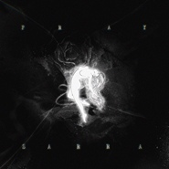

PRAY 失语症
============================

|  |  |
| :--: | :-- |
| [ PRAY 失语症](https://emumo.xiami.com/album/5022611820) | **艺人**: [SARRA](../index.md) **语种**: 国语 **唱片公司**: SparkMusic 火花音悦 **发行时间**: 2021年01月29日 **专辑类别**: EP, 单曲 **专辑风格**: 独立流行 Indie Pop, 电子乐 Electronica **播放数**: 88651 **收藏数**: 14 **评论数**: 11  |

## 简介

因情感过于强烈而突然失声，你有体验过吗？

而你对面的人，能否穿透此刻静止的空气，读出你的心声？

 

在这3分27秒里，SARRA将时间静止在告白欲言却止的那一瞬间，尝试以清醒的思绪，在让人晕头转向的热恋中探寻内心最真实的底色——“爱到深处已无言”。伴唱及打击乐邀请了知名电子音乐制作人mAjorHon操刀，铺垫了单曲硬朗深沉的基调。配器编排是极简的，情绪却是复杂的，表色虽清冷，热流却暗涌。

## 曲目

## 评论

|  |  |  |  |
| :-- | :-- | :-- | :-- |
|  [虾米用户](https://emumo.xiami.com/u/18222056) 这家伙很可爱什么也没留下 2021-02-05 10:47 赞(0) 踩(0) | 
各位再见
 |
|  [虾米用户](https://emumo.xiami.com/u/58829284) 怎么还不来 2021-02-04 23:15 赞(1) 踩(0) | 
谢谢你
 |
| ⇒ |  [虾米用户](https://emumo.xiami.com/u/30112556)  2021-02-05 10:43 赞(0) 踩(0) | 
友再见
 |
|  [虾米用户](https://emumo.xiami.com/u/322161699) 我还没想好要写什么... 2021-02-02 10:07 赞(0) 踩(0) | 
无敌好听，我词穷了。
 |
|  [虾米用户](https://emumo.xiami.com/u/306065331) 幸福开始有人选 2021-02-01 13:05 赞(0) 踩(0) | 
“爱要大声喊出来”“出来！出来！”
 |
|  [虾米用户](https://emumo.xiami.com/u/304588167)  2021-01-31 07:50 赞(1) 踩(0) | 
朋友圈都说好听！真的！二年没有发朋友圈了！但听了这首歌！我打破惯例！   
 |
|  [虾米用户](https://emumo.xiami.com/u/671456) 我还没想好要写什么... 2021-01-30 23:55 赞(0) 踩(0) | 
love every single beat
 |
|  [虾米用户](https://emumo.xiami.com/u/33149354) 电子游戏及炫酷音乐爱好者 2021-01-30 06:32 赞(0) 踩(0) | 
坚持一如既往的风格，无可替代！
 |
|  [虾米用户](https://emumo.xiami.com/u/277652932)  2021-01-30 04:10 赞(0) 踩(0) | 
很有个人特色的音乐人，加油！
 |
|  [虾米用户](https://emumo.xiami.com/u/337210752) 我还没想好要写什么.. 2021-01-29 12:53 赞(0) 踩(0) | 
来了，来了啊
 |
|  [虾米用户](https://emumo.xiami.com/u/330980198) 我还没想好要写什么... 2021-01-29 11:01 赞(0) 踩(0) | 
最爱那有质感的嗓音！
 |
