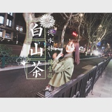

白山茶
============================

|  |  |
| :--: | :-- |
| [ 白山茶](https://emumo.xiami.com/album/2102855364) | **艺人**: [陈雪凝](../index.md) **语种**: 国语 **唱片公司**: 独立发行 **发行时间**: 2017年04月26日 **专辑类别**: EP, 单曲 **专辑风格**:  **播放数**: 346740 **收藏数**: 729 **评论数**: 39  |

## 简介

《白山茶》是00后创作女歌手陈雪凝发行的首支单曲。作词作曲都来自陈雪凝本人。 因为歌曲中直击人心的歌词以及她自身独特的唱法被听众所喜爱。

## 曲目

## 评论

|  |  |  |
| :-- | :-- | :-- |
|  [虾米用户](https://emumo.xiami.com/u/297365892)  2019-10-12 19:35 赞(0) 踩(0) | 
好好看
 |
|  [虾米用户](https://emumo.xiami.com/u/427374323)  2019-07-16 17:42 赞(1) 踩(0) | 
666666
 |
|  [虾米用户](https://emumo.xiami.com/u/424672772)  2019-05-31 19:24 赞(0) 踩(0) | 
6666666666
 |
|  [虾米用户](https://emumo.xiami.com/u/424515500) 欺负我家雪凝，你完了！ 2019-05-30 19:40 赞(4) 踩(0) | 
666666666666666666666666666666666666666666666666666666666666 666666666666666666666666666666666666666666666666666666666666 6666666666666666666666 666666666666666666666666666666666666666666666666666666666666 66666666666 666666666666666666666666666666666666666666666666666666666666 66666666666 6666666666666
 |
|  [虾米用户](https://emumo.xiami.com/u/405952993)  2019-05-08 07:20 赞(0) 踩(0) | 
很喜欢
 |
|  [虾米用户](https://emumo.xiami.com/u/67849022)  2019-04-25 06:42 赞(3) 踩(0) | 
抄袭还有理？
 |
|  [虾米用户](https://emumo.xiami.com/u/407004358)  2019-04-11 15:29 赞(0) 踩(0) | 
虾米竟然还有这首歌，找疯了，666，太好了！
 |
| ⇒ |  [虾米用户](https://emumo.xiami.com/u/425612809)  2019-08-23 18:20 赞(0) 踩(0) | 
可以听吗
 |
|  [虾米用户](https://emumo.xiami.com/u/379392597) dying 2019-04-03 21:26 赞(1) 踩(0) | 
炒鸡好
 |
|  [虾米用户](https://emumo.xiami.com/u/218544178) 做自己喜欢的 2019-03-30 10:49 赞(1) 踩(0) | 
旋律有点像夜车
 |
|  [虾米用户](https://emumo.xiami.com/u/419571592)  2019-02-19 22:59 赞(0) 踩(0) | 
没有差评
 |
|  [虾米用户](https://emumo.xiami.com/u/419275907)  2019-02-17 11:54 赞(0) 踩(0) | 
呵呵哒  
 |
|  [虾米用户](https://emumo.xiami.com/u/259902211)  2019-01-10 01:59 赞(0) 踩(0) | 
谁有HQ34.4M下载的，我原来的不知怎么的没有了。
 |
|  [虾米用户](https://emumo.xiami.com/u/404024856)  2019-01-07 04:27 赞(2) 踩(0) | 
我觉得吧，就算他是抄袭，他也比原版做的更好。这应该算是在原有基础上的进步吧 其次，要是一个旋律只能用在一首歌身上，那对音乐的作曲来说，会有很多阻碍，然后影响发展吧
 |
|  [虾米用户](https://emumo.xiami.com/u/411926255)  2019-01-06 11:41 赞(1) 踩(0) | 
抄袭怎么了，音乐是用来欣赏的，现在明星翻唱别人歌曲。你怎么不逼逼
 |
|  [虾米用户](https://emumo.xiami.com/u/67849022)  2018-08-07 12:13 赞(13) 踩(0) | 
抄袭都有理了，呵呵
 |
| ⇒ |  [虾米用户](https://emumo.xiami.com/u/330200748)  2018-08-22 02:08 赞(0) 踩(0) | 
你写个试试？
 |
| ⇒ |  [虾米用户](https://emumo.xiami.com/u/420720728)  2019-04-25 09:04 赞(0) 踩(0) | 
你不抄袭你火啊，好听就行呗，就你欠。说别人同时不自己撒尿照照自己。你有什么资本。这辈子也就这点格局！无能
 |
| ⇒ |  [虾米用户](https://emumo.xiami.com/u/424515500) 欺负我家雪凝，你完了！ 2019-05-30 19:49 赞(0) 踩(0) | 
哼，送你一句话！别BB，莫BB，不会BB，别BB，BB半天，白BB！
 |
| ⇒ |  [虾米用户](https://emumo.xiami.com/u/286598418) 我记住了他的样子，我不知... 2020-01-23 21:04 赞(0) 踩(0) | 
<q><b>请叫我瑞总说：</b></q>
 |
| ⇒ |  [虾米用户](https://emumo.xiami.com/u/441071616)  2020-03-17 13:33 赞(0) 踩(0) | 
<q><b>陈雪凝〔部落酉长〕说：</b></q>
 |
| ⇒ |  [虾米用户](https://emumo.xiami.com/u/446527465) cpdd 2021-01-06 13:55 赞(0) 踩(0) | 
抄你了？？
 |
|  [虾米用户](https://emumo.xiami.com/u/359627619)  2018-04-21 21:58 赞(1) 踩(0) | 
和我很像
 |
|  [虾米用户](https://emumo.xiami.com/u/351419979)  2018-02-20 03:04 赞(4) 踩(0) | 
抄袭你妹妹，什么都说抄袭，以为是你  吗？  
 |
|  [虾米用户](https://emumo.xiami.com/u/264720767)  2018-02-02 11:58 赞(0) 踩(0) | 
想听
 |
|  [虾米用户](https://emumo.xiami.com/u/345285204)  2018-01-18 13:12 赞(0) 踩(0) | 
不可以听啊！
 |
|  [虾米用户](https://emumo.xiami.com/u/342481400)  2018-01-01 09:52 赞(0) 踩(0) | 
为什么不可以听？
 |
|  [虾米用户](https://emumo.xiami.com/u/24912517) 只是好看的皮囊不想理你有... 2017-12-03 09:41 赞(1) 踩(0) | 
第一☝️
 |
|  [虾米用户](https://emumo.xiami.com/u/94930444)  2017-11-30 23:55 赞(0) 踩(0) | 
你温柔的说眷恋我
 |
|  [虾米用户](https://emumo.xiami.com/u/336169600) 鹿晗 2017-11-23 16:51 赞(0) 踩(0) | 
加油
 |
|  [虾米用户](https://emumo.xiami.com/u/331100038)  2017-10-21 12:52 赞(0) 踩(0) | 
好听
 |
| ⇒ |  [虾米用户](https://emumo.xiami.com/u/326569910) 是金子总会发光 2017-12-30 13:03 赞(0) 踩(0) | 
  
 |
|  [虾米用户](https://emumo.xiami.com/u/6373689) 心如猛虎，细嗅蔷薇。 2017-10-20 21:18 赞(0) 踩(0) | 
真的是超有感觉。。。
 |
|  [虾米用户](https://emumo.xiami.com/u/271050406)  2017-10-04 13:13 赞(1) 踩(0) | 
超好听哒
 |
|  [虾米用户](https://emumo.xiami.com/u/61742946)  2017-10-01 18:38 赞(0) 踩(0) | 
汽水加油！
 |
|  [虾米用户](https://emumo.xiami.com/u/26416320)   2017-09-29 10:42 赞(2) 踩(0) | 
歌词很多引用别人的 抄袭狗 &amp;hellip;旋律和罗大佑《告别的年代》一毛一样&amp;hellip;一星都不想给
 |
| ⇒ |  [虾米用户](https://emumo.xiami.com/u/238759220)  2018-01-06 20:34 赞(0) 踩(0) | 
你是瞎还是聋？
 |
| ⇒ |  [虾米用户](https://emumo.xiami.com/u/26416320)   2018-01-07 18:49 赞(0) 踩(0) | 
<q><b>你我的甜蜜探戈说：</b></q>
 |
|  [虾米用户](https://emumo.xiami.com/u/322303682) 霉霉 2017-09-12 17:38 赞(0) 踩(0) | 
你认真的说你喜欢白山茶.怡然自得的收起别的红玫瑰...
 |
