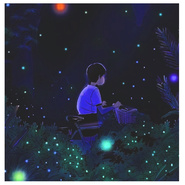
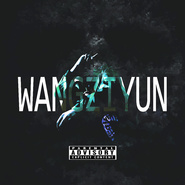
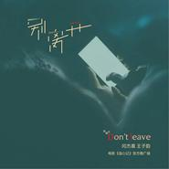
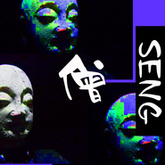
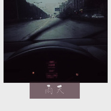
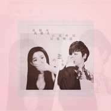
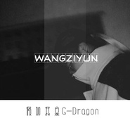
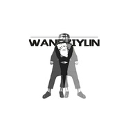
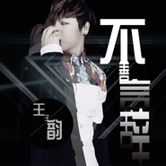
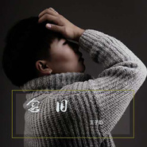

王子韵
============================

|  |  |
| :--: | :-- |
| [ 王子韵](https://i.xiami.com/jackwzy) | **地区**: China 中国大陆 **风格**: 华语唱作人 Chinese Singer-Songwriter, 国语流行 Mandarin Pop **播放数**: 4875284 **粉丝数**: 148 **评论数**: 16  |

## 档案

## 专辑

| 名称 | 语种 | 唱片公司 | 发行时间 | 专辑类别 | 专辑风格 |
| :--: | :-- | :-- | :-- | :-- | :-- |
| [ 上膛](./albums/2105575215.md) | 国语 | 太声文化 | 2019年12月13日 | EP, 单曲 | 国语流行 Mandarin Pop |
| [ 天亮之后](./albums/2105483910.md) | 国语 | 太声文化 | 2019年09月11日 | EP, 单曲 | 国语流行 Mandarin Pop |
| [ 从前不会来](./albums/2104930294.md) | 国语 | 太声文化 | 2019年06月07日 | EP, 单曲 |  |
| [ 战犯](./albums/5022449347.md) | 国语 |  | 2019年04月16日 | EP, 单曲 |  |
| [ ？](./albums/2104596186.md) | 国语 | 太声文化 | 2019年02月15日 | EP, 单曲 | 国语流行 Mandarin Pop |
| [ 梦坞](./albums/2104304114.md) | 国语 | 太声文化 | 2018年12月01日 | EP, 单曲 | 国语流行 Mandarin Pop |
| [ 想你](./albums/2104267071.md) | 国语 | 太声文化 | 2018年11月24日 | EP, 单曲 | 国语流行 Mandarin Pop |
| [ 土皇帝](./albums/2104224553.md) | 国语 | 太声文化 | 2018年11月17日 | EP, 单曲 | 国语流行 Mandarin Pop |
| [ 多余](./albums/2104114152.md) | 国语 | 太声文化 | 2018年10月16日 | EP, 单曲 | 国语流行 Mandarin Pop |
| [ 玩-你-丧-志](./albums/2104114154.md) | 国语 | 太声文化 | 2018年10月16日 | EP, 单曲 | 嘻哈 Hip-Hop |
| [ 导演](./albums/2104114146.md) | 国语 | 太声文化 | 2018年10月16日 | EP, 单曲 | 国语流行 Mandarin Pop |
| [ 酗酒 (Prod By Jurrivh)](./albums/2104114149.md) | 国语 | 太声文化 | 2018年10月16日 | EP, 单曲 | 嘻哈 Hip-Hop |
| [ 电影《追心记》官方推广曲](./albums/5022426007.md) | 国语 |  | 2018年10月11日 | EP, 单曲 |  |
| [ GANYIBEI干一杯](./albums/2104057606.md) | 国语 | 太声文化 | 2018年09月26日 | EP, 单曲 | 嘻哈 Hip-Hop |
| [ 僧](./albums/2104027562.md) | 国语 | 太声文化 | 2018年09月14日 | EP, 单曲 |  |
| [ The Latin Vision / Jack's Theme](./albums/2104009250.md) | 英语 | Warner Music | 2018年09月07日 | EP, 单曲 |  |
| [ 酗酒](./albums/5022465760.md) | 国语 | 太声文化 | 2018年08月03日 | EP, 单曲 |  |
| [ Loto and Tulipa](./albums/2103813777.md) | 英语 | Natura Viva | 2018年07月06日 | EP, 单曲 |  |
| [ 是谁杀了那个女孩？](./albums/2103777361.md) | 国语 | 独立发行 | 2018年07月04日 | EP, 单曲 | 嘻哈 Hip-Hop, 流行说唱 Pop Rap, 陷阱说唱 Trap Rap |
| [ 雨天](./albums/2103742867.md) | 国语 | 独立发行 | 2018年06月09日 | EP, 单曲 | 流行 Pop, 电音流行 Electropop |
| [ 陌生朋友](./albums/5022450635.md) | 国语 |  | 2018年05月09日 | EP, 单曲 |  |
| [ 风很大 云也听话](./albums/2103702189.md) | 国语 | 独立发行 | 2018年05月04日 | EP, 单曲 | 流行 Pop, 流行说唱 Pop Rap |
| [ 等风也等你](./albums/5022407947.md) | 国语 | 太声文化 | 2018年05月03日 | 录音室专辑 |  |
| [ 共享男孩](./albums/2103522891.md) | 国语 | 独立发行 | 2018年02月09日 | 录音室专辑 | 独立电子乐 Indietronica, 电子 Electronic |
| [ 《我们在不同的路上各自安好》](./albums/5022370934.md) | 国语 |  | 2017年10月26日 | EP, 单曲 |  |
| [ BINGBIAN病变](./albums/2102874934.md) | 国语 | 独立发行 | 2017年10月18日 | EP, 单曲 | 独立电子乐 Indietronica |
| [ 不善言辞](./albums/2102851435.md) | 国语 | 独立发行 | 2017年09月05日 | 录音室专辑 | 流行 Pop, 国语流行 Mandarin Pop, 独立流行 Indie Pop |
| [ 念旧](./albums/2102759915.md) | 国语 | 独立发行 | 2017年06月05日 | EP, 单曲 | 华语唱作人 Chinese Singer-Songwriter |

## 评论

|  |  |  |
| :-- | :-- | :-- |
|  [虾米用户](https://emumo.xiami.com/u/358104299) 悲观的唯心存在现实解构虚... 2020-12-09 12:27 赞(1) 踩(0) | 
42790
 |
|  [虾米用户](https://emumo.xiami.com/u/17146554) weibo：@L1RRO... 2018-03-17 07:48 赞(3) 踩(0) | 
病变
 |
|  [虾米用户](https://emumo.xiami.com/u/352592235)  2018-02-27 22:27 赞(1) 踩(0) | 
子韵，病变非常好听，但是我觉得你还会有更好的作品，加油，我看好你！
 |
|  [虾米用户](https://emumo.xiami.com/u/352304584) BINGBIAN 2018-02-25 20:44 赞(0) 踩(0) | 
病变女生版好听
 |
|  [虾米用户](https://emumo.xiami.com/u/272528785) 。。。 2018-02-20 09:52 赞(0) 踩(0) | 
那首《BINGBIAN病变》 
 |
|  [虾米用户](https://emumo.xiami.com/u/257885805)  2018-01-30 11:18 赞(2) 踩(0) | 
有自己的风格，不错啊，加油！
 |
|  [虾米用户](https://emumo.xiami.com/u/344825141)  2018-01-26 13:32 赞(0) 踩(0) | 
病变这首作品不错，继续加油
 |
|  [虾米用户](https://emumo.xiami.com/u/339269537)  2018-01-18 13:12 赞(0) 踩(0) | 
病变超级好听
 |
|  [虾米用户](https://emumo.xiami.com/u/283652743)  2018-01-17 01:04 赞(1) 踩(0) | 
你把病变说唱唱出了歌词本身的含义，厉害了我的哥
 |
|  [虾米用户](https://emumo.xiami.com/u/330865537)  2018-01-13 20:24 赞(0) 踩(0) | 
  
 |
|  [虾米用户](https://emumo.xiami.com/u/335483631) 11岁！ 2018-01-06 11:15 赞(2) 踩(0) | 
希望你的粉丝越来越多！
 |
| ⇒ |  [虾米用户](https://emumo.xiami.com/u/278455233)  2018-01-07 22:21 赞(0) 踩(0) | 
谢谢你
 |
| ⇒ |  [虾米用户](https://emumo.xiami.com/u/335483631) 11岁！ 2018-01-08 19:34 赞(0) 踩(0) | 
<q><b>王子韵说：</b></q>
 |
|  [虾米用户](https://emumo.xiami.com/u/202459052)  2017-11-18 08:28 赞(3) 踩(0) | 
声音好听
 |
|  [虾米用户](https://emumo.xiami.com/u/311268691) 我还没想好要写什么... 2017-11-04 15:37 赞(4) 踩(0) | 
BINGBANG病态 这首歌表达了太多，声音很好听
 |
|  [虾米用户](https://emumo.xiami.com/u/278455233)  2017-06-05 17:01 赞(12) 踩(0) | 
我刚入驻了虾米音乐人，欢迎大家来我的个人主页，收听我的最新音乐
 |
