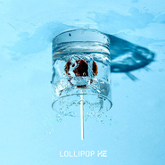

Lollipop
============================

|  |  |
| :--: | :-- |
| [ Lollipop](https://emumo.xiami.com/album/2103806874) | **艺人**: [贺仙人](../index.md) **语种**: 国语 **唱片公司**: 东亚星光 **发行时间**: 2018年07月14日 **专辑类别**: EP, 单曲 **专辑风格**:  **播放数**: 334400 **收藏数**: 7 **评论数**: 2  |

## 简介

如同一种浪漫的气息 散发在空气中环绕全身如此期待你的出现  
像糖果的甜蜜 让我着迷  
  
贺仙人——潮流电音惊喜诠释俏皮夏日风  
有你的时光，是小时候口中最甜腻的草莓味硬糖，是每天下课时心心念念的渴望至极， 是时时刻刻充满心底的美好时光，你的身边总是环绕着一股独特的浪漫，让我不经意之间被你吸引，为你着迷。就像贺仙人新单曲《Lollipop》所表达的“我要把你/含在我嘴里/我要把你/融化在心里/你的美丽/如此甜蜜/我无力抗拒/你让我着迷”。轻快的节奏，浪漫的歌词，让人仿佛置身于冷气十足的糖果加工厂，呼吸的每一口空气，都充斥着甜蜜的气息。让人不禁对爱情充满期待。  
  
新单曲《Lollipop》是贺仙人“电音告白日”系列第二首单曲，整首歌以清新简单的曲    调，轻快律动的鼓点以及俏皮可爱的歌词贯穿始终，风格上融合了雷鬼、电吉他等元素，再    搭配贺仙人略沙哑的质感声线，甜蜜的爱情影像随着旋律逐渐映入脑海中。除此之外，小朋友暖萌的声音出现也是歌曲一大亮点之一，仿佛寓意着我们心底最纯净的快乐。而如此美好且俏皮的《Lollipop》也和快乐的暑假气息很搭，吃着糖果，感受着微风与阳光的洗礼，重回童真时代，这是一次呵护至极的甜蜜，这是贺仙人的《Lollipop》给你带来的爱情惊喜。 

## 曲目

## 评论

|  |  |  |  |
| :-- | :-- | :-- | :-- |
|  [虾米用户](https://emumo.xiami.com/u/295113037) 平芜尽处是春山 2020-02-15 22:08 赞(1) 踩(0) | 
是宝藏boy
 |
|  [虾米用户](https://emumo.xiami.com/u/38847730) 我还没想好要写什么... 2018-07-14 14:41 赞(1) 踩(0) | 
xhuu
 |
