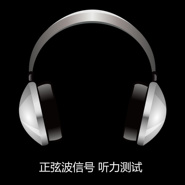

正弦波信号 人耳听力测试 音响调试人耳听力测试
============================

|  |  |
| :--: | :-- |
| [ 正弦波信号 人耳听力测试 音响调试人耳听力测试](https://emumo.xiami.com/album/2105304848) | **艺人**: [迷幻森林](../index.md) **语种**: 其他 **唱片公司**: 独立发行 **发行时间**: 2017年01月01日 **专辑类别**: 录音室专辑 **专辑风格**: 噪音 Noise **播放数**: 169815 **收藏数**: 86 **评论数**: 0  |

## 简介

理论上来说&nbsp;人耳的听觉范围在20～20000Hz&nbsp;CD级别的音频可达22000hz&nbsp;Mp3&nbsp;320Kbps的可达20000Hz&nbsp;&nbsp;经常戴耳机或随着年龄的增长&nbsp;听力会有下降&nbsp;需要及时做测试&nbsp;请认真聆听20～20000Hz的音频&nbsp;如都可以听到或者感应到&nbsp;那您的听觉还是比较健康的&nbsp;反之亦然

## 曲目

## 评论

|  |  |  |  |
| :-- | :-- | :-- | :-- |
