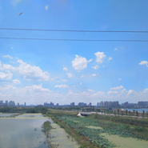

旅行 (Inst.)
============================

|  |  |
| :--: | :-- |
| [ 旅行 (Inst.)](https://emumo.xiami.com/album/5021341484) | **艺人**: [迷幻森林](../index.md) **语种**: 纯音乐 **唱片公司**: 独立发行 **发行时间**: 2020年08月26日 **专辑类别**: 录音室专辑 **专辑风格**: 民谣 Folk **播放数**: 157 **收藏数**: 2 **评论数**: 0  |

## 简介

这是一首未完成的曲子....&nbsp;&nbsp;&nbsp;因为后面还要作曲填词成一首歌曲  
  
旅行  
  
要搭上一列火车&nbsp;才能够离开这座城  
  
我看到山的侧颜&nbsp;还有那无边的田野  
  
我在奔向你的路上..... 

## 曲目

## 评论

|  |  |  |  |
| :-- | :-- | :-- | :-- |
