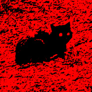

猫
============================

|  |  |
| :--: | :-- |
| [ 猫](https://emumo.xiami.com/album/5021573565) | **艺人**: [迷幻森林](../index.md) **语种**: 国语 **唱片公司**: 独立发行 **发行时间**: 2020年09月29日 **专辑类别**: 录音室专辑 **专辑风格**: 实验音乐 Experimental, 自由即兴 Free Improvisation **播放数**: 132 **收藏数**: 0 **评论数**: 0  |

## 简介

这是一首包含着大量负面情绪的歌&nbsp;我做过一个噩梦&nbsp;梦中一些怪异的场景至今还有印象&nbsp;那诡异的动作&nbsp;不符合现实的帧率&nbsp;再加上支离破碎的画面&nbsp;所以我做了这首歌&nbsp;我弱化了人声&nbsp;以至于几乎听不到&nbsp;从最初的创作&nbsp;只有简单的四个音&nbsp;再到编曲&nbsp;作曲作词&nbsp;录音&nbsp;混缩&nbsp;完成&nbsp;只用了两天&nbsp;大部分时间是调鼓声&nbsp;用了很多效果器&nbsp;最终调到了自己喜欢的音色

## 曲目

## 评论

|  |  |  |  |
| :-- | :-- | :-- | :-- |
