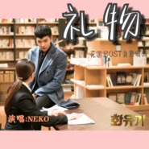

礼物—花游记OST背影中文填词
============================

|  |  |
| :--: | :-- |
| [ 礼物—花游记OST背影中文填词](https://emumo.xiami.com/album/2103584539) | **艺人**: [NEKO](../index.md) **语种**: 国语 **唱片公司**: 独立发行 **发行时间**: 2018年03月06日 **专辑类别**: 录音室专辑 **专辑风格**: 韩国流行 K-Pop, 国语流行 Mandarin Pop, 流行 Pop **播放数**: 78380 **收藏数**: 10 **评论数**: 1  |

## 简介

 真的超喜欢这位孙悟空大人了T-T

## 曲目

## 评论

|  |  |  |  |
| :-- | :-- | :-- | :-- |
|  [虾米用户](https://emumo.xiami.com/u/24658063) 我有无限能力，富足，智慧... 2018-03-07 18:40 赞(0) 踩(0) | 
开头曲调和郑伊健的活在我的心好像
 |
